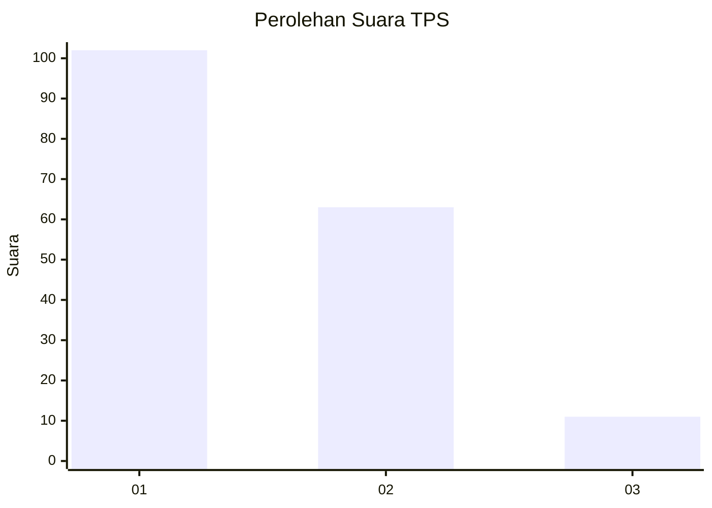
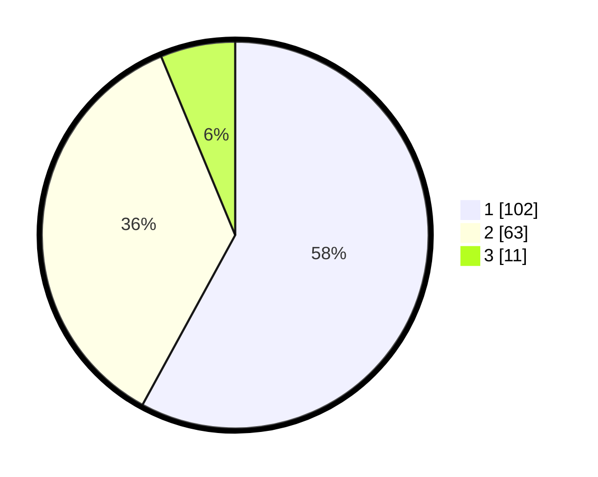

# Hasil

## Grafik

## Tabel

| No. | Nama Paslon    | Suara | Suara (raw) | Persentase |
|:--- |:-------------- | -----:| -----------:| ----------:|
| 1   | ANIES MUHAIMIN | 102   | [102][p-1]  | 57,95      |
| 2   | PRABOWO GIBRAN | 63    | [63][p-2]   | 35,80      |
| 3   | GANJAR MAHFUD  | 11    | [11][p-3]   | 6,25       |

[p-1]: https://github.com/gigit-pemilu/pemilu-2024/blob/main/pilpres/hitung-suara/sub/35-jawa-timur/sub/29-sumenep/sub/09-guluk-guluk/sub/2007-bragung/sub/012-tps/sub/paslon-1.txt
[p-2]: https://github.com/gigit-pemilu/pemilu-2024/blob/main/pilpres/hitung-suara/sub/35-jawa-timur/sub/29-sumenep/sub/09-guluk-guluk/sub/2007-bragung/sub/012-tps/sub/paslon-2.txt
[p-3]: https://github.com/gigit-pemilu/pemilu-2024/blob/main/pilpres/hitung-suara/sub/35-jawa-timur/sub/29-sumenep/sub/09-guluk-guluk/sub/2007-bragung/sub/012-tps/sub/paslon-3.txt

## Foto C Plano

https://sirekap-obj-formc.kpu.go.id/3f04/pemilu/ppwp/35/29/09/20/07/3529092007012-20240225-214313--06b1c541-e78f-4e18-85a0-059f7cbe1ca3.jpg

https://sirekap-obj-formc.kpu.go.id/3f04/pemilu/ppwp/35/29/09/20/07/3529092007012-20240225-214402--c810d618-9b4b-4832-ac58-0b9ba2c4b3a7.jpg

https://sirekap-obj-formc.kpu.go.id/3f04/pemilu/ppwp/35/29/09/20/07/3529092007012-20240225-214537--71e05125-dc25-4d81-81ea-983c39664f24.jpg

## Metadata

| Key        | Value               |
| ---------- | ------------------- |
| Time Stamp | 2024-02-28 19:00:00 |

