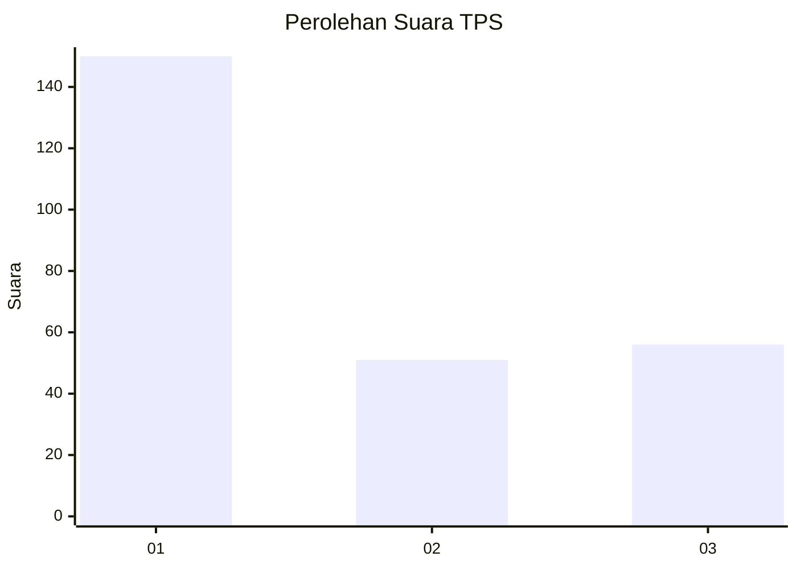
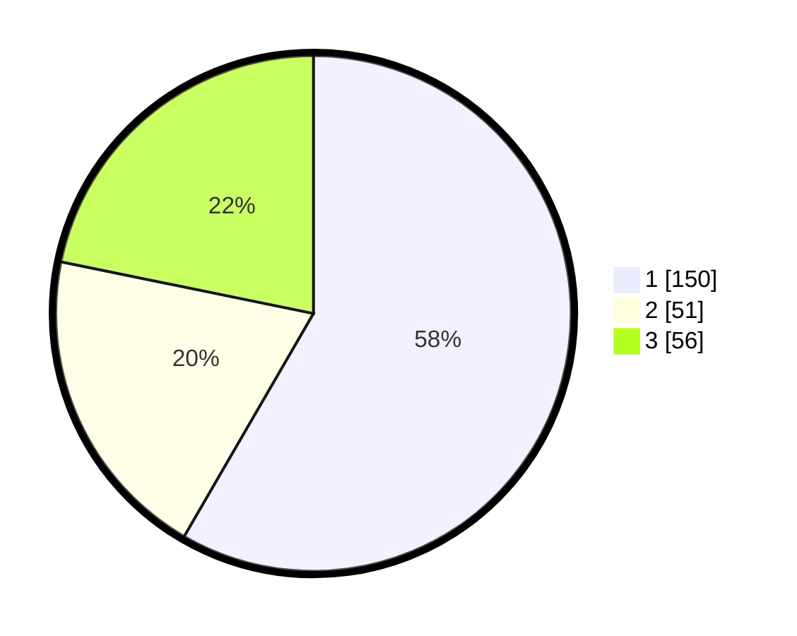

# Hasil

## Grafik

## Tabel

| No. | Nama Paslon    | Suara | Suara (raw) | Persentase |
|:--- |:-------------- | -----:| -----------:| ----------:|
| 1   | ANIES MUHAIMIN | 150   | [150][p-1]  | 58,37      |
| 2   | PRABOWO GIBRAN | 51    | [51][p-2]   | 19,84      |
| 3   | GANJAR MAHFUD  | 56    | [56][p-3]   | 21,79      |

[p-1]: https://github.com/gigit-pemilu/pemilu-2024/blob/main/pilpres/hitung-suara/sub/35-jawa-timur/sub/29-sumenep/sub/09-guluk-guluk/sub/2008-tambuko/sub/001-tps/sub/paslon-1.txt
[p-2]: https://github.com/gigit-pemilu/pemilu-2024/blob/main/pilpres/hitung-suara/sub/35-jawa-timur/sub/29-sumenep/sub/09-guluk-guluk/sub/2008-tambuko/sub/001-tps/sub/paslon-2.txt
[p-3]: https://github.com/gigit-pemilu/pemilu-2024/blob/main/pilpres/hitung-suara/sub/35-jawa-timur/sub/29-sumenep/sub/09-guluk-guluk/sub/2008-tambuko/sub/001-tps/sub/paslon-3.txt

## Foto C Plano

https://sirekap-obj-formc.kpu.go.id/bbea/pemilu/ppwp/35/29/09/20/08/3529092008001-20240224-145457--030f80f6-099a-4bae-86ec-e5198ca2e810.jpg

https://sirekap-obj-formc.kpu.go.id/bbea/pemilu/ppwp/35/29/09/20/08/3529092008001-20240224-145522--3fc83275-d90d-44f0-bf84-b9bad5e43562.jpg

https://sirekap-obj-formc.kpu.go.id/bbea/pemilu/ppwp/35/29/09/20/08/3529092008001-20240224-145547--81dc343b-a568-4b2e-a8b4-fb8e6ba18db2.jpg

## Metadata

| Key        | Value               |
| ---------- | ------------------- |
| Time Stamp | 2024-02-28 19:00:00 |

