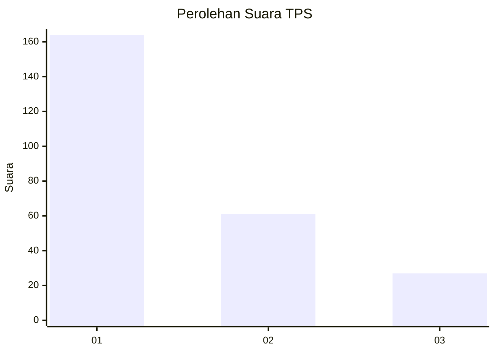
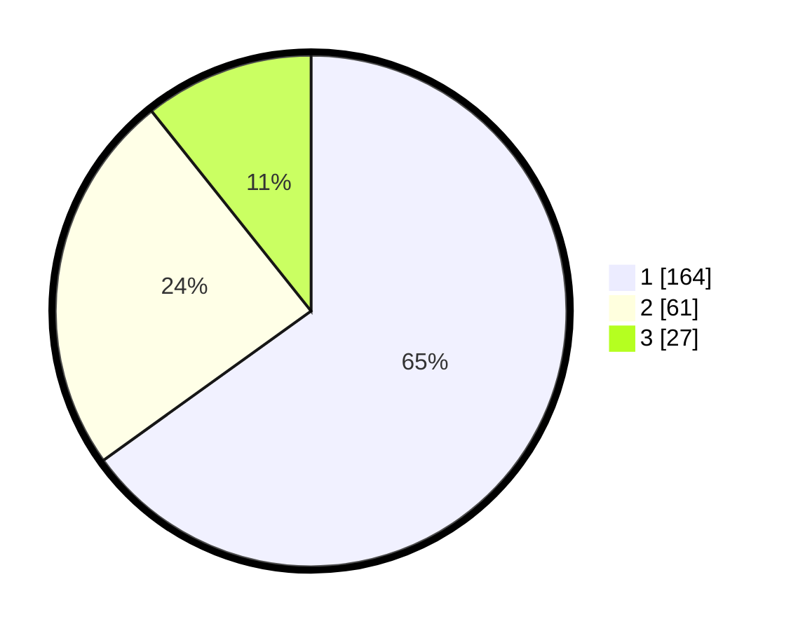

# Hasil

## Grafik

## Tabel

| No. | Nama Paslon    | Suara | Suara (raw) | Persentase |
|:--- |:-------------- | -----:| -----------:| ----------:|
| 1   | ANIES MUHAIMIN | 164   | [164][p-1]  | 65,08      |
| 2   | PRABOWO GIBRAN | 61    | [61][p-2]   | 24,21      |
| 3   | GANJAR MAHFUD  | 27    | [27][p-3]   | 10,71      |

[p-1]: https://github.com/gigit-pemilu/pemilu-2024/blob/main/pilpres/hitung-suara/sub/35-jawa-timur/sub/29-sumenep/sub/09-guluk-guluk/sub/2008-tambuko/sub/002-tps/sub/paslon-1.txt
[p-2]: https://github.com/gigit-pemilu/pemilu-2024/blob/main/pilpres/hitung-suara/sub/35-jawa-timur/sub/29-sumenep/sub/09-guluk-guluk/sub/2008-tambuko/sub/002-tps/sub/paslon-2.txt
[p-3]: https://github.com/gigit-pemilu/pemilu-2024/blob/main/pilpres/hitung-suara/sub/35-jawa-timur/sub/29-sumenep/sub/09-guluk-guluk/sub/2008-tambuko/sub/002-tps/sub/paslon-3.txt

## Foto C Plano

https://sirekap-obj-formc.kpu.go.id/f6e6/pemilu/ppwp/35/29/09/20/08/3529092008002-20240224-150454--fc116bd4-fd14-442f-98ed-f6fe9ccded7a.jpg

https://sirekap-obj-formc.kpu.go.id/f6e6/pemilu/ppwp/35/29/09/20/08/3529092008002-20240224-150600--a3962985-2fa9-428f-a3d6-8347a9ed2614.jpg

https://sirekap-obj-formc.kpu.go.id/f6e6/pemilu/ppwp/35/29/09/20/08/3529092008002-20240224-150643--a9b454e8-dc7c-495b-b4f7-171ea4db2e62.jpg

## Metadata

| Key        | Value               |
| ---------- | ------------------- |
| Time Stamp | 2024-02-28 19:00:00 |

