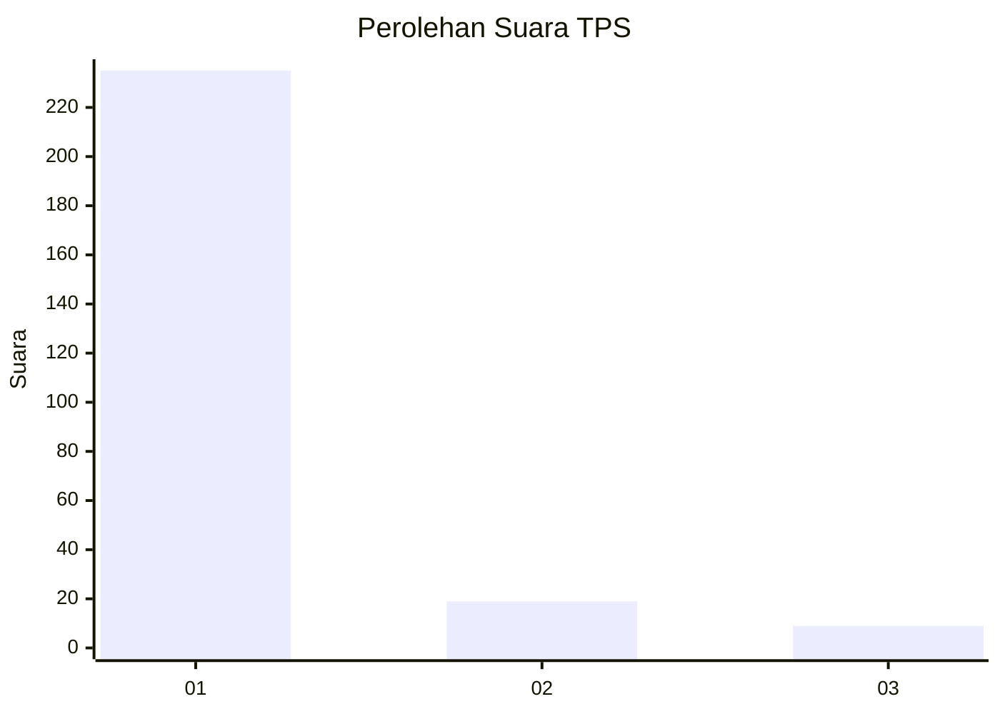
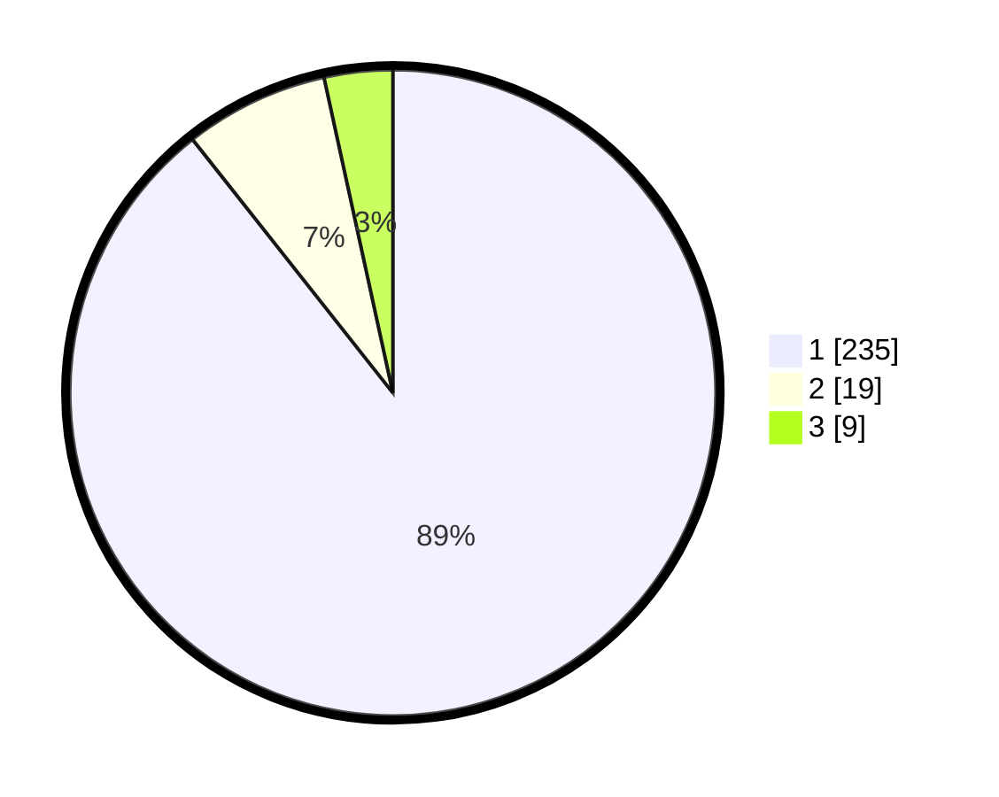

# Hasil

## Grafik

## Tabel

| No. | Nama Paslon    | Suara | Suara (raw) | Persentase |
|:--- |:-------------- | -----:| -----------:| ----------:|
| 1   | ANIES MUHAIMIN | 235   | [235][p-1]  | 89,35      |
| 2   | PRABOWO GIBRAN | 19    | [19][p-2]   | 7,22       |
| 3   | GANJAR MAHFUD  | 9     | [9][p-3]    | 3,42       |

[p-1]: https://github.com/gigit-pemilu/pemilu-2024-35-jawa-timur/blob/main/pilpres/hitung-suara/sub/35-jawa-timur/sub/29-sumenep/sub/09-guluk-guluk/sub/2008-tambuko/sub/003-tps/sub/paslon-1.txt
[p-2]: https://github.com/gigit-pemilu/pemilu-2024-35-jawa-timur/blob/main/pilpres/hitung-suara/sub/35-jawa-timur/sub/29-sumenep/sub/09-guluk-guluk/sub/2008-tambuko/sub/003-tps/sub/paslon-2.txt
[p-3]: https://github.com/gigit-pemilu/pemilu-2024-35-jawa-timur/blob/main/pilpres/hitung-suara/sub/35-jawa-timur/sub/29-sumenep/sub/09-guluk-guluk/sub/2008-tambuko/sub/003-tps/sub/paslon-3.txt

## Foto C Plano

https://sirekap-obj-formc.kpu.go.id/2b46/pemilu/ppwp/35/29/09/20/08/3529092008003-20240224-150722--82d368d8-1227-475a-8c62-8ac270a646f3.jpg

https://sirekap-obj-formc.kpu.go.id/2b46/pemilu/ppwp/35/29/09/20/08/3529092008003-20240224-150747--5d6009ae-b8fb-4aae-9ec1-68c3267089e8.jpg

https://sirekap-obj-formc.kpu.go.id/2b46/pemilu/ppwp/35/29/09/20/08/3529092008003-20240224-150912--7a82b4a7-5a2b-4dd0-a76c-f23e58c09339.jpg

## Metadata

| Key        | Value               |
| ---------- | ------------------- |
| Time Stamp | 2024-02-28 19:00:00 |

