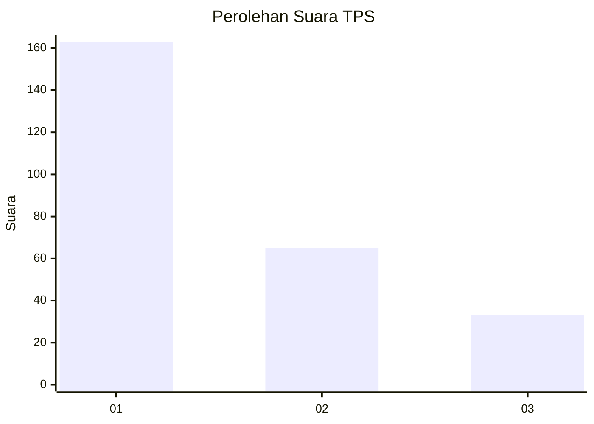
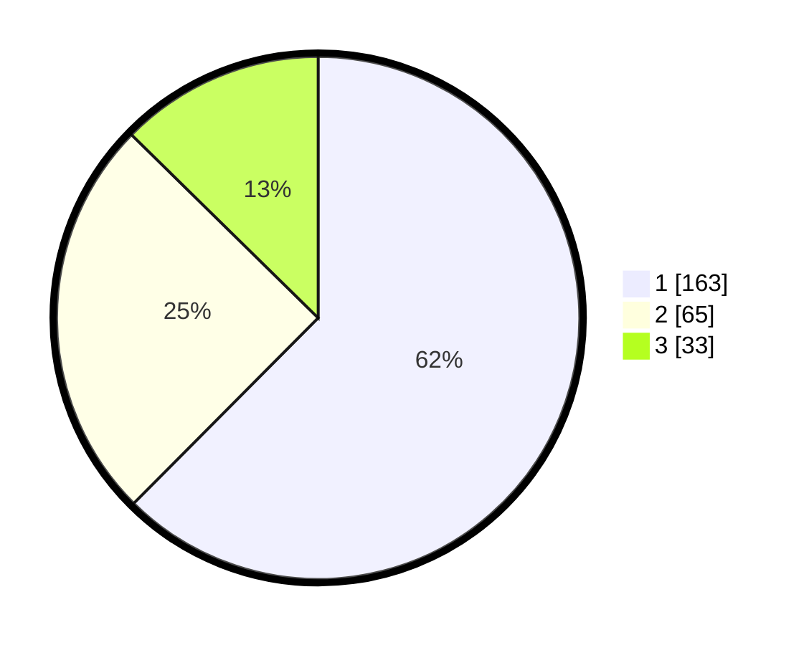

# Hasil

## Grafik

## Tabel

| No. | Nama Paslon    | Suara | Suara (raw) | Persentase |
|:--- |:-------------- | -----:| -----------:| ----------:|
| 1   | ANIES MUHAIMIN | 163   | [163][p-1]  | 62,45      |
| 2   | PRABOWO GIBRAN | 65    | [65][p-2]   | 24,90      |
| 3   | GANJAR MAHFUD  | 33    | [33][p-3]   | 12,64      |

[p-1]: https://github.com/gigit-pemilu/pemilu-2024-35-jawa-timur/blob/main/pilpres/hitung-suara/sub/35-jawa-timur/sub/29-sumenep/sub/09-guluk-guluk/sub/2008-tambuko/sub/004-tps/sub/paslon-1.txt
[p-2]: https://github.com/gigit-pemilu/pemilu-2024-35-jawa-timur/blob/main/pilpres/hitung-suara/sub/35-jawa-timur/sub/29-sumenep/sub/09-guluk-guluk/sub/2008-tambuko/sub/004-tps/sub/paslon-2.txt
[p-3]: https://github.com/gigit-pemilu/pemilu-2024-35-jawa-timur/blob/main/pilpres/hitung-suara/sub/35-jawa-timur/sub/29-sumenep/sub/09-guluk-guluk/sub/2008-tambuko/sub/004-tps/sub/paslon-3.txt

## Foto C Plano

https://sirekap-obj-formc.kpu.go.id/18e6/pemilu/ppwp/35/29/09/20/08/3529092008004-20240224-151251--4ea2f33f-5f9f-462b-ace0-b202d88b5ebf.jpg

https://sirekap-obj-formc.kpu.go.id/18e6/pemilu/ppwp/35/29/09/20/08/3529092008004-20240224-151324--47eca185-4650-487b-91b2-e3c4831c2822.jpg

https://sirekap-obj-formc.kpu.go.id/18e6/pemilu/ppwp/35/29/09/20/08/3529092008004-20240224-151358--1796774a-48e5-4a97-bbbe-131c31ddf3a0.jpg

## Metadata

| Key        | Value               |
| ---------- | ------------------- |
| Time Stamp | 2024-02-28 19:00:00 |

