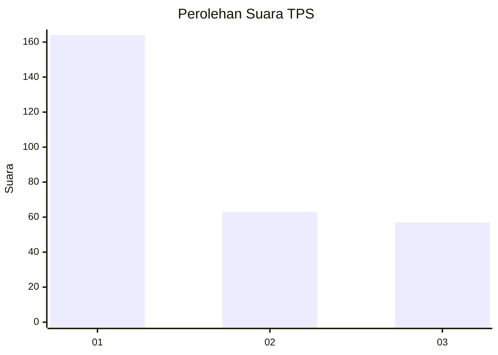
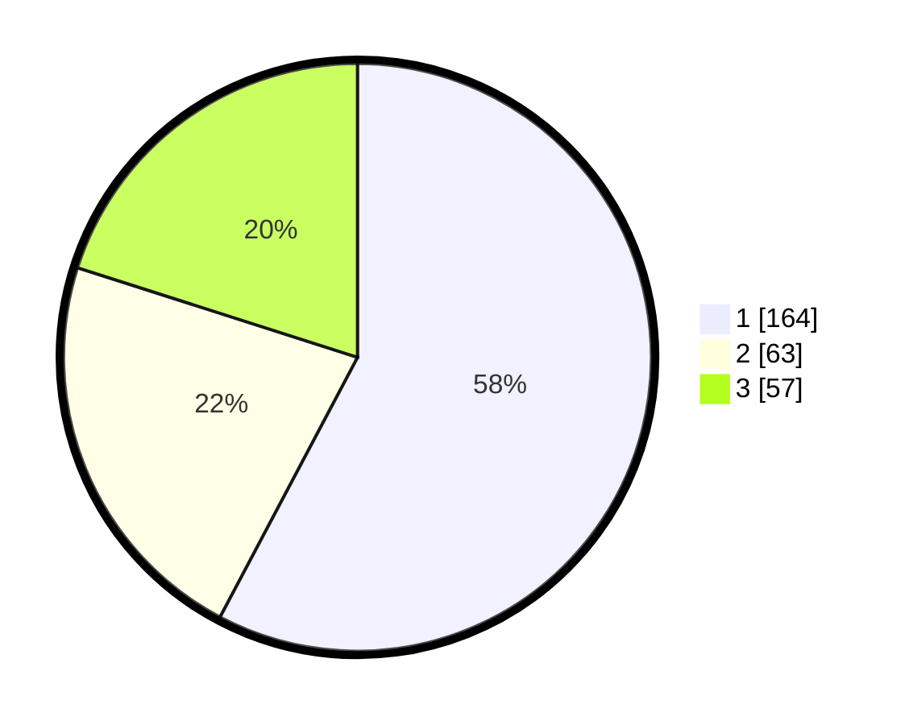

# Hasil

## Grafik

## Tabel

| No. | Nama Paslon    | Suara | Suara (raw) | Persentase |
|:--- |:-------------- | -----:| -----------:| ----------:|
| 1   | ANIES MUHAIMIN | 164   | [164][p-1]  | 57,75      |
| 2   | PRABOWO GIBRAN | 63    | [63][p-2]   | 22,18      |
| 3   | GANJAR MAHFUD  | 57    | [57][p-3]   | 20,07      |

[p-1]: https://github.com/gigit-pemilu/pemilu-2024-35-jawa-timur/blob/main/pilpres/hitung-suara/sub/35-jawa-timur/sub/29-sumenep/sub/09-guluk-guluk/sub/2008-tambuko/sub/005-tps/sub/paslon-1.txt
[p-2]: https://github.com/gigit-pemilu/pemilu-2024-35-jawa-timur/blob/main/pilpres/hitung-suara/sub/35-jawa-timur/sub/29-sumenep/sub/09-guluk-guluk/sub/2008-tambuko/sub/005-tps/sub/paslon-2.txt
[p-3]: https://github.com/gigit-pemilu/pemilu-2024-35-jawa-timur/blob/main/pilpres/hitung-suara/sub/35-jawa-timur/sub/29-sumenep/sub/09-guluk-guluk/sub/2008-tambuko/sub/005-tps/sub/paslon-3.txt

## Foto C Plano

https://sirekap-obj-formc.kpu.go.id/6ad5/pemilu/ppwp/35/29/09/20/08/3529092008005-20240224-152007--0760c7db-0303-46c6-8f63-c31e612bb3d3.jpg

https://sirekap-obj-formc.kpu.go.id/6ad5/pemilu/ppwp/35/29/09/20/08/3529092008005-20240224-152035--b7b322fb-adb4-4ef1-a324-0577a4038e09.jpg

https://sirekap-obj-formc.kpu.go.id/6ad5/pemilu/ppwp/35/29/09/20/08/3529092008005-20240224-152114--b3661eb7-4364-4028-a291-7d1e2b9b75a8.jpg

## Metadata

| Key        | Value               |
| ---------- | ------------------- |
| Time Stamp | 2024-02-28 19:00:00 |

