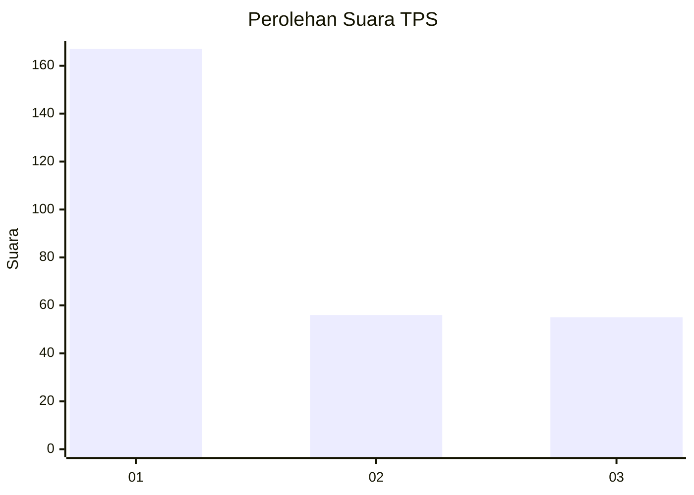
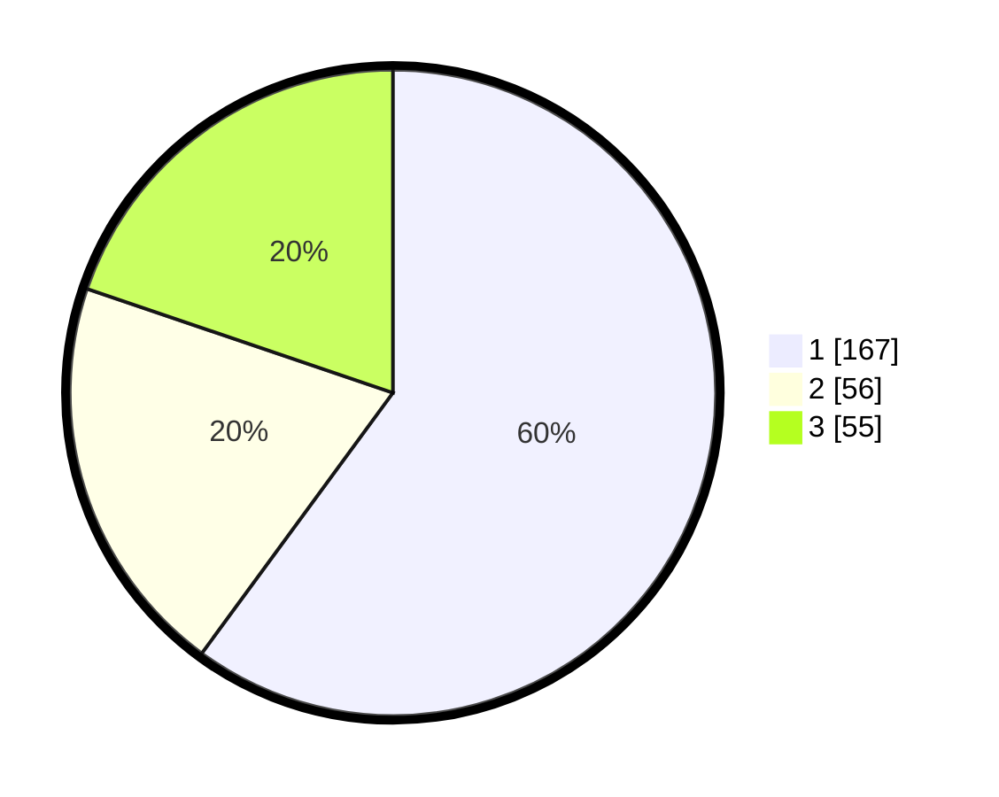

# Hasil

## Grafik

## Tabel

| No. | Nama Paslon    | Suara | Suara (raw) | Persentase |
|:--- |:-------------- | -----:| -----------:| ----------:|
| 1   | ANIES MUHAIMIN | 167   | [167][p-1]  | 60,07      |
| 2   | PRABOWO GIBRAN | 56    | [56][p-2]   | 20,14      |
| 3   | GANJAR MAHFUD  | 55    | [55][p-3]   | 19,78      |

[p-1]: https://github.com/gigit-pemilu/pemilu-2024-35-jawa-timur/blob/main/pilpres/hitung-suara/sub/35-jawa-timur/sub/29-sumenep/sub/09-guluk-guluk/sub/2008-tambuko/sub/006-tps/sub/paslon-1.txt
[p-2]: https://github.com/gigit-pemilu/pemilu-2024-35-jawa-timur/blob/main/pilpres/hitung-suara/sub/35-jawa-timur/sub/29-sumenep/sub/09-guluk-guluk/sub/2008-tambuko/sub/006-tps/sub/paslon-2.txt
[p-3]: https://github.com/gigit-pemilu/pemilu-2024-35-jawa-timur/blob/main/pilpres/hitung-suara/sub/35-jawa-timur/sub/29-sumenep/sub/09-guluk-guluk/sub/2008-tambuko/sub/006-tps/sub/paslon-3.txt

## Foto C Plano

https://sirekap-obj-formc.kpu.go.id/ab2a/pemilu/ppwp/35/29/09/20/08/3529092008006-20240224-152618--b9dd6dc6-f64c-4356-bb35-d0689ff40977.jpg

https://sirekap-obj-formc.kpu.go.id/ab2a/pemilu/ppwp/35/29/09/20/08/3529092008006-20240224-152648--5e13ecd9-d4eb-42f5-8679-33d6e2629c6a.jpg

https://sirekap-obj-formc.kpu.go.id/ab2a/pemilu/ppwp/35/29/09/20/08/3529092008006-20240224-152743--79f32802-9b90-450a-8b98-321a36965f74.jpg

## Metadata

| Key        | Value               |
| ---------- | ------------------- |
| Time Stamp | 2024-02-29 19:00:00 |

