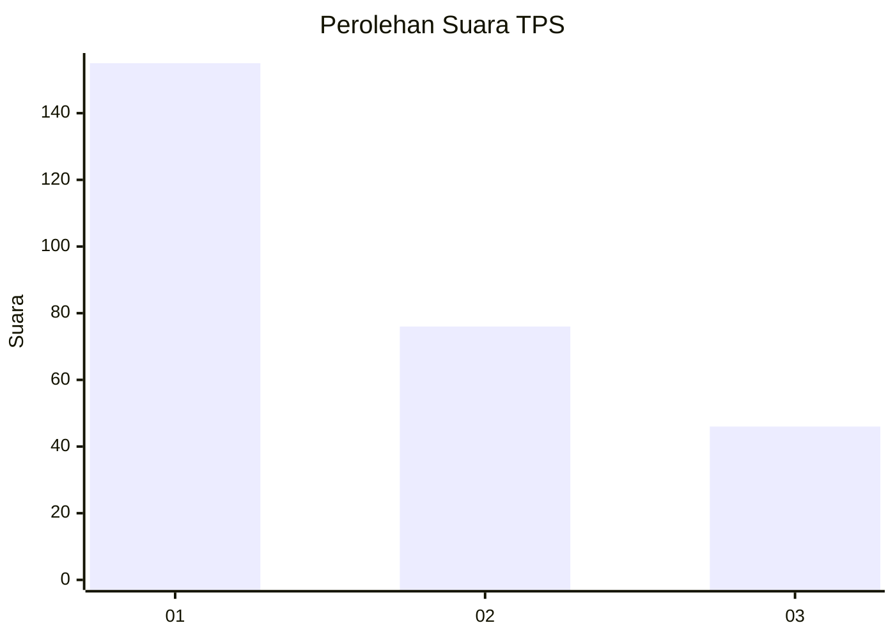
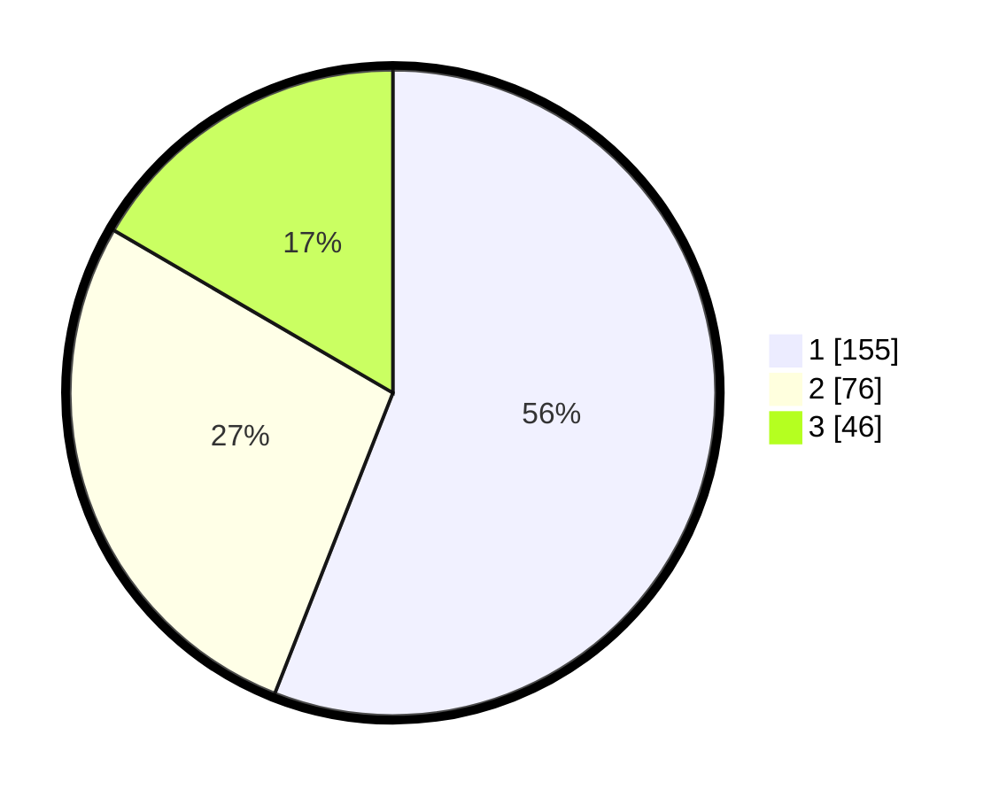

# Hasil

## Grafik

## Tabel

| No. | Nama Paslon    | Suara | Suara (raw) | Persentase |
|:--- |:-------------- | -----:| -----------:| ----------:|
| 1   | ANIES MUHAIMIN | 155   | [155][p-1]  | 55,96      |
| 2   | PRABOWO GIBRAN | 76    | [76][p-2]   | 27,44      |
| 3   | GANJAR MAHFUD  | 46    | [46][p-3]   | 16,61      |

[p-1]: https://github.com/gigit-pemilu/pemilu-2024/blob/main/pilpres/hitung-suara/sub/35-jawa-timur/sub/29-sumenep/sub/09-guluk-guluk/sub/2008-tambuko/sub/007-tps/sub/paslon-1.txt
[p-2]: https://github.com/gigit-pemilu/pemilu-2024/blob/main/pilpres/hitung-suara/sub/35-jawa-timur/sub/29-sumenep/sub/09-guluk-guluk/sub/2008-tambuko/sub/007-tps/sub/paslon-2.txt
[p-3]: https://github.com/gigit-pemilu/pemilu-2024/blob/main/pilpres/hitung-suara/sub/35-jawa-timur/sub/29-sumenep/sub/09-guluk-guluk/sub/2008-tambuko/sub/007-tps/sub/paslon-3.txt

## Foto C Plano

https://sirekap-obj-formc.kpu.go.id/247b/pemilu/ppwp/35/29/09/20/08/3529092008007-20240224-152829--4c568368-f5bc-4b4a-af01-372feb6ac7d6.jpg

https://sirekap-obj-formc.kpu.go.id/247b/pemilu/ppwp/35/29/09/20/08/3529092008007-20240224-152857--59593c58-ca78-4713-b8d2-beaf228919ad.jpg

https://sirekap-obj-formc.kpu.go.id/247b/pemilu/ppwp/35/29/09/20/08/3529092008007-20240224-152941--e0159e42-ce76-43ec-917d-502fbcf8efa8.jpg

## Metadata

| Key        | Value               |
| ---------- | ------------------- |
| Time Stamp | 2024-02-28 19:00:00 |

