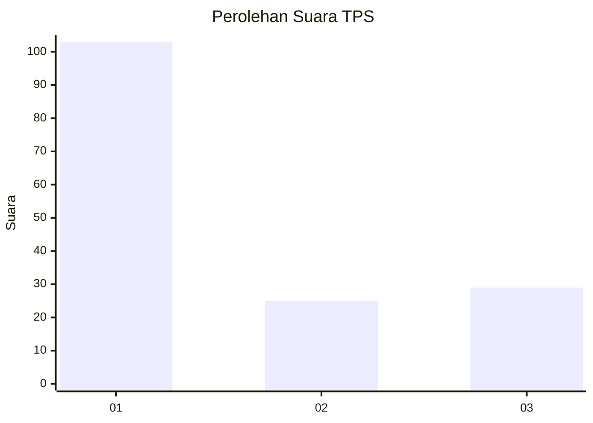
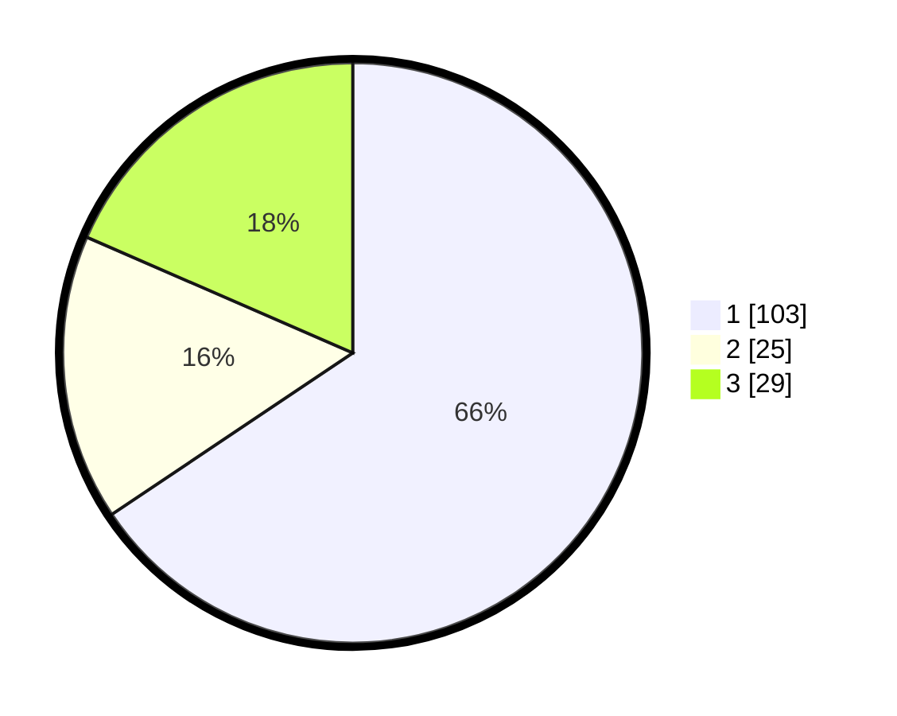

# Hasil

## Grafik

## Tabel

| No. | Nama Paslon    | Suara | Suara (raw) | Persentase |
|:--- |:-------------- | -----:| -----------:| ----------:|
| 1   | ANIES MUHAIMIN | 103   | [103][p-1]  | 65,61      |
| 2   | PRABOWO GIBRAN | 25    | [25][p-2]   | 15,92      |
| 3   | GANJAR MAHFUD  | 29    | [29][p-3]   | 18,47      |

[p-1]: https://github.com/gigit-pemilu/pemilu-2024/blob/main/pilpres/hitung-suara/sub/35-jawa-timur/sub/29-sumenep/sub/09-guluk-guluk/sub/2008-tambuko/sub/008-tps/sub/paslon-1.txt
[p-2]: https://github.com/gigit-pemilu/pemilu-2024/blob/main/pilpres/hitung-suara/sub/35-jawa-timur/sub/29-sumenep/sub/09-guluk-guluk/sub/2008-tambuko/sub/008-tps/sub/paslon-2.txt
[p-3]: https://github.com/gigit-pemilu/pemilu-2024/blob/main/pilpres/hitung-suara/sub/35-jawa-timur/sub/29-sumenep/sub/09-guluk-guluk/sub/2008-tambuko/sub/008-tps/sub/paslon-3.txt

## Foto C Plano

https://sirekap-obj-formc.kpu.go.id/23b9/pemilu/ppwp/35/29/09/20/08/3529092008008-20240224-153659--ef39b8f6-a095-4d02-be10-29d910d29e72.jpg

https://sirekap-obj-formc.kpu.go.id/23b9/pemilu/ppwp/35/29/09/20/08/3529092008008-20240224-153724--6211932d-dcd1-4566-92b0-ff23ed6eae5f.jpg

https://sirekap-obj-formc.kpu.go.id/23b9/pemilu/ppwp/35/29/09/20/08/3529092008008-20240224-153751--dfd3a81c-4b61-47ea-bf06-49d02a5a8651.jpg

## Metadata

| Key        | Value               |
| ---------- | ------------------- |
| Time Stamp | 2024-02-29 16:00:00 |

