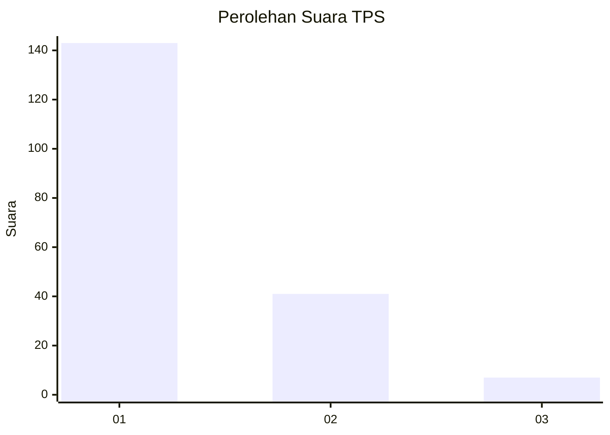
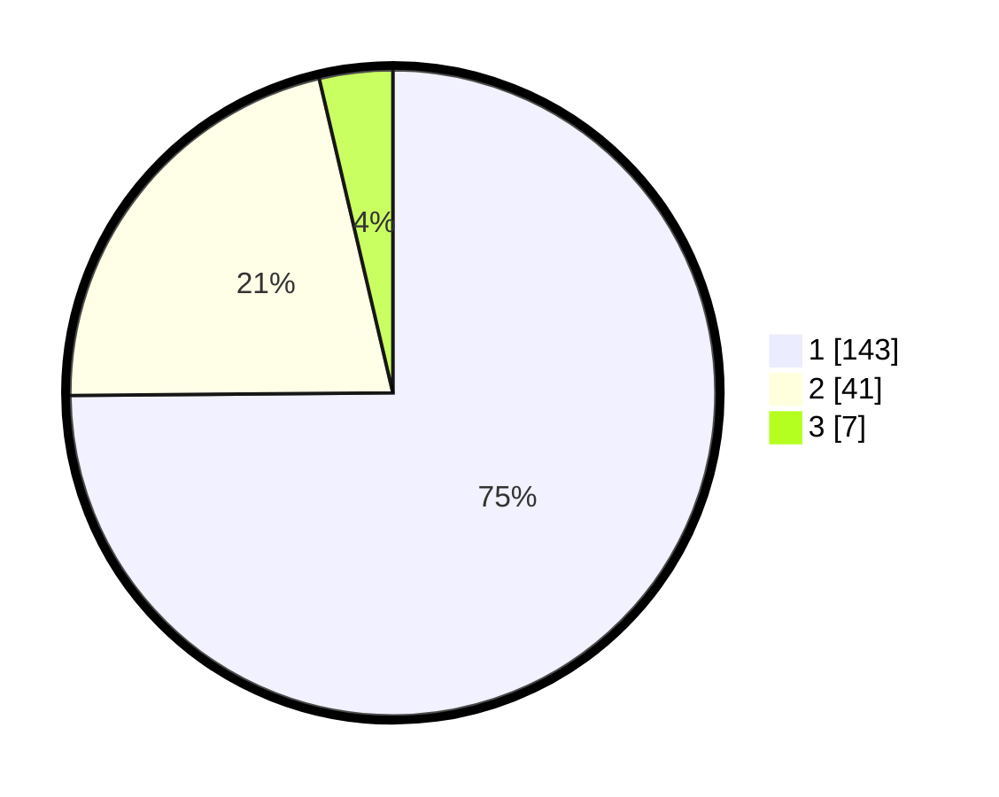

# Hasil

## Grafik

## Tabel

| No. | Nama Paslon    | Suara | Suara (raw) | Persentase |
|:--- |:-------------- | -----:| -----------:| ----------:|
| 1   | ANIES MUHAIMIN | 143   | [143][p-1]  | 74,87      |
| 2   | PRABOWO GIBRAN | 41    | [41][p-2]   | 21,47      |
| 3   | GANJAR MAHFUD  | 7     | [7][p-3]    | 3,66       |

[p-1]: https://github.com/gigit-pemilu/pemilu-2024-35-jawa-timur/blob/main/pilpres/hitung-suara/sub/35-jawa-timur/sub/29-sumenep/sub/09-guluk-guluk/sub/2008-tambuko/sub/009-tps/sub/paslon-1.txt
[p-2]: https://github.com/gigit-pemilu/pemilu-2024-35-jawa-timur/blob/main/pilpres/hitung-suara/sub/35-jawa-timur/sub/29-sumenep/sub/09-guluk-guluk/sub/2008-tambuko/sub/009-tps/sub/paslon-2.txt
[p-3]: https://github.com/gigit-pemilu/pemilu-2024-35-jawa-timur/blob/main/pilpres/hitung-suara/sub/35-jawa-timur/sub/29-sumenep/sub/09-guluk-guluk/sub/2008-tambuko/sub/009-tps/sub/paslon-3.txt

## Foto C Plano

https://sirekap-obj-formc.kpu.go.id/05c1/pemilu/ppwp/35/29/09/20/08/3529092008009-20240224-155015--e4bec327-fdbe-4081-bf14-cc99af8b0c19.jpg

https://sirekap-obj-formc.kpu.go.id/05c1/pemilu/ppwp/35/29/09/20/08/3529092008009-20240224-155044--7c22ad97-b4cd-43fd-8ce3-26c909c28120.jpg

https://sirekap-obj-formc.kpu.go.id/05c1/pemilu/ppwp/35/29/09/20/08/3529092008009-20240224-155211--19b68d2b-b380-4645-b206-e71a15044c1f.jpg

## Metadata

| Key        | Value               |
| ---------- | ------------------- |
| Time Stamp | 2024-02-28 19:00:00 |

