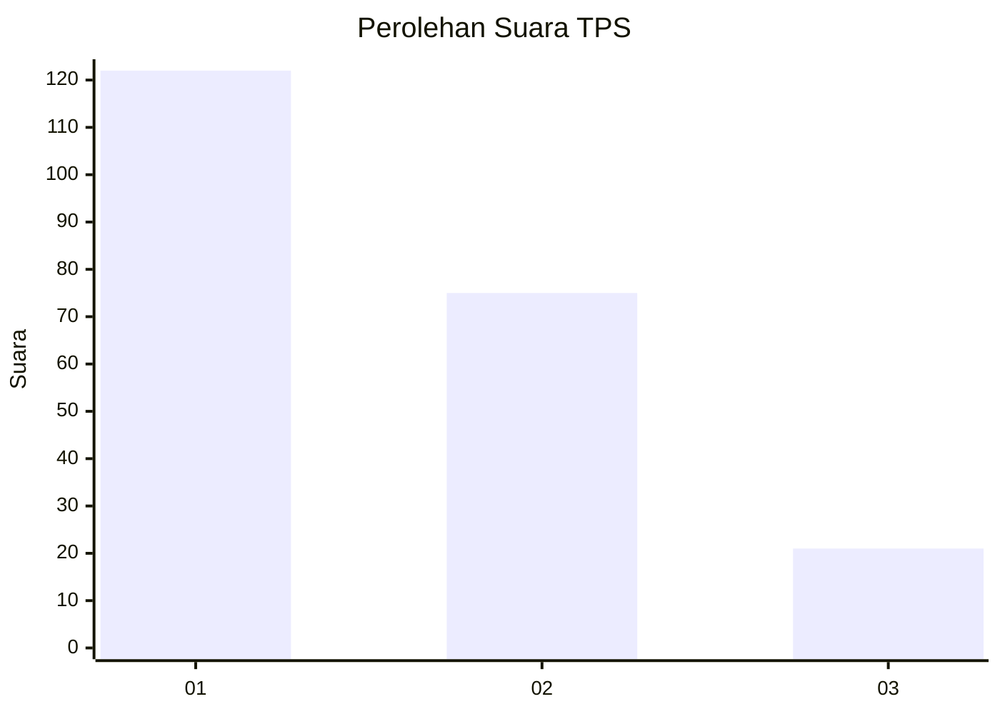
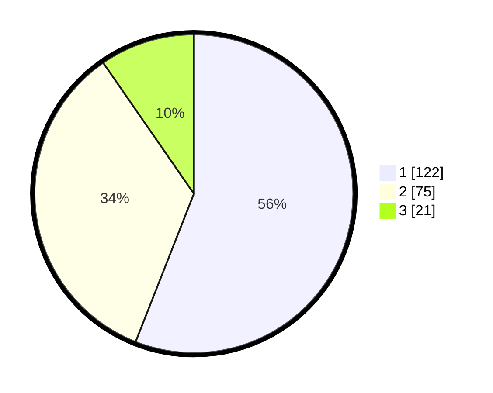

# Hasil

## Grafik

## Tabel

| No. | Nama Paslon    | Suara | Suara (raw) | Persentase |
|:--- |:-------------- | -----:| -----------:| ----------:|
| 1   | ANIES MUHAIMIN | 122   | [122][p-1]  | 55,96      |
| 2   | PRABOWO GIBRAN | 75    | [75][p-2]   | 34,40      |
| 3   | GANJAR MAHFUD  | 21    | [21][p-3]   | 9,63       |

[p-1]: https://github.com/gigit-pemilu/pemilu-2024/blob/main/pilpres/hitung-suara/sub/35-jawa-timur/sub/29-sumenep/sub/09-guluk-guluk/sub/2009-payudan-nangger/sub/001-tps/sub/paslon-1.txt
[p-2]: https://github.com/gigit-pemilu/pemilu-2024/blob/main/pilpres/hitung-suara/sub/35-jawa-timur/sub/29-sumenep/sub/09-guluk-guluk/sub/2009-payudan-nangger/sub/001-tps/sub/paslon-2.txt
[p-3]: https://github.com/gigit-pemilu/pemilu-2024/blob/main/pilpres/hitung-suara/sub/35-jawa-timur/sub/29-sumenep/sub/09-guluk-guluk/sub/2009-payudan-nangger/sub/001-tps/sub/paslon-3.txt

## Foto C Plano

https://sirekap-obj-formc.kpu.go.id/48f5/pemilu/ppwp/35/29/09/20/09/3529092009001-20240224-154938--92d2a376-1679-4ece-aa96-11b7b9563372.jpg

https://sirekap-obj-formc.kpu.go.id/48f5/pemilu/ppwp/35/29/09/20/09/3529092009001-20240224-155005--04111312-4ac6-4daa-9a52-98da81cea494.jpg

https://sirekap-obj-formc.kpu.go.id/48f5/pemilu/ppwp/35/29/09/20/09/3529092009001-20240224-155033--d3b31ec7-c53c-47a6-aa8a-368c321dba79.jpg

## Metadata

| Key        | Value               |
| ---------- | ------------------- |
| Time Stamp | 2024-02-28 19:00:00 |

