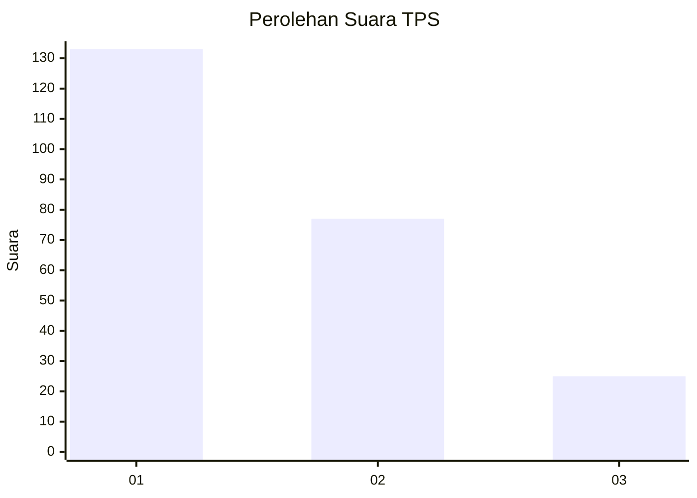
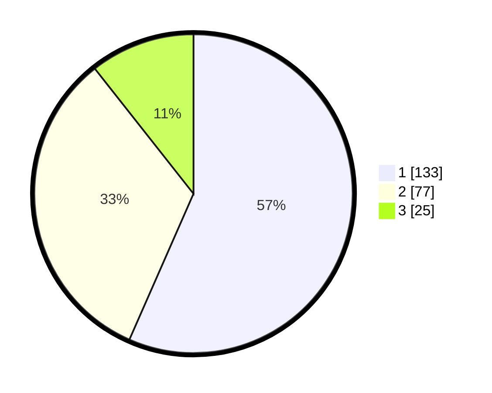

# Hasil

## Grafik

## Tabel

| No. | Nama Paslon    | Suara | Suara (raw) | Persentase |
|:--- |:-------------- | -----:| -----------:| ----------:|
| 1   | ANIES MUHAIMIN | 133   | [133][p-1]  | 56,60      |
| 2   | PRABOWO GIBRAN | 77    | [77][p-2]   | 32,77      |
| 3   | GANJAR MAHFUD  | 25    | [25][p-3]   | 10,64      |

[p-1]: https://github.com/gigit-pemilu/pemilu-2024-35-jawa-timur/blob/main/pilpres/hitung-suara/sub/35-jawa-timur/sub/29-sumenep/sub/09-guluk-guluk/sub/2009-payudan-nangger/sub/002-tps/sub/paslon-1.txt
[p-2]: https://github.com/gigit-pemilu/pemilu-2024-35-jawa-timur/blob/main/pilpres/hitung-suara/sub/35-jawa-timur/sub/29-sumenep/sub/09-guluk-guluk/sub/2009-payudan-nangger/sub/002-tps/sub/paslon-2.txt
[p-3]: https://github.com/gigit-pemilu/pemilu-2024-35-jawa-timur/blob/main/pilpres/hitung-suara/sub/35-jawa-timur/sub/29-sumenep/sub/09-guluk-guluk/sub/2009-payudan-nangger/sub/002-tps/sub/paslon-3.txt

## Foto C Plano

https://sirekap-obj-formc.kpu.go.id/9635/pemilu/ppwp/35/29/09/20/09/3529092009002-20240224-155148--893703b5-a93f-4b3e-9e68-7d77ac57bbe5.jpg

https://sirekap-obj-formc.kpu.go.id/9635/pemilu/ppwp/35/29/09/20/09/3529092009002-20240224-155219--c4de3dd6-59a8-4eb0-a271-ee4d80080d1f.jpg

https://sirekap-obj-formc.kpu.go.id/9635/pemilu/ppwp/35/29/09/20/09/3529092009002-20240224-155241--bcfc4169-700c-4be9-9f4c-6593c74b9fed.jpg

## Metadata

| Key        | Value               |
| ---------- | ------------------- |
| Time Stamp | 2024-02-28 20:00:00 |

