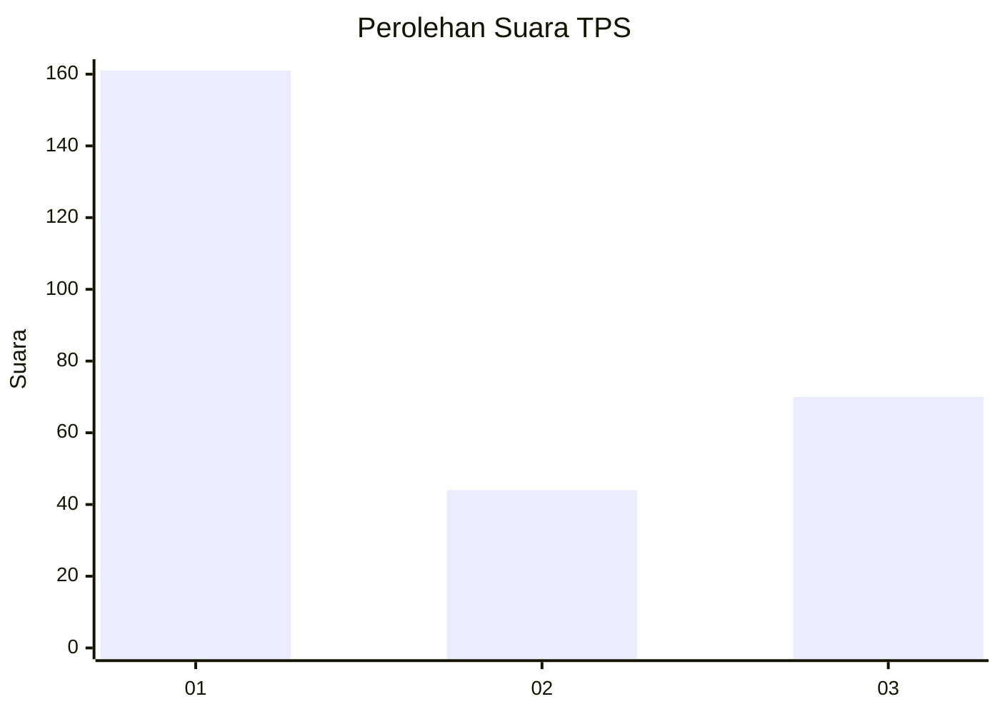
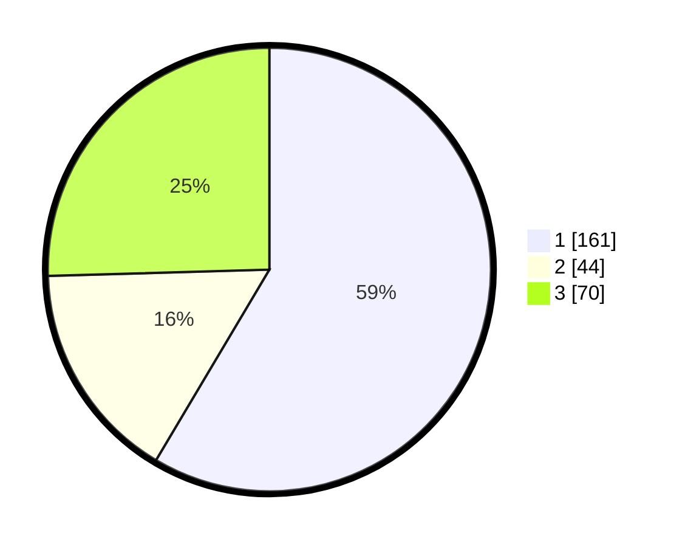

# Hasil

## Grafik

## Tabel

| No. | Nama Paslon    | Suara | Suara (raw) | Persentase |
|:--- |:-------------- | -----:| -----------:| ----------:|
| 1   | ANIES MUHAIMIN | 161   | [161][p-1]  | 58,55      |
| 2   | PRABOWO GIBRAN | 44    | [44][p-2]   | 16,00      |
| 3   | GANJAR MAHFUD  | 70    | [70][p-3]   | 25,45      |

[p-1]: https://github.com/gigit-pemilu/pemilu-2024/blob/main/pilpres/hitung-suara/sub/35-jawa-timur/sub/29-sumenep/sub/09-guluk-guluk/sub/2009-payudan-nangger/sub/003-tps/sub/paslon-1.txt
[p-2]: https://github.com/gigit-pemilu/pemilu-2024/blob/main/pilpres/hitung-suara/sub/35-jawa-timur/sub/29-sumenep/sub/09-guluk-guluk/sub/2009-payudan-nangger/sub/003-tps/sub/paslon-2.txt
[p-3]: https://github.com/gigit-pemilu/pemilu-2024/blob/main/pilpres/hitung-suara/sub/35-jawa-timur/sub/29-sumenep/sub/09-guluk-guluk/sub/2009-payudan-nangger/sub/003-tps/sub/paslon-3.txt

## Foto C Plano

https://sirekap-obj-formc.kpu.go.id/1382/pemilu/ppwp/35/29/09/20/09/3529092009003-20240224-160344--9a59f828-31e6-4ad3-8320-8b238cd75e66.jpg

https://sirekap-obj-formc.kpu.go.id/1382/pemilu/ppwp/35/29/09/20/09/3529092009003-20240224-160415--c1e5a712-50ac-44d3-8104-7b87bc8e967c.jpg

https://sirekap-obj-formc.kpu.go.id/1382/pemilu/ppwp/35/29/09/20/09/3529092009003-20240224-160220--9ff61ca3-607b-4022-88da-b67bbdfd9893.jpg

## Metadata

| Key        | Value               |
| ---------- | ------------------- |
| Time Stamp | 2024-02-28 19:00:00 |

