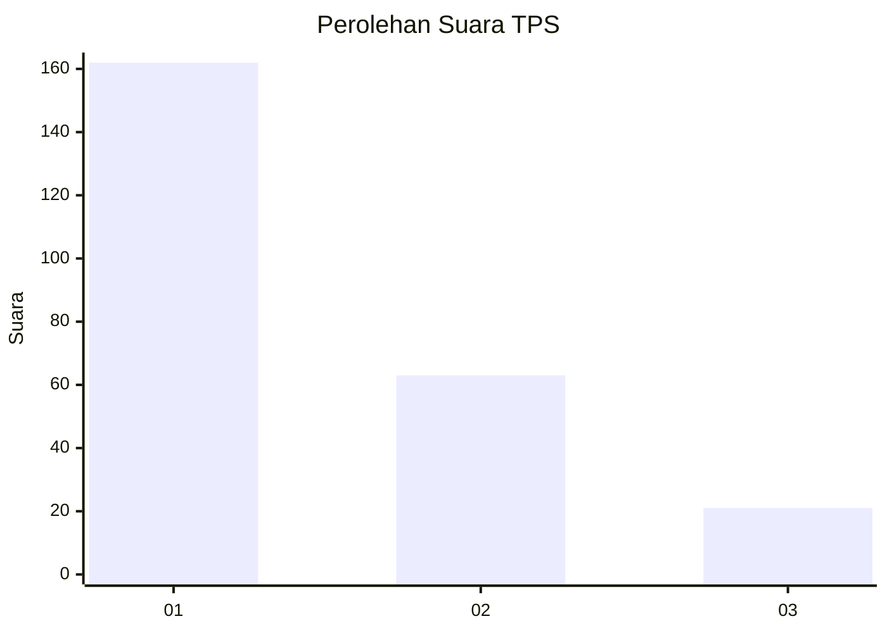
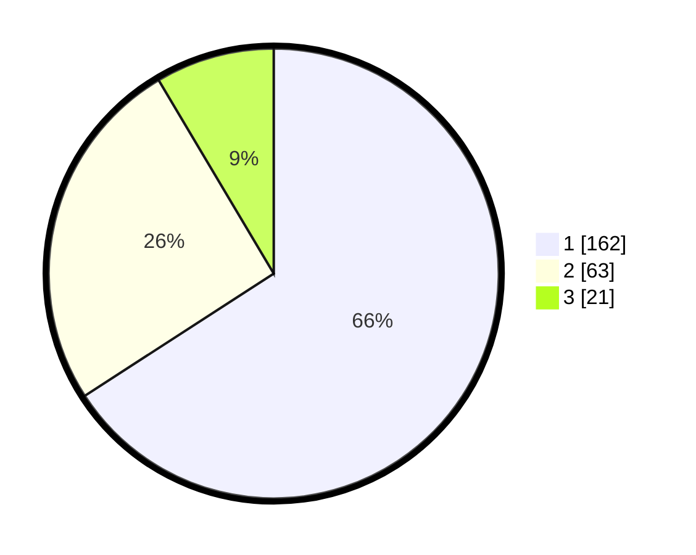

# Hasil

## Grafik

## Tabel

| No. | Nama Paslon    | Suara | Suara (raw) | Persentase |
|:--- |:-------------- | -----:| -----------:| ----------:|
| 1   | ANIES MUHAIMIN | 162   | [162][p-1]  | 65,85      |
| 2   | PRABOWO GIBRAN | 63    | [63][p-2]   | 25,61      |
| 3   | GANJAR MAHFUD  | 21    | [21][p-3]   | 8,54       |

[p-1]: https://github.com/gigit-pemilu/pemilu-2024-35-jawa-timur/blob/main/pilpres/hitung-suara/sub/35-jawa-timur/sub/29-sumenep/sub/09-guluk-guluk/sub/2009-payudan-nangger/sub/004-tps/sub/paslon-1.txt
[p-2]: https://github.com/gigit-pemilu/pemilu-2024-35-jawa-timur/blob/main/pilpres/hitung-suara/sub/35-jawa-timur/sub/29-sumenep/sub/09-guluk-guluk/sub/2009-payudan-nangger/sub/004-tps/sub/paslon-2.txt
[p-3]: https://github.com/gigit-pemilu/pemilu-2024-35-jawa-timur/blob/main/pilpres/hitung-suara/sub/35-jawa-timur/sub/29-sumenep/sub/09-guluk-guluk/sub/2009-payudan-nangger/sub/004-tps/sub/paslon-3.txt

## Foto C Plano

https://sirekap-obj-formc.kpu.go.id/e180/pemilu/ppwp/35/29/09/20/09/3529092009004-20240224-160314--94262659-c640-4385-a5f7-921c21feb841.jpg

https://sirekap-obj-formc.kpu.go.id/e180/pemilu/ppwp/35/29/09/20/09/3529092009004-20240224-160336--1923ab9b-7b8a-440c-8214-2209e248561a.jpg

https://sirekap-obj-formc.kpu.go.id/e180/pemilu/ppwp/35/29/09/20/09/3529092009004-20240224-160405--93e89c2a-3ba3-435b-9b93-7135d89e366d.jpg

## Metadata

| Key        | Value               |
| ---------- | ------------------- |
| Time Stamp | 2024-02-28 19:00:00 |

