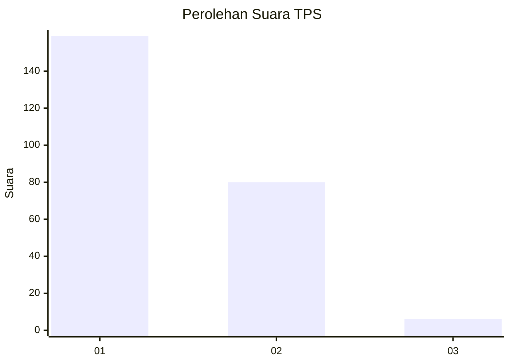
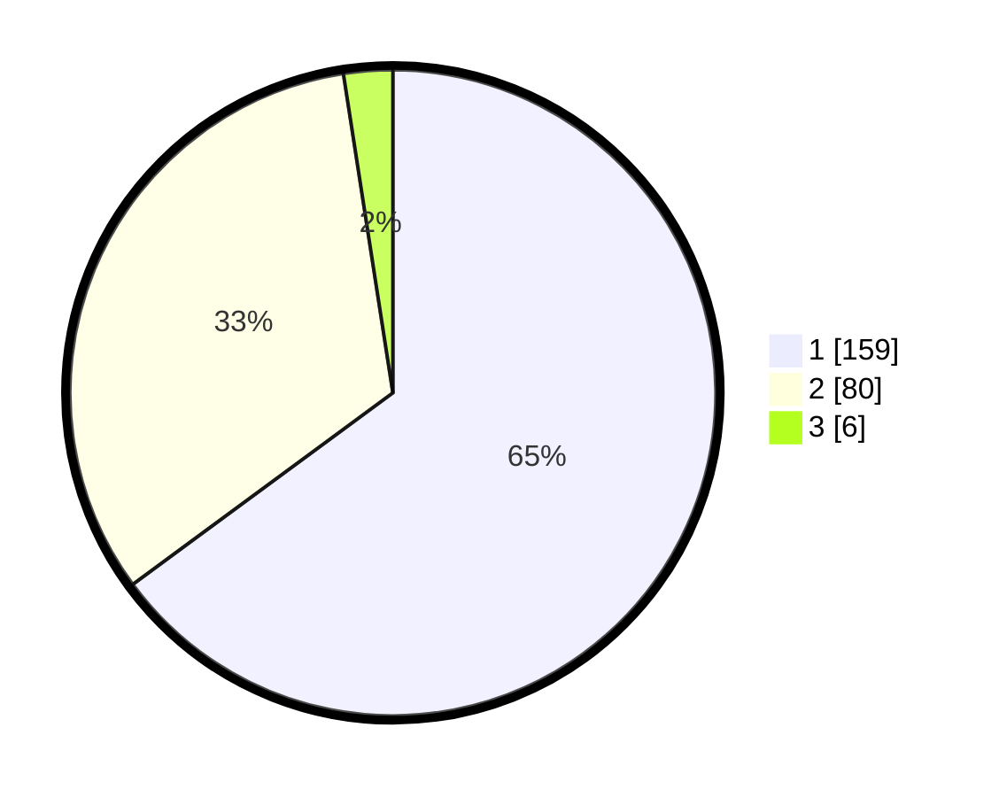

# Hasil

## Grafik

## Tabel

| No. | Nama Paslon    | Suara | Suara (raw) | Persentase |
|:--- |:-------------- | -----:| -----------:| ----------:|
| 1   | ANIES MUHAIMIN | 159   | [159][p-1]  | 64,90      |
| 2   | PRABOWO GIBRAN | 80    | [80][p-2]   | 32,65      |
| 3   | GANJAR MAHFUD  | 6     | [6][p-3]    | 2,45       |

[p-1]: https://github.com/gigit-pemilu/pemilu-2024/blob/main/pilpres/hitung-suara/sub/35-jawa-timur/sub/29-sumenep/sub/09-guluk-guluk/sub/2010-payudan-daleman/sub/001-tps/sub/paslon-1.txt
[p-2]: https://github.com/gigit-pemilu/pemilu-2024/blob/main/pilpres/hitung-suara/sub/35-jawa-timur/sub/29-sumenep/sub/09-guluk-guluk/sub/2010-payudan-daleman/sub/001-tps/sub/paslon-2.txt
[p-3]: https://github.com/gigit-pemilu/pemilu-2024/blob/main/pilpres/hitung-suara/sub/35-jawa-timur/sub/29-sumenep/sub/09-guluk-guluk/sub/2010-payudan-daleman/sub/001-tps/sub/paslon-3.txt

## Foto C Plano

https://sirekap-obj-formc.kpu.go.id/30c2/pemilu/ppwp/35/29/09/20/10/3529092010001-20240225-100158--8693ba04-2aa0-4d5c-8cb4-04cb3f0f1750.jpg

https://sirekap-obj-formc.kpu.go.id/30c2/pemilu/ppwp/35/29/09/20/10/3529092010001-20240225-100246--03035985-20a6-4f7b-aa26-36fd00201d7c.jpg

https://sirekap-obj-formc.kpu.go.id/30c2/pemilu/ppwp/35/29/09/20/10/3529092010001-20240225-100325--e2445739-b433-4196-bc25-fea8c68042a9.jpg

## Metadata

| Key        | Value               |
| ---------- | ------------------- |
| Time Stamp | 2024-03-01 15:00:00 |

