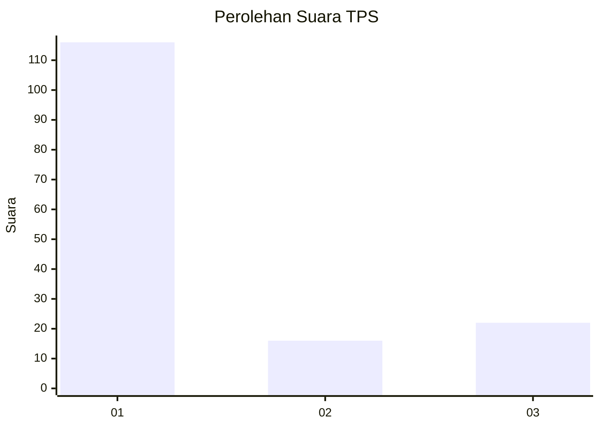
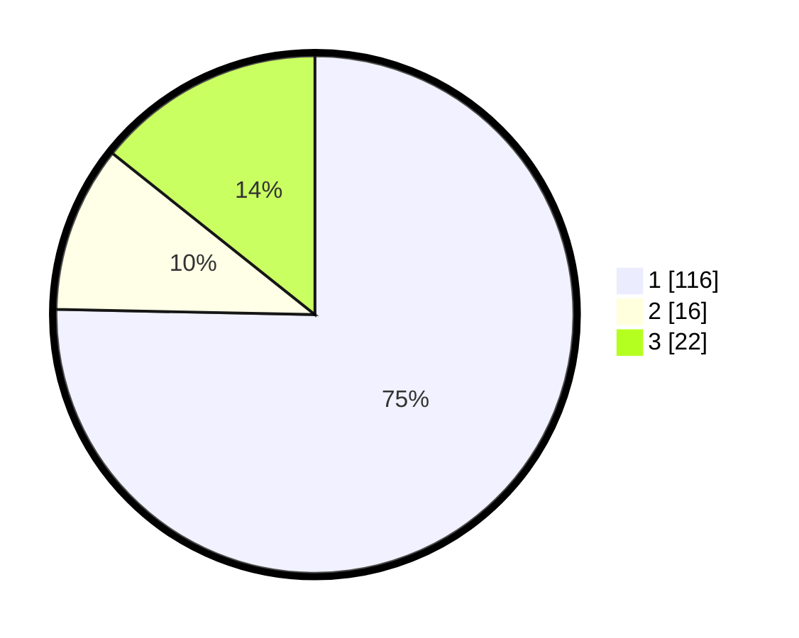

# Hasil

## Grafik

## Tabel

| No. | Nama Paslon    | Suara | Suara (raw) | Persentase |
|:--- |:-------------- | -----:| -----------:| ----------:|
| 1   | ANIES MUHAIMIN | 116   | [116][p-1]  | 75,32      |
| 2   | PRABOWO GIBRAN | 16    | [16][p-2]   | 10,39      |
| 3   | GANJAR MAHFUD  | 22    | [22][p-3]   | 14,29      |

[p-1]: https://github.com/gigit-pemilu/pemilu-2024-35-jawa-timur/blob/main/pilpres/hitung-suara/sub/35-jawa-timur/sub/29-sumenep/sub/09-guluk-guluk/sub/2010-payudan-daleman/sub/003-tps/sub/paslon-1.txt
[p-2]: https://github.com/gigit-pemilu/pemilu-2024-35-jawa-timur/blob/main/pilpres/hitung-suara/sub/35-jawa-timur/sub/29-sumenep/sub/09-guluk-guluk/sub/2010-payudan-daleman/sub/003-tps/sub/paslon-2.txt
[p-3]: https://github.com/gigit-pemilu/pemilu-2024-35-jawa-timur/blob/main/pilpres/hitung-suara/sub/35-jawa-timur/sub/29-sumenep/sub/09-guluk-guluk/sub/2010-payudan-daleman/sub/003-tps/sub/paslon-3.txt

## Foto C Plano

https://sirekap-obj-formc.kpu.go.id/dc30/pemilu/ppwp/35/29/09/20/10/3529092010003-20240225-104115--e7a931b7-b9fa-4f35-901a-42e90029c4ad.jpg

https://sirekap-obj-formc.kpu.go.id/dc30/pemilu/ppwp/35/29/09/20/10/3529092010003-20240225-104144--295635da-7c43-42ad-85a0-b34cd6dcccdd.jpg

https://sirekap-obj-formc.kpu.go.id/dc30/pemilu/ppwp/35/29/09/20/10/3529092010003-20240225-092445--162c68ba-7ff0-405e-a8ba-7b62c2cdaa31.jpg

## Metadata

| Key        | Value               |
| ---------- | ------------------- |
| Time Stamp | 2024-02-25 12:00:00 |

## DATA PEMILIH TETAP

Jumlah pemilih dalam DPT: **284**.
 * L: **126**.
 * P: **158**.

## DATA PENGGUNA HAK PILIH

Jumlah pengguna hak pilih dalam DPT: **256**.
 * L: **223**.
 * P: **223**.

Jumlah pengguna hak pilih dalam DPTb: **70**.
 * L: **570**.
 * P: **70**.

Jumlah pengguna hak pilih dalam DPK: **7**.
 * L: **57**.
 * P: **10**.

Jumlah pengguna hak pilih: **256**.
 * L: **113**.
 * P: **143**.

## JUMLAH SUARA SAH DAN TIDAK SAH

JUMLAH SELURUH SUARA SAH: **249**.

JUMLAH SUARA TIDAK SAH: **107**.

JUMLAH SELURUH SUARA SAH DAN SUARA TIDAK SAH: **296**.

