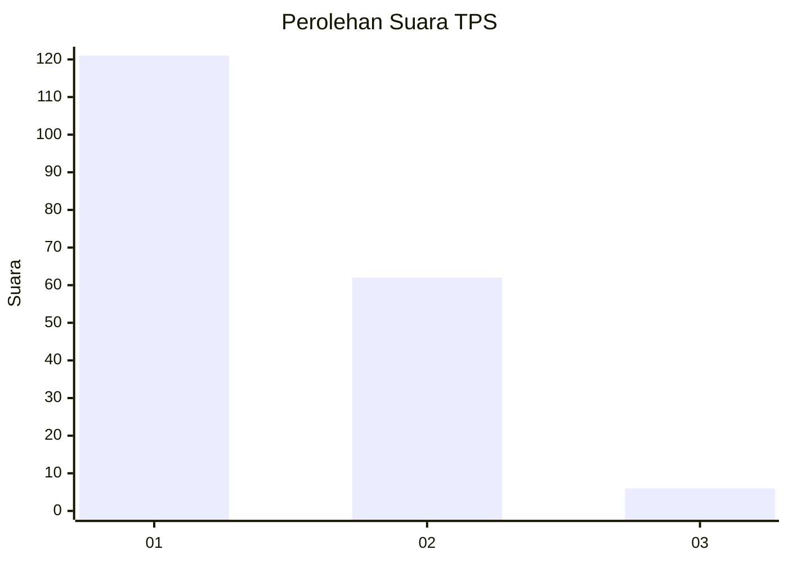
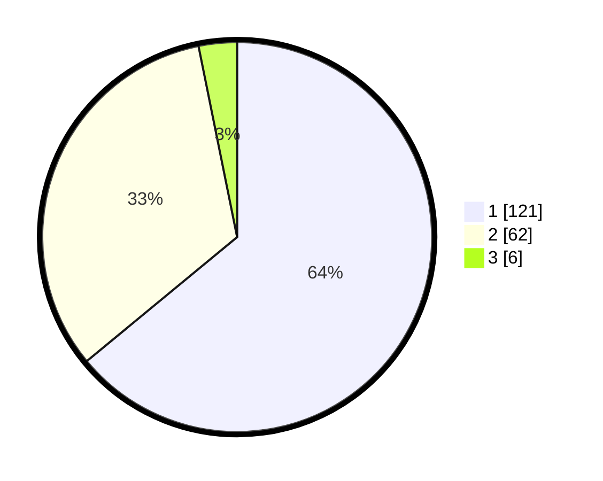

# Hasil

## Grafik

## Tabel

| No. | Nama Paslon    | Suara | Suara (raw) | Persentase |
|:--- |:-------------- | -----:| -----------:| ----------:|
| 1   | ANIES MUHAIMIN | 121   | [121][p-1]  | 64,02      |
| 2   | PRABOWO GIBRAN | 62    | [62][p-2]   | 32,80      |
| 3   | GANJAR MAHFUD  | 6     | [6][p-3]    | 3,17       |

[p-1]: https://github.com/gigit-pemilu/pemilu-2024/blob/main/pilpres/hitung-suara/sub/35-jawa-timur/sub/29-sumenep/sub/09-guluk-guluk/sub/2010-payudan-daleman/sub/009-tps/sub/paslon-1.txt
[p-2]: https://github.com/gigit-pemilu/pemilu-2024/blob/main/pilpres/hitung-suara/sub/35-jawa-timur/sub/29-sumenep/sub/09-guluk-guluk/sub/2010-payudan-daleman/sub/009-tps/sub/paslon-2.txt
[p-3]: https://github.com/gigit-pemilu/pemilu-2024/blob/main/pilpres/hitung-suara/sub/35-jawa-timur/sub/29-sumenep/sub/09-guluk-guluk/sub/2010-payudan-daleman/sub/009-tps/sub/paslon-3.txt

## Foto C Plano

https://sirekap-obj-formc.kpu.go.id/79bc/pemilu/ppwp/35/29/09/20/10/3529092010009-20240225-095907--fb75125c-8f09-4bd9-87b5-dc4f72511fe8.jpg

https://sirekap-obj-formc.kpu.go.id/79bc/pemilu/ppwp/35/29/09/20/10/3529092010009-20240225-095929--aa108e07-2876-4bf1-afe7-c950a6cece42.jpg

https://sirekap-obj-formc.kpu.go.id/79bc/pemilu/ppwp/35/29/09/20/10/3529092010009-20240225-095952--f1cd89f4-0d57-4755-835d-0b51ddd16e93.jpg

## Metadata

| Key        | Value               |
| ---------- | ------------------- |
| Time Stamp | 2024-02-28 20:00:00 |

