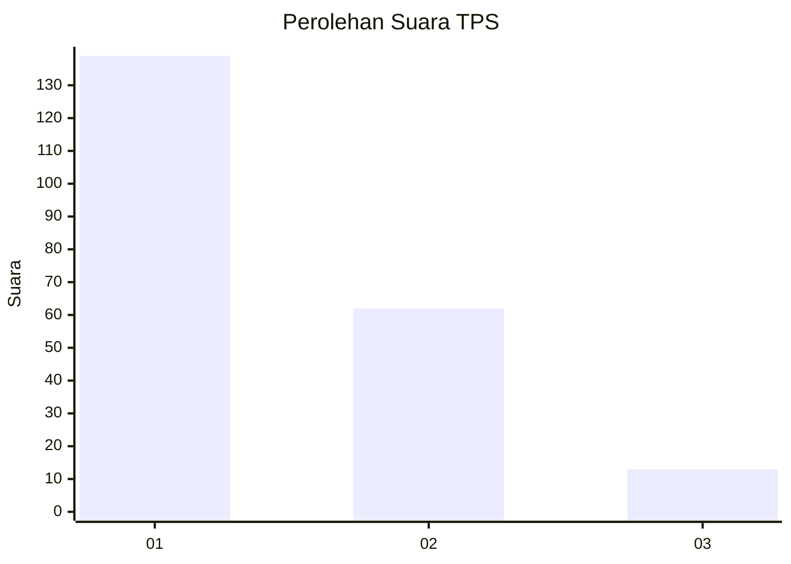
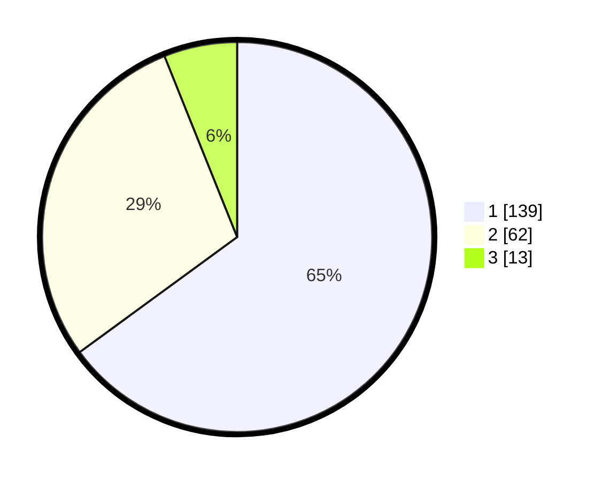

# Hasil

## Grafik

## Tabel

| No. | Nama Paslon    | Suara | Suara (raw) | Persentase |
|:--- |:-------------- | -----:| -----------:| ----------:|
| 1   | ANIES MUHAIMIN | 139   | [139][p-1]  | 64,95      |
| 2   | PRABOWO GIBRAN | 62    | [62][p-2]   | 28,97      |
| 3   | GANJAR MAHFUD  | 13    | [13][p-3]   | 6,07       |

[p-1]: https://github.com/gigit-pemilu/pemilu-2024-35-jawa-timur/blob/main/pilpres/hitung-suara/sub/35-jawa-timur/sub/29-sumenep/sub/09-guluk-guluk/sub/2010-payudan-daleman/sub/010-tps/sub/paslon-1.txt
[p-2]: https://github.com/gigit-pemilu/pemilu-2024-35-jawa-timur/blob/main/pilpres/hitung-suara/sub/35-jawa-timur/sub/29-sumenep/sub/09-guluk-guluk/sub/2010-payudan-daleman/sub/010-tps/sub/paslon-2.txt
[p-3]: https://github.com/gigit-pemilu/pemilu-2024-35-jawa-timur/blob/main/pilpres/hitung-suara/sub/35-jawa-timur/sub/29-sumenep/sub/09-guluk-guluk/sub/2010-payudan-daleman/sub/010-tps/sub/paslon-3.txt

## Foto C Plano

https://sirekap-obj-formc.kpu.go.id/32fa/pemilu/ppwp/35/29/09/20/10/3529092010010-20240225-092441--36aef49b-b987-4dfe-baeb-899109ee1798.jpg

https://sirekap-obj-formc.kpu.go.id/32fa/pemilu/ppwp/35/29/09/20/10/3529092010010-20240225-092456--593b9f79-7b05-4392-b441-09c9a9feb501.jpg

https://sirekap-obj-formc.kpu.go.id/32fa/pemilu/ppwp/35/29/09/20/10/3529092010010-20240225-092532--b94eed87-50fd-40e7-95bb-369a72895f21.jpg

## Metadata

| Key        | Value               |
| ---------- | ------------------- |
| Time Stamp | 2024-02-28 20:00:00 |

