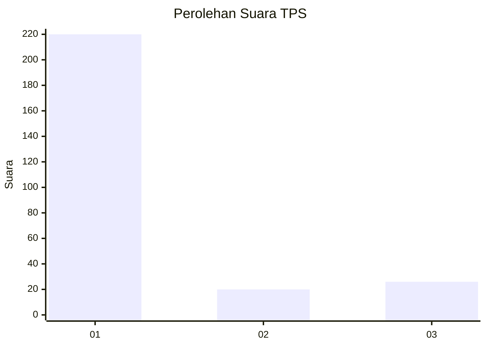
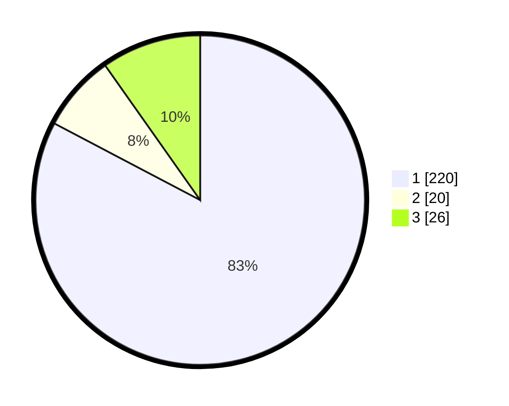

# Hasil

## Grafik

## Tabel

| No. | Nama Paslon    | Suara | Suara (raw) | Persentase |
|:--- |:-------------- | -----:| -----------:| ----------:|
| 1   | ANIES MUHAIMIN | 220   | [220][p-1]  | 82,71      |
| 2   | PRABOWO GIBRAN | 20    | [20][p-2]   | 7,52       |
| 3   | GANJAR MAHFUD  | 26    | [26][p-3]   | 9,77       |

[p-1]: https://github.com/gigit-pemilu/pemilu-2024/blob/main/pilpres/hitung-suara/sub/35-jawa-timur/sub/29-sumenep/sub/09-guluk-guluk/sub/2011-payudan-karangsokon/sub/001-tps/sub/paslon-1.txt
[p-2]: https://github.com/gigit-pemilu/pemilu-2024/blob/main/pilpres/hitung-suara/sub/35-jawa-timur/sub/29-sumenep/sub/09-guluk-guluk/sub/2011-payudan-karangsokon/sub/001-tps/sub/paslon-2.txt
[p-3]: https://github.com/gigit-pemilu/pemilu-2024/blob/main/pilpres/hitung-suara/sub/35-jawa-timur/sub/29-sumenep/sub/09-guluk-guluk/sub/2011-payudan-karangsokon/sub/001-tps/sub/paslon-3.txt

## Foto C Plano

https://sirekap-obj-formc.kpu.go.id/ae78/pemilu/ppwp/35/29/09/20/11/3529092011001-20240225-152239--65b83b0e-b9fe-42dc-a12e-c40d688d5861.jpg

https://sirekap-obj-formc.kpu.go.id/ae78/pemilu/ppwp/35/29/09/20/11/3529092011001-20240225-152423--0b0a2492-53a5-4f2c-9f34-2906e20c8ebe.jpg

https://sirekap-obj-formc.kpu.go.id/ae78/pemilu/ppwp/35/29/09/20/11/3529092011001-20240225-152448--6923fab5-594d-47ec-9b14-aa1b76d4df4e.jpg

## Metadata

| Key        | Value               |
| ---------- | ------------------- |
| Time Stamp | 2024-02-28 20:00:00 |

