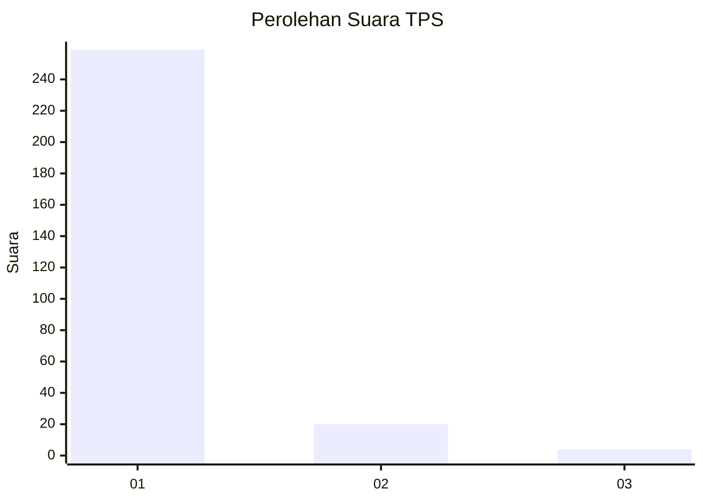
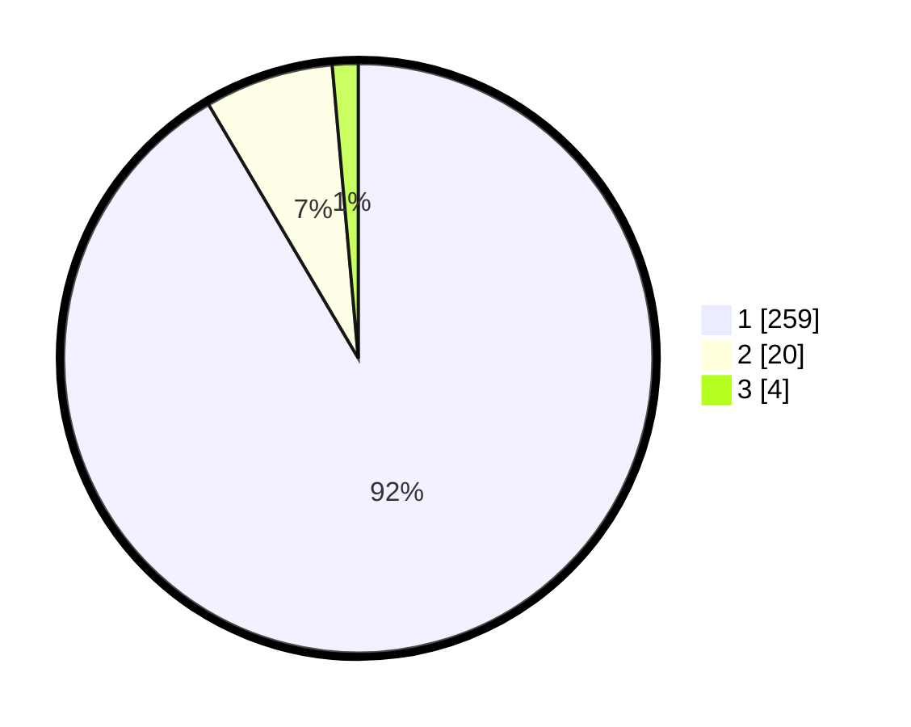

# Hasil

## Grafik

## Tabel

| No. | Nama Paslon    | Suara | Suara (raw) | Persentase |
|:--- |:-------------- | -----:| -----------:| ----------:|
| 1   | ANIES MUHAIMIN | 259   | [259][p-1]  | 91,52      |
| 2   | PRABOWO GIBRAN | 20    | [20][p-2]   | 7,07       |
| 3   | GANJAR MAHFUD  | 4     | [4][p-3]    | 1,41       |

[p-1]: https://github.com/gigit-pemilu/pemilu-2024/blob/main/pilpres/hitung-suara/sub/35-jawa-timur/sub/29-sumenep/sub/09-guluk-guluk/sub/2011-payudan-karangsokon/sub/002-tps/sub/paslon-1.txt
[p-2]: https://github.com/gigit-pemilu/pemilu-2024/blob/main/pilpres/hitung-suara/sub/35-jawa-timur/sub/29-sumenep/sub/09-guluk-guluk/sub/2011-payudan-karangsokon/sub/002-tps/sub/paslon-2.txt
[p-3]: https://github.com/gigit-pemilu/pemilu-2024/blob/main/pilpres/hitung-suara/sub/35-jawa-timur/sub/29-sumenep/sub/09-guluk-guluk/sub/2011-payudan-karangsokon/sub/002-tps/sub/paslon-3.txt

## Foto C Plano

https://sirekap-obj-formc.kpu.go.id/4c05/pemilu/ppwp/35/29/09/20/11/3529092011002-20240225-152719--36acaeee-863f-45c3-bc40-1836b8d0abed.jpg

https://sirekap-obj-formc.kpu.go.id/4c05/pemilu/ppwp/35/29/09/20/11/3529092011002-20240225-152745--0f3dd6ae-eb88-41d8-82ef-d603b566a96b.jpg

https://sirekap-obj-formc.kpu.go.id/4c05/pemilu/ppwp/35/29/09/20/11/3529092011002-20240225-152834--ab008302-b2c7-4d2a-a4ef-d3c84d69e06a.jpg

## Metadata

| Key        | Value               |
| ---------- | ------------------- |
| Time Stamp | 2024-02-28 19:00:00 |

