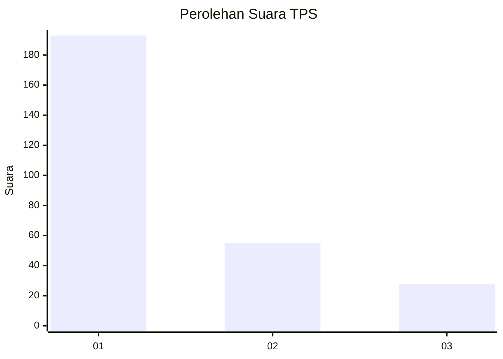
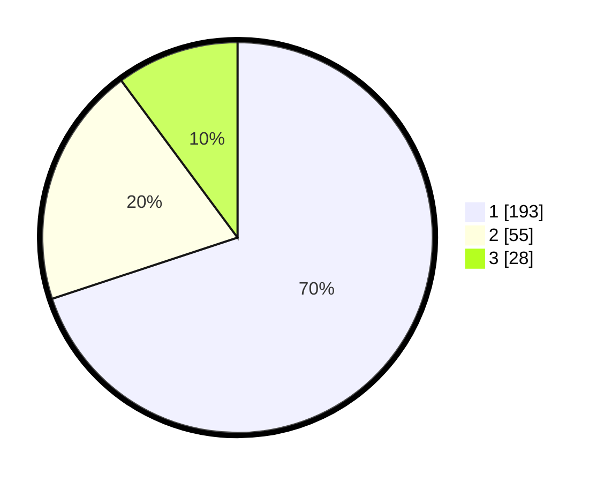

# Hasil

## Grafik

## Tabel

| No. | Nama Paslon    | Suara | Suara (raw) | Persentase |
|:--- |:-------------- | -----:| -----------:| ----------:|
| 1   | ANIES MUHAIMIN | 193   | [193][p-1]  | 69,93      |
| 2   | PRABOWO GIBRAN | 55    | [55][p-2]   | 19,93      |
| 3   | GANJAR MAHFUD  | 28    | [28][p-3]   | 10,14      |

[p-1]: https://github.com/gigit-pemilu/pemilu-2024-35-jawa-timur/blob/main/pilpres/hitung-suara/sub/35-jawa-timur/sub/29-sumenep/sub/09-guluk-guluk/sub/2011-payudan-karangsokon/sub/003-tps/sub/paslon-1.txt
[p-2]: https://github.com/gigit-pemilu/pemilu-2024-35-jawa-timur/blob/main/pilpres/hitung-suara/sub/35-jawa-timur/sub/29-sumenep/sub/09-guluk-guluk/sub/2011-payudan-karangsokon/sub/003-tps/sub/paslon-2.txt
[p-3]: https://github.com/gigit-pemilu/pemilu-2024-35-jawa-timur/blob/main/pilpres/hitung-suara/sub/35-jawa-timur/sub/29-sumenep/sub/09-guluk-guluk/sub/2011-payudan-karangsokon/sub/003-tps/sub/paslon-3.txt

## Foto C Plano

https://sirekap-obj-formc.kpu.go.id/1e24/pemilu/ppwp/35/29/09/20/11/3529092011003-20240225-153011--9f8189a7-cc13-45ad-8fdf-b56a21a67a0e.jpg

https://sirekap-obj-formc.kpu.go.id/1e24/pemilu/ppwp/35/29/09/20/11/3529092011003-20240225-153051--a068e7f6-956c-4570-900e-8c874c570eb2.jpg

https://sirekap-obj-formc.kpu.go.id/1e24/pemilu/ppwp/35/29/09/20/11/3529092011003-20240225-153117--2530e43a-c96f-4da6-88c5-a67ed0447d21.jpg

## Metadata

| Key        | Value               |
| ---------- | ------------------- |
| Time Stamp | 2024-02-28 19:00:00 |

