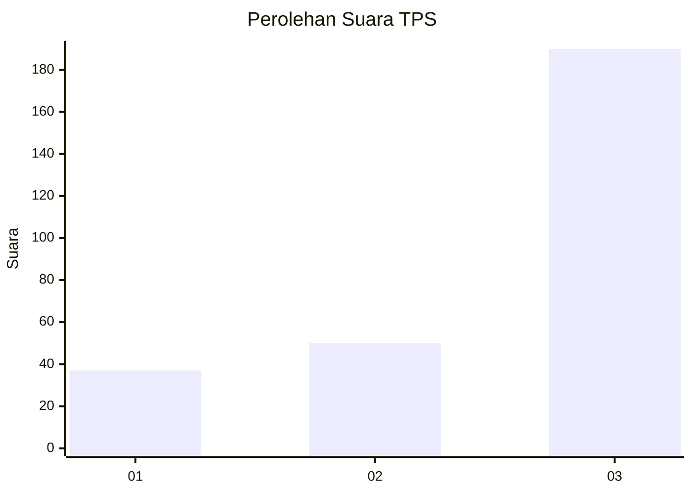
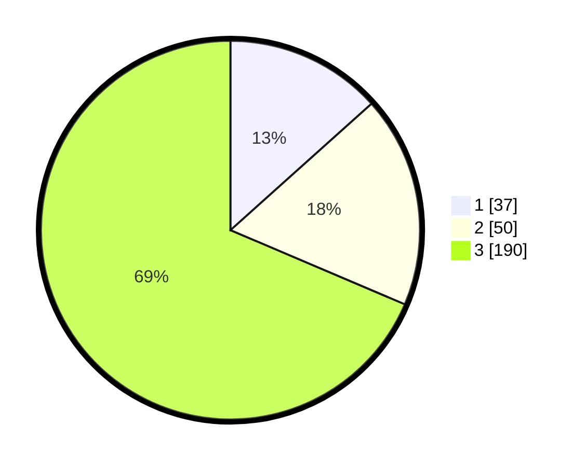

# Hasil

## Grafik

## Tabel

| No. | Nama Paslon    | Suara | Suara (raw) | Persentase |
|:--- |:-------------- | -----:| -----------:| ----------:|
| 1   | ANIES MUHAIMIN | 37    | [37][p-1]   | 13,36      |
| 2   | PRABOWO GIBRAN | 50    | [50][p-2]   | 18,05      |
| 3   | GANJAR MAHFUD  | 190   | [190][p-3]  | 68,59      |

[p-1]: https://github.com/gigit-pemilu/pemilu-2024/blob/main/pilpres/hitung-suara/sub/35-jawa-timur/sub/29-sumenep/sub/09-guluk-guluk/sub/2011-payudan-karangsokon/sub/004-tps/sub/paslon-1.txt
[p-2]: https://github.com/gigit-pemilu/pemilu-2024/blob/main/pilpres/hitung-suara/sub/35-jawa-timur/sub/29-sumenep/sub/09-guluk-guluk/sub/2011-payudan-karangsokon/sub/004-tps/sub/paslon-2.txt
[p-3]: https://github.com/gigit-pemilu/pemilu-2024/blob/main/pilpres/hitung-suara/sub/35-jawa-timur/sub/29-sumenep/sub/09-guluk-guluk/sub/2011-payudan-karangsokon/sub/004-tps/sub/paslon-3.txt

## Foto C Plano

https://sirekap-obj-formc.kpu.go.id/b6f6/pemilu/ppwp/35/29/09/20/11/3529092011004-20240225-153257--ca02adc0-c7d9-492c-92b8-f9907a78478f.jpg

https://sirekap-obj-formc.kpu.go.id/b6f6/pemilu/ppwp/35/29/09/20/11/3529092011004-20240225-153321--19b2581c-02e0-4ea3-812e-a815adb6afe6.jpg

https://sirekap-obj-formc.kpu.go.id/b6f6/pemilu/ppwp/35/29/09/20/11/3529092011004-20240225-153407--d0d15990-d042-4cd7-a62f-cd575cd8b7c5.jpg

## Metadata

| Key        | Value               |
| ---------- | ------------------- |
| Time Stamp | 2024-02-28 19:00:00 |

