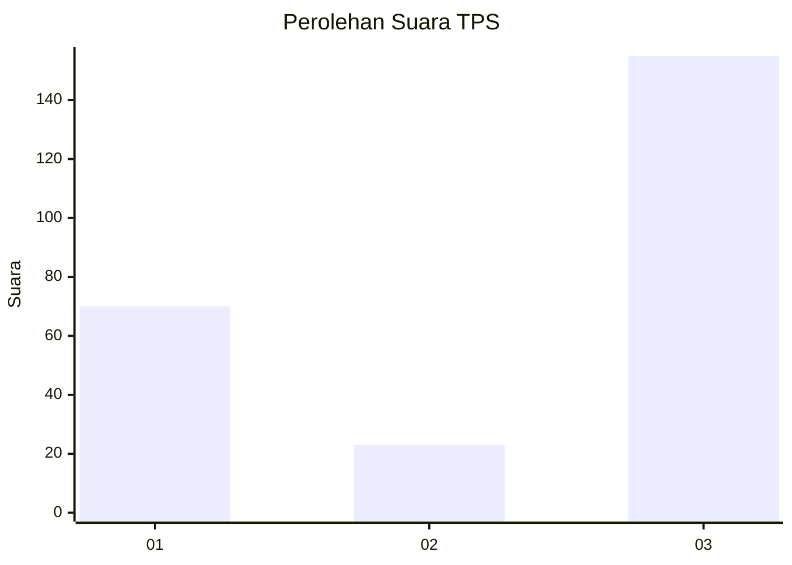
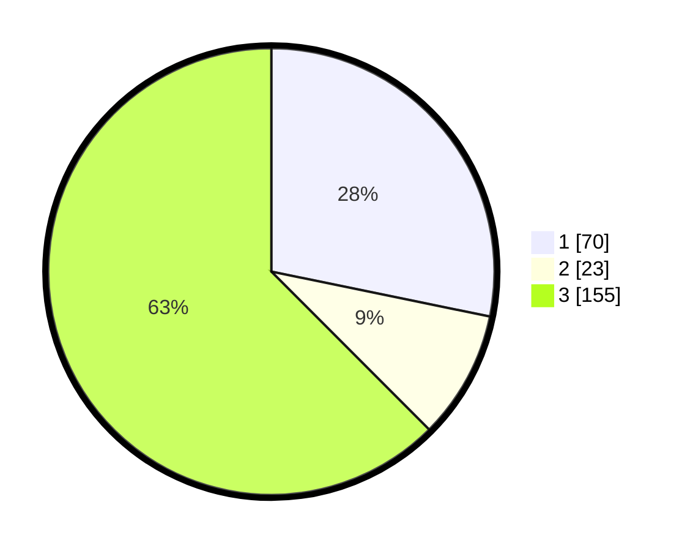

# Hasil

## Grafik

## Tabel

| No. | Nama Paslon    | Suara | Suara (raw) | Persentase |
|:--- |:-------------- | -----:| -----------:| ----------:|
| 1   | ANIES MUHAIMIN | 70    | [70][p-1]   | 28,23      |
| 2   | PRABOWO GIBRAN | 23    | [23][p-2]   | 9,27       |
| 3   | GANJAR MAHFUD  | 155   | [155][p-3]  | 62,50      |

[p-1]: https://github.com/gigit-pemilu/pemilu-2024/blob/main/pilpres/hitung-suara/sub/35-jawa-timur/sub/29-sumenep/sub/09-guluk-guluk/sub/2011-payudan-karangsokon/sub/006-tps/sub/paslon-1.txt
[p-2]: https://github.com/gigit-pemilu/pemilu-2024/blob/main/pilpres/hitung-suara/sub/35-jawa-timur/sub/29-sumenep/sub/09-guluk-guluk/sub/2011-payudan-karangsokon/sub/006-tps/sub/paslon-2.txt
[p-3]: https://github.com/gigit-pemilu/pemilu-2024/blob/main/pilpres/hitung-suara/sub/35-jawa-timur/sub/29-sumenep/sub/09-guluk-guluk/sub/2011-payudan-karangsokon/sub/006-tps/sub/paslon-3.txt

## Foto C Plano

https://sirekap-obj-formc.kpu.go.id/324c/pemilu/ppwp/35/29/09/20/11/3529092011006-20240225-155920--15dbcaf8-d2bf-41e9-ad7f-d589e4a28d93.jpg

https://sirekap-obj-formc.kpu.go.id/324c/pemilu/ppwp/35/29/09/20/11/3529092011006-20240225-155952--24c574bf-1e1a-433b-a2b2-2f30bf5a9420.jpg

https://sirekap-obj-formc.kpu.go.id/324c/pemilu/ppwp/35/29/09/20/11/3529092011006-20240225-160017--80e766bf-fa3a-4ead-84a1-210e1e4f2ecf.jpg

## Metadata

| Key        | Value               |
| ---------- | ------------------- |
| Time Stamp | 2024-02-28 19:00:00 |

