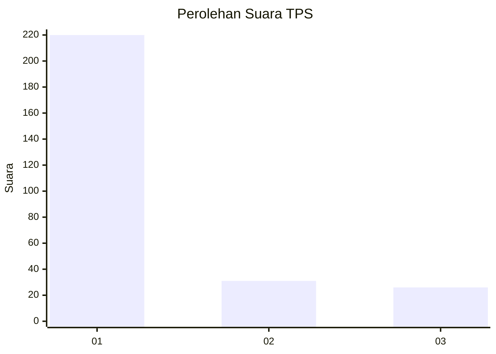
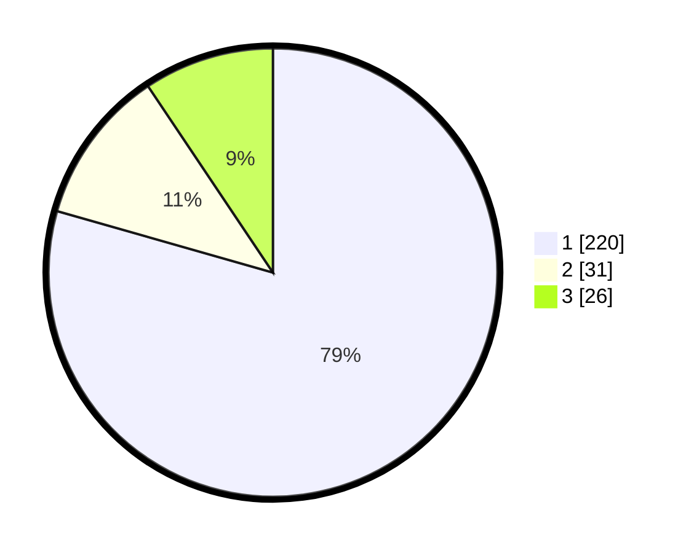

# Hasil

## Grafik

## Tabel

| No. | Nama Paslon    | Suara | Suara (raw) | Persentase |
|:--- |:-------------- | -----:| -----------:| ----------:|
| 1   | ANIES MUHAIMIN | 220   | [220][p-1]  | 79,42      |
| 2   | PRABOWO GIBRAN | 31    | [31][p-2]   | 11,19      |
| 3   | GANJAR MAHFUD  | 26    | [26][p-3]   | 9,39       |

[p-1]: https://github.com/gigit-pemilu/pemilu-2024/blob/main/pilpres/hitung-suara/sub/35-jawa-timur/sub/29-sumenep/sub/09-guluk-guluk/sub/2011-payudan-karangsokon/sub/007-tps/sub/paslon-1.txt
[p-2]: https://github.com/gigit-pemilu/pemilu-2024/blob/main/pilpres/hitung-suara/sub/35-jawa-timur/sub/29-sumenep/sub/09-guluk-guluk/sub/2011-payudan-karangsokon/sub/007-tps/sub/paslon-2.txt
[p-3]: https://github.com/gigit-pemilu/pemilu-2024/blob/main/pilpres/hitung-suara/sub/35-jawa-timur/sub/29-sumenep/sub/09-guluk-guluk/sub/2011-payudan-karangsokon/sub/007-tps/sub/paslon-3.txt

## Foto C Plano

https://sirekap-obj-formc.kpu.go.id/e9a0/pemilu/ppwp/35/29/09/20/11/3529092011007-20240225-160214--84705271-da3e-4cb7-ac93-ac3d575a26e7.jpg

https://sirekap-obj-formc.kpu.go.id/e9a0/pemilu/ppwp/35/29/09/20/11/3529092011007-20240225-160257--902502df-8584-45d8-bf3c-d3d782e5a821.jpg

https://sirekap-obj-formc.kpu.go.id/e9a0/pemilu/ppwp/35/29/09/20/11/3529092011007-20240225-160326--de2be0f2-bebf-4051-9f55-7683c19507df.jpg

## Metadata

| Key        | Value               |
| ---------- | ------------------- |
| Time Stamp | 2024-02-28 19:00:00 |

