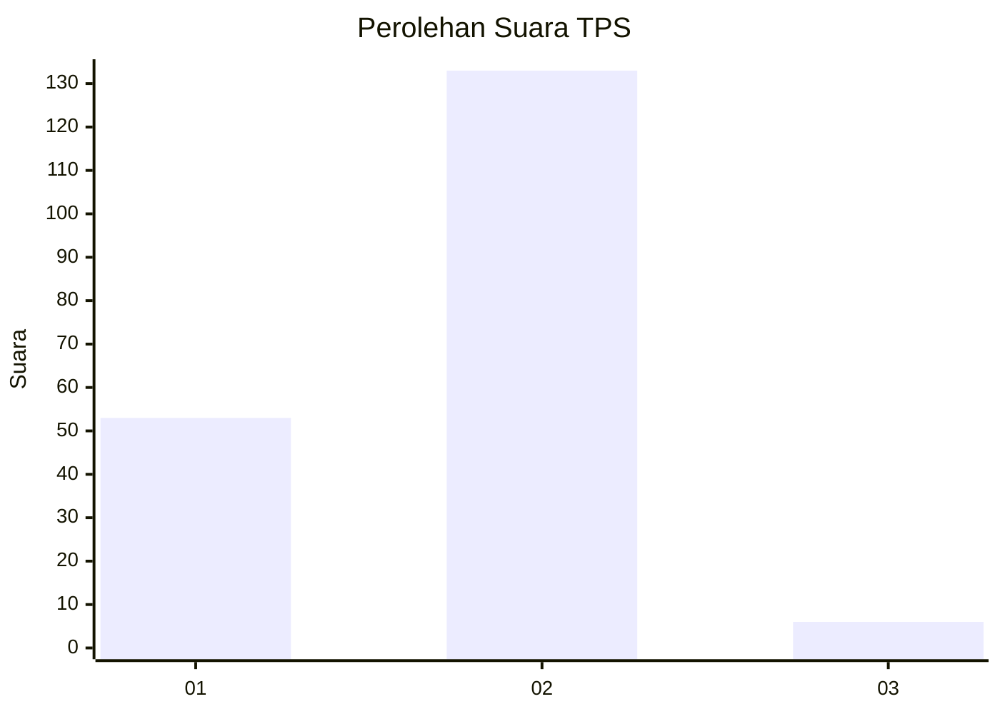
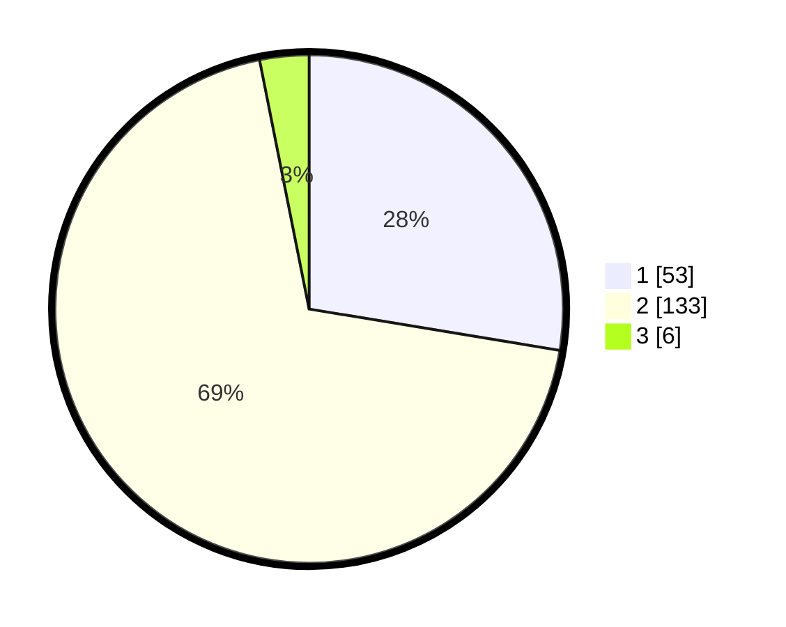

# Hasil

## Grafik

## Tabel

| No. | Nama Paslon    | Suara | Suara (raw) | Persentase |
|:--- |:-------------- | -----:| -----------:| ----------:|
| 1   | ANIES MUHAIMIN | 53    | [53][p-1]   | 27,60      |
| 2   | PRABOWO GIBRAN | 133   | [133][p-2]  | 69,27      |
| 3   | GANJAR MAHFUD  | 6     | [6][p-3]    | 3,13       |

[p-1]: https://github.com/gigit-pemilu/pemilu-2024/blob/main/pilpres/hitung-suara/sub/35-jawa-timur/sub/29-sumenep/sub/10-ganding/sub/2001-bataal-barat/sub/004-tps/sub/paslon-1.txt
[p-2]: https://github.com/gigit-pemilu/pemilu-2024/blob/main/pilpres/hitung-suara/sub/35-jawa-timur/sub/29-sumenep/sub/10-ganding/sub/2001-bataal-barat/sub/004-tps/sub/paslon-2.txt
[p-3]: https://github.com/gigit-pemilu/pemilu-2024/blob/main/pilpres/hitung-suara/sub/35-jawa-timur/sub/29-sumenep/sub/10-ganding/sub/2001-bataal-barat/sub/004-tps/sub/paslon-3.txt

## Foto C Plano

https://sirekap-obj-formc.kpu.go.id/67ad/pemilu/ppwp/35/29/10/20/01/3529102001004-20240223-211229--01f408c1-6c8b-4579-a904-0d46caa90e5f.jpg

https://sirekap-obj-formc.kpu.go.id/67ad/pemilu/ppwp/35/29/10/20/01/3529102001004-20240223-211947--51675969-a222-4af2-94a3-f856be1c1af8.jpg

https://sirekap-obj-formc.kpu.go.id/67ad/pemilu/ppwp/35/29/10/20/01/3529102001004-20240223-212041--8ccf5c87-b48f-459e-9eec-fbdb4c2deab8.jpg

## Metadata

| Key        | Value               |
| ---------- | ------------------- |
| Time Stamp | 2024-02-24 22:31:28 |

