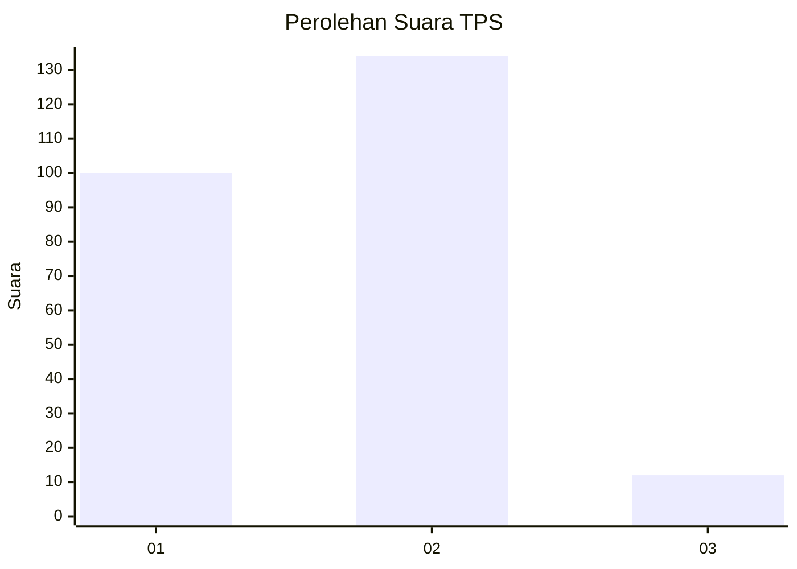
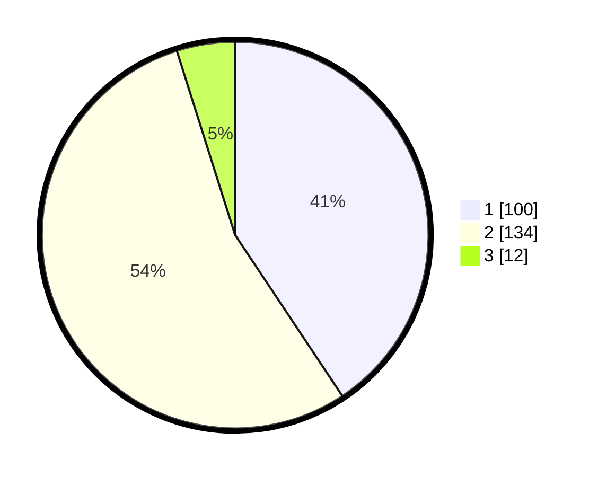

# Hasil

## Grafik

## Tabel

| No. | Nama Paslon    | Suara | Suara (raw) | Persentase |
|:--- |:-------------- | -----:| -----------:| ----------:|
| 1   | ANIES MUHAIMIN | 100   | [100][p-1]  | 40,65      |
| 2   | PRABOWO GIBRAN | 134   | [134][p-2]  | 54,47      |
| 3   | GANJAR MAHFUD  | 12    | [12][p-3]   | 4,88       |

[p-1]: https://github.com/gigit-pemilu/pemilu-2024/blob/main/pilpres/hitung-suara/sub/35-jawa-timur/sub/29-sumenep/sub/10-ganding/sub/2002-bataal-timur/sub/001-tps/sub/paslon-1.txt
[p-2]: https://github.com/gigit-pemilu/pemilu-2024/blob/main/pilpres/hitung-suara/sub/35-jawa-timur/sub/29-sumenep/sub/10-ganding/sub/2002-bataal-timur/sub/001-tps/sub/paslon-2.txt
[p-3]: https://github.com/gigit-pemilu/pemilu-2024/blob/main/pilpres/hitung-suara/sub/35-jawa-timur/sub/29-sumenep/sub/10-ganding/sub/2002-bataal-timur/sub/001-tps/sub/paslon-3.txt

## Foto C Plano

https://sirekap-obj-formc.kpu.go.id/c9bd/pemilu/ppwp/35/29/10/20/02/3529102002001-20240214-193239--03ae18d0-67cf-4720-8407-8f8d8b10d705.jpg

https://sirekap-obj-formc.kpu.go.id/c9bd/pemilu/ppwp/35/29/10/20/02/3529102002001-20240214-193329--9823e4ab-aa40-4b6d-ae05-3ba9572297f7.jpg

https://sirekap-obj-formc.kpu.go.id/c9bd/pemilu/ppwp/35/29/10/20/02/3529102002001-20240214-193415--af2ed18a-f484-43f6-b091-ba0a8f5bfd8d.jpg

## Metadata

| Key        | Value               |
| ---------- | ------------------- |
| Time Stamp | 2024-02-16 22:30:00 |

