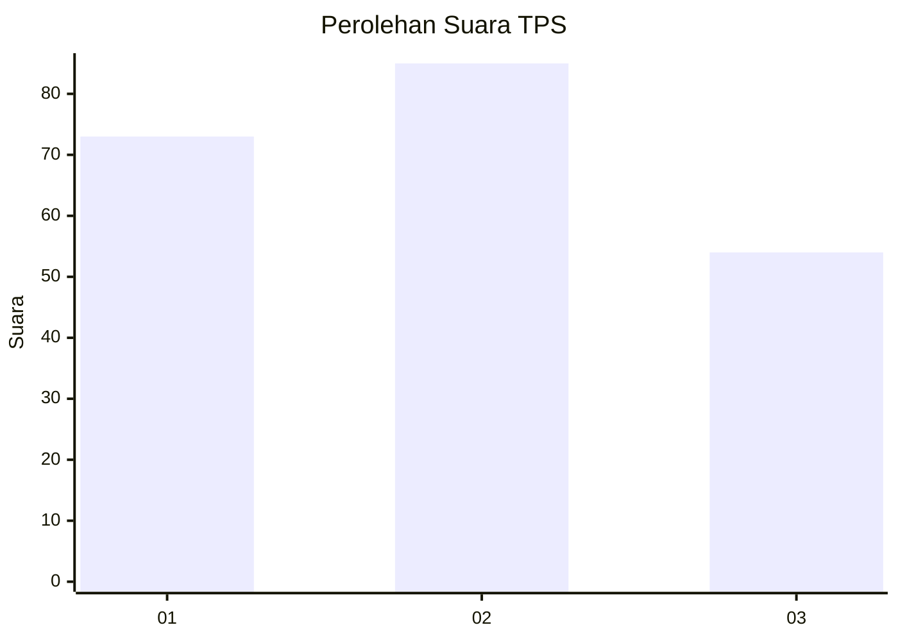
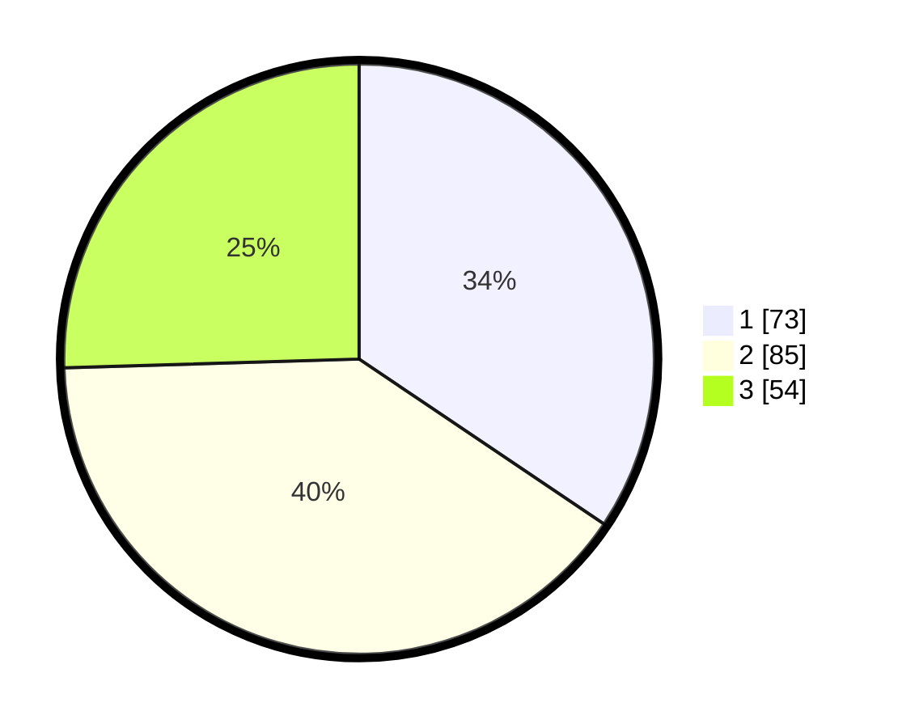

# Hasil

## Grafik

## Tabel

| No. | Nama Paslon    | Suara | Suara (raw) | Persentase |
|:--- |:-------------- | -----:| -----------:| ----------:|
| 1   | ANIES MUHAIMIN | 73    | [73][p-1]   | 34,43      |
| 2   | PRABOWO GIBRAN | 85    | [85][p-2]   | 40,09      |
| 3   | GANJAR MAHFUD  | 54    | [54][p-3]   | 25,47      |

[p-1]: https://github.com/gigit-pemilu/pemilu-2024-35-jawa-timur/blob/main/pilpres/hitung-suara/sub/35-jawa-timur/sub/29-sumenep/sub/10-ganding/sub/2009-gadu-timur/sub/002-tps/sub/paslon-1.txt
[p-2]: https://github.com/gigit-pemilu/pemilu-2024-35-jawa-timur/blob/main/pilpres/hitung-suara/sub/35-jawa-timur/sub/29-sumenep/sub/10-ganding/sub/2009-gadu-timur/sub/002-tps/sub/paslon-2.txt
[p-3]: https://github.com/gigit-pemilu/pemilu-2024-35-jawa-timur/blob/main/pilpres/hitung-suara/sub/35-jawa-timur/sub/29-sumenep/sub/10-ganding/sub/2009-gadu-timur/sub/002-tps/sub/paslon-3.txt

## Foto C Plano

https://sirekap-obj-formc.kpu.go.id/eb97/pemilu/ppwp/35/29/10/20/09/3529102009002-20240214-222259--2490aefd-c70f-4671-9873-3a8bd02ef1ff.jpg

https://sirekap-obj-formc.kpu.go.id/eb97/pemilu/ppwp/35/29/10/20/09/3529102009002-20240214-222308--7692d8ca-906a-4c8b-8c99-a94feafc798e.jpg

https://sirekap-obj-formc.kpu.go.id/eb97/pemilu/ppwp/35/29/10/20/09/3529102009002-20240214-222317--484ee1c9-119c-4a83-a711-2252190abc3d.jpg

## Metadata

| Key        | Value               |
| ---------- | ------------------- |
| Time Stamp | 2024-02-15 22:00:27 |

