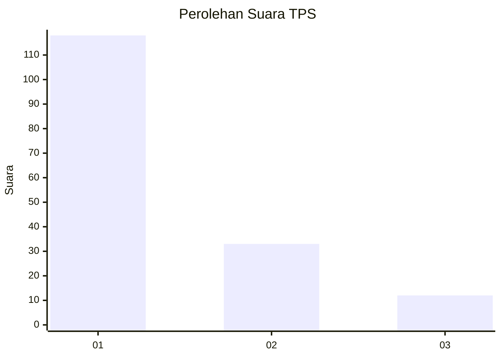
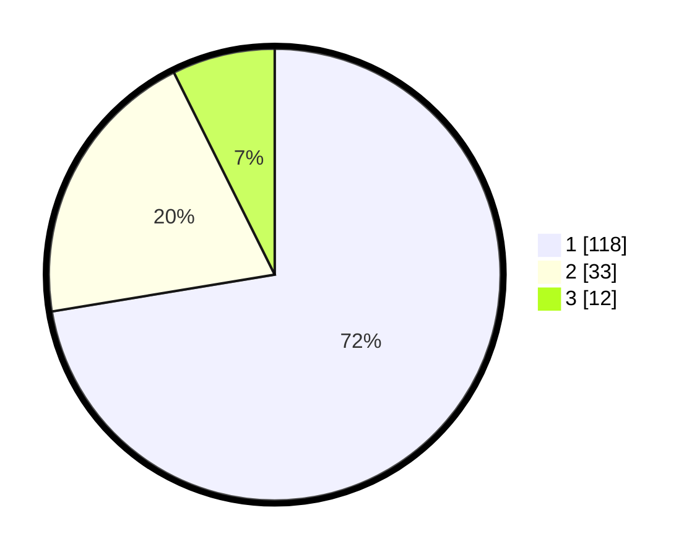

# Hasil

## Grafik

## Tabel

| No. | Nama Paslon    | Suara | Suara (raw) | Persentase |
|:--- |:-------------- | -----:| -----------:| ----------:|
| 1   | ANIES MUHAIMIN | 118   | [118][p-1]  | 72,39      |
| 2   | PRABOWO GIBRAN | 33    | [33][p-2]   | 20,25      |
| 3   | GANJAR MAHFUD  | 12    | [12][p-3]   | 7,36       |

[p-1]: https://github.com/gigit-pemilu/pemilu-2024-35-jawa-timur/blob/main/pilpres/hitung-suara/sub/35-jawa-timur/sub/29-sumenep/sub/10-ganding/sub/2009-gadu-timur/sub/011-tps/sub/paslon-1.txt
[p-2]: https://github.com/gigit-pemilu/pemilu-2024-35-jawa-timur/blob/main/pilpres/hitung-suara/sub/35-jawa-timur/sub/29-sumenep/sub/10-ganding/sub/2009-gadu-timur/sub/011-tps/sub/paslon-2.txt
[p-3]: https://github.com/gigit-pemilu/pemilu-2024-35-jawa-timur/blob/main/pilpres/hitung-suara/sub/35-jawa-timur/sub/29-sumenep/sub/10-ganding/sub/2009-gadu-timur/sub/011-tps/sub/paslon-3.txt

## Foto C Plano

https://sirekap-obj-formc.kpu.go.id/9aeb/pemilu/ppwp/35/29/10/20/09/3529102009011-20240223-203054--0734cce5-d9a7-40dc-9789-034984aac47d.jpg

https://sirekap-obj-formc.kpu.go.id/9aeb/pemilu/ppwp/35/29/10/20/09/3529102009011-20240223-203943--f9997e26-7a4f-48d6-9115-bd438fe1b83c.jpg

https://sirekap-obj-formc.kpu.go.id/9aeb/pemilu/ppwp/35/29/10/20/09/3529102009011-20240223-195928--0f6b38c7-d30c-4bcf-8d9b-8b9f3be8d9fd.jpg

## Metadata

| Key        | Value               |
| ---------- | ------------------- |
| Time Stamp | 2024-02-25 12:00:00 |

