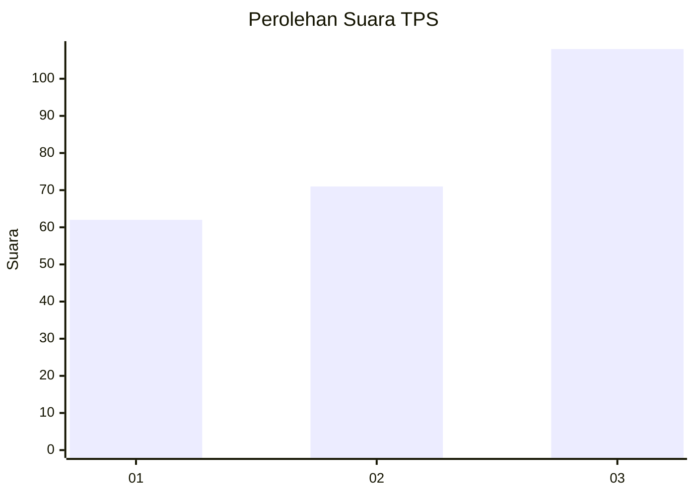
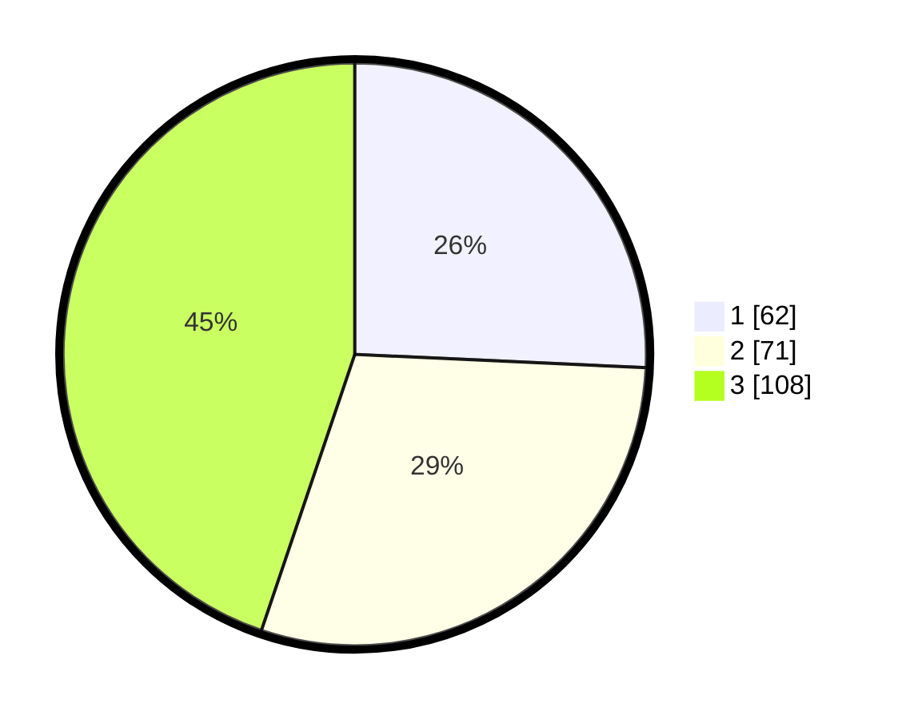

# Hasil

## Grafik

## Tabel

| No. | Nama Paslon    | Suara | Suara (raw) | Persentase |
|:--- |:-------------- | -----:| -----------:| ----------:|
| 1   | ANIES MUHAIMIN | 62    | [62][p-1]   | 25,73      |
| 2   | PRABOWO GIBRAN | 71    | [71][p-2]   | 29,46      |
| 3   | GANJAR MAHFUD  | 108   | [108][p-3]  | 44,81      |

[p-1]: https://github.com/gigit-pemilu/pemilu-2024/blob/main/pilpres/hitung-suara/sub/35-jawa-timur/sub/29-sumenep/sub/10-ganding/sub/2010-gadu-barat/sub/005-tps/sub/paslon-1.txt
[p-2]: https://github.com/gigit-pemilu/pemilu-2024/blob/main/pilpres/hitung-suara/sub/35-jawa-timur/sub/29-sumenep/sub/10-ganding/sub/2010-gadu-barat/sub/005-tps/sub/paslon-2.txt
[p-3]: https://github.com/gigit-pemilu/pemilu-2024/blob/main/pilpres/hitung-suara/sub/35-jawa-timur/sub/29-sumenep/sub/10-ganding/sub/2010-gadu-barat/sub/005-tps/sub/paslon-3.txt

## Foto C Plano

https://sirekap-obj-formc.kpu.go.id/0ef2/pemilu/ppwp/35/29/10/20/10/3529102010005-20240215-165515--e8a188e0-2f50-4d13-bfaa-5158892223ed.jpg

https://sirekap-obj-formc.kpu.go.id/0ef2/pemilu/ppwp/35/29/10/20/10/3529102010005-20240215-165618--25705fe1-0ca8-4a51-a5c4-f52bc20f4802.jpg

https://sirekap-obj-formc.kpu.go.id/0ef2/pemilu/ppwp/35/29/10/20/10/3529102010005-20240215-165712--c73e1fa5-a145-4fcb-94ab-ee891e5c44d6.jpg

## Metadata

| Key        | Value               |
| ---------- | ------------------- |
| Time Stamp | 2024-02-25 11:00:00 |

