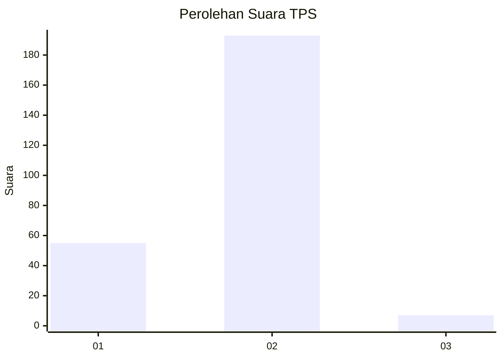
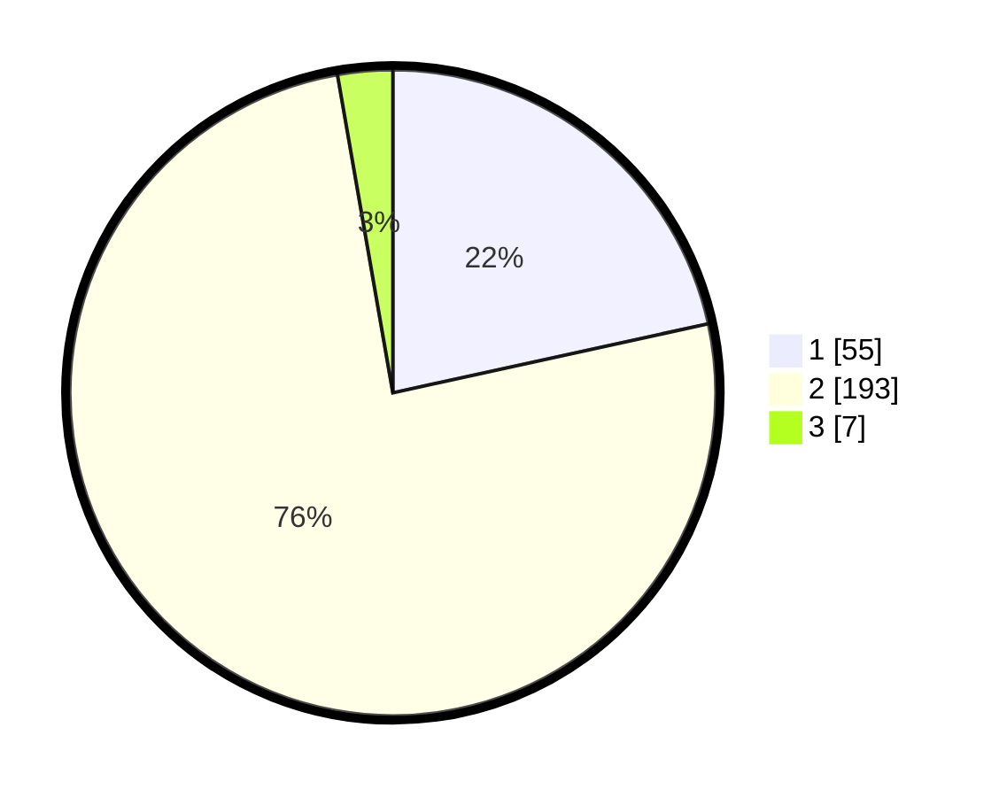

# Hasil

## Grafik

## Tabel

| No. | Nama Paslon    | Suara | Suara (raw) | Persentase |
|:--- |:-------------- | -----:| -----------:| ----------:|
| 1   | ANIES MUHAIMIN | 55    | [55][p-1]   | 21,57      |
| 2   | PRABOWO GIBRAN | 193   | [193][p-2]  | 75,69      |
| 3   | GANJAR MAHFUD  | 7     | [7][p-3]    | 2,75       |

[p-1]: https://github.com/gigit-pemilu/pemilu-2024-35-jawa-timur/blob/main/pilpres/hitung-suara/sub/35-jawa-timur/sub/29-sumenep/sub/10-ganding/sub/2012-ketawang-parebaan/sub/001-tps/sub/paslon-1.txt
[p-2]: https://github.com/gigit-pemilu/pemilu-2024-35-jawa-timur/blob/main/pilpres/hitung-suara/sub/35-jawa-timur/sub/29-sumenep/sub/10-ganding/sub/2012-ketawang-parebaan/sub/001-tps/sub/paslon-2.txt
[p-3]: https://github.com/gigit-pemilu/pemilu-2024-35-jawa-timur/blob/main/pilpres/hitung-suara/sub/35-jawa-timur/sub/29-sumenep/sub/10-ganding/sub/2012-ketawang-parebaan/sub/001-tps/sub/paslon-3.txt

## Foto C Plano

https://sirekap-obj-formc.kpu.go.id/68d7/pemilu/ppwp/35/29/10/20/12/3529102012001-20240216-211053--8ef28d13-b293-45b2-8d0f-3c30fcd152ae.jpg

https://sirekap-obj-formc.kpu.go.id/68d7/pemilu/ppwp/35/29/10/20/12/3529102012001-20240216-211545--29aff164-4b95-4f3a-a68e-a86a0d09bde2.jpg

## Metadata

| Key        | Value               |
| ---------- | ------------------- |
| Time Stamp | 2024-02-24 22:31:28 |

