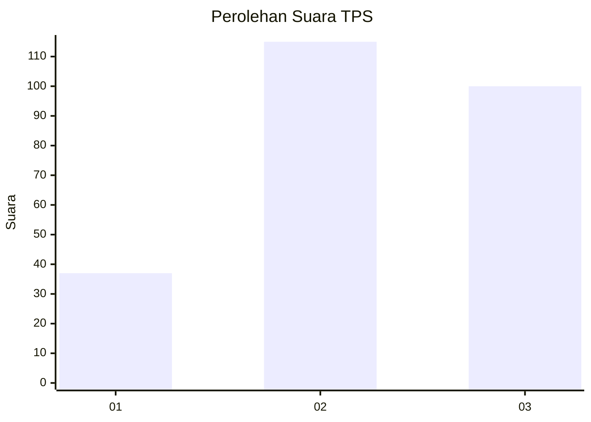
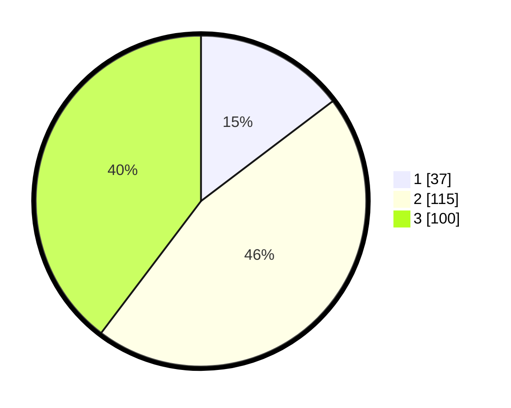

# Hasil

## Grafik

## Tabel

| No. | Nama Paslon    | Suara | Suara (raw) | Persentase |
|:--- |:-------------- | -----:| -----------:| ----------:|
| 1   | ANIES MUHAIMIN | 37    | [37][p-1]   | 14,68      |
| 2   | PRABOWO GIBRAN | 115   | [115][p-2]  | 45,63      |
| 3   | GANJAR MAHFUD  | 100   | [100][p-3]  | 39,68      |

[p-1]: https://github.com/gigit-pemilu/pemilu-2024-35-jawa-timur/blob/main/pilpres/hitung-suara/sub/35-jawa-timur/sub/29-sumenep/sub/11-pragaan/sub/2001-kaduara-timur/sub/005-tps/sub/paslon-1.txt
[p-2]: https://github.com/gigit-pemilu/pemilu-2024-35-jawa-timur/blob/main/pilpres/hitung-suara/sub/35-jawa-timur/sub/29-sumenep/sub/11-pragaan/sub/2001-kaduara-timur/sub/005-tps/sub/paslon-2.txt
[p-3]: https://github.com/gigit-pemilu/pemilu-2024-35-jawa-timur/blob/main/pilpres/hitung-suara/sub/35-jawa-timur/sub/29-sumenep/sub/11-pragaan/sub/2001-kaduara-timur/sub/005-tps/sub/paslon-3.txt

## Foto C Plano

https://sirekap-obj-formc.kpu.go.id/46ad/pemilu/ppwp/35/29/11/20/01/3529112001005-20240215-015650--af8c74fb-7442-4605-a331-3357288b2620.jpg

https://sirekap-obj-formc.kpu.go.id/46ad/pemilu/ppwp/35/29/11/20/01/3529112001005-20240215-020014--47514504-b779-46ff-8a04-1a3df2a3a705.jpg

https://sirekap-obj-formc.kpu.go.id/46ad/pemilu/ppwp/35/29/11/20/01/3529112001005-20240215-020351--53a08a32-0f46-4cc9-969b-81a1a7a17b24.jpg

## Metadata

| Key        | Value               |
| ---------- | ------------------- |
| Time Stamp | 2024-02-26 02:00:00 |

