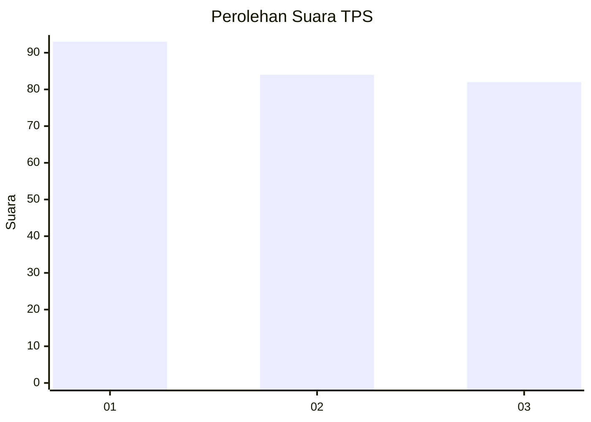
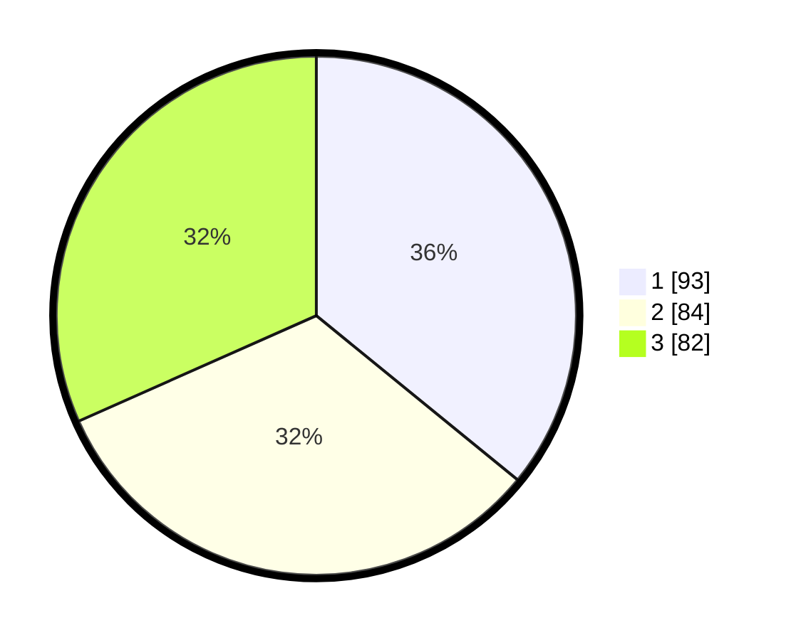

# Hasil

## Grafik

## Tabel

| No. | Nama Paslon    | Suara | Suara (raw) | Persentase |
|:--- |:-------------- | -----:| -----------:| ----------:|
| 1   | ANIES MUHAIMIN | 93    | [93][p-1]   | 35,91      |
| 2   | PRABOWO GIBRAN | 84    | [84][p-2]   | 32,43      |
| 3   | GANJAR MAHFUD  | 82    | [82][p-3]   | 31,66      |

[p-1]: https://github.com/gigit-pemilu/pemilu-2024-35-jawa-timur/blob/main/pilpres/hitung-suara/sub/35-jawa-timur/sub/29-sumenep/sub/11-pragaan/sub/2001-kaduara-timur/sub/007-tps/sub/paslon-1.txt
[p-2]: https://github.com/gigit-pemilu/pemilu-2024-35-jawa-timur/blob/main/pilpres/hitung-suara/sub/35-jawa-timur/sub/29-sumenep/sub/11-pragaan/sub/2001-kaduara-timur/sub/007-tps/sub/paslon-2.txt
[p-3]: https://github.com/gigit-pemilu/pemilu-2024-35-jawa-timur/blob/main/pilpres/hitung-suara/sub/35-jawa-timur/sub/29-sumenep/sub/11-pragaan/sub/2001-kaduara-timur/sub/007-tps/sub/paslon-3.txt

## Foto C Plano

https://sirekap-obj-formc.kpu.go.id/a2e9/pemilu/ppwp/35/29/11/20/01/3529112001007-20240215-084632--d96bd757-be5e-47f1-9121-80433c8daec6.jpg

https://sirekap-obj-formc.kpu.go.id/a2e9/pemilu/ppwp/35/29/11/20/01/3529112001007-20240215-084752--36aeafaa-2d7d-45dd-8551-adff3df5108d.jpg

https://sirekap-obj-formc.kpu.go.id/a2e9/pemilu/ppwp/35/29/11/20/01/3529112001007-20240215-084826--3265a2aa-befa-4229-9e99-3a63bbc197eb.jpg

## Metadata

| Key        | Value               |
| ---------- | ------------------- |
| Time Stamp | 2024-02-15 21:30:27 |

