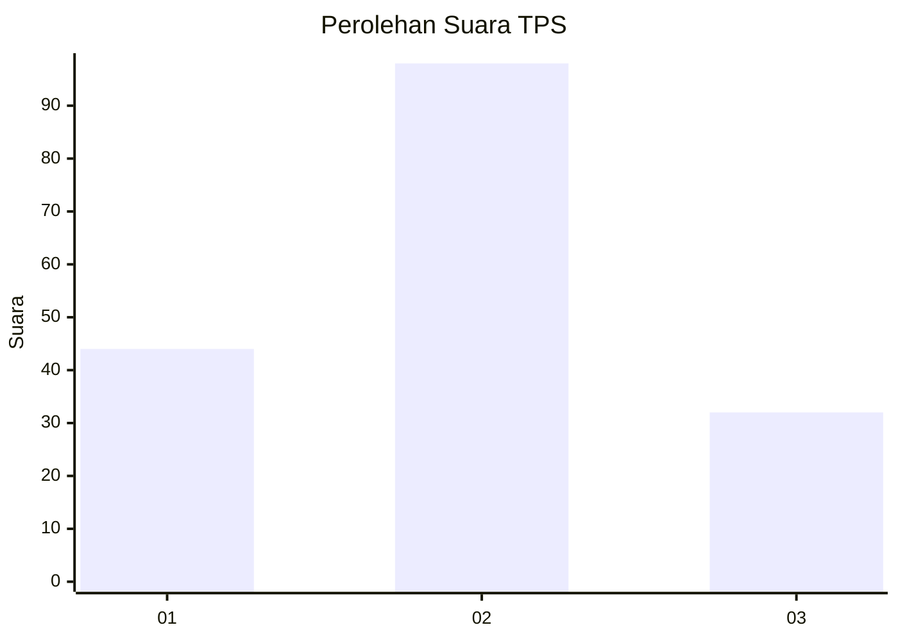
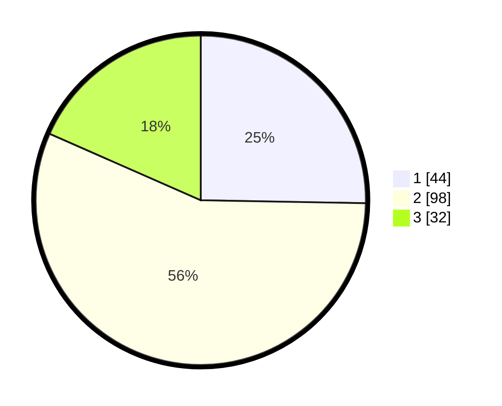

# Hasil

## Grafik

## Tabel

| No. | Nama Paslon    | Suara | Suara (raw) | Persentase |
|:--- |:-------------- | -----:| -----------:| ----------:|
| 1   | ANIES MUHAIMIN | 44    | [44][p-1]   | 25,29      |
| 2   | PRABOWO GIBRAN | 98    | [98][p-2]   | 56,32      |
| 3   | GANJAR MAHFUD  | 32    | [32][p-3]   | 18,39      |

[p-1]: https://github.com/gigit-pemilu/pemilu-2024-35-jawa-timur/blob/main/pilpres/hitung-suara/sub/35-jawa-timur/sub/29-sumenep/sub/11-pragaan/sub/2004-sentol-laok/sub/003-tps/sub/paslon-1.txt
[p-2]: https://github.com/gigit-pemilu/pemilu-2024-35-jawa-timur/blob/main/pilpres/hitung-suara/sub/35-jawa-timur/sub/29-sumenep/sub/11-pragaan/sub/2004-sentol-laok/sub/003-tps/sub/paslon-2.txt
[p-3]: https://github.com/gigit-pemilu/pemilu-2024-35-jawa-timur/blob/main/pilpres/hitung-suara/sub/35-jawa-timur/sub/29-sumenep/sub/11-pragaan/sub/2004-sentol-laok/sub/003-tps/sub/paslon-3.txt

## Foto C Plano

https://sirekap-obj-formc.kpu.go.id/a9de/pemilu/ppwp/35/29/11/20/04/3529112004003-20240214-192318--5ac16c08-68a8-4c15-b3ef-e9feb6a4802d.jpg

https://sirekap-obj-formc.kpu.go.id/a9de/pemilu/ppwp/35/29/11/20/04/3529112004003-20240214-193238--296b8254-cfc3-4812-91b3-dff2d27f9ed2.jpg

https://sirekap-obj-formc.kpu.go.id/a9de/pemilu/ppwp/35/29/11/20/04/3529112004003-20240214-193145--f3f62ce7-6193-49a1-a0a1-ef1e4578b778.jpg

## Metadata

| Key        | Value               |
| ---------- | ------------------- |
| Time Stamp | 2024-02-16 12:51:22 |

