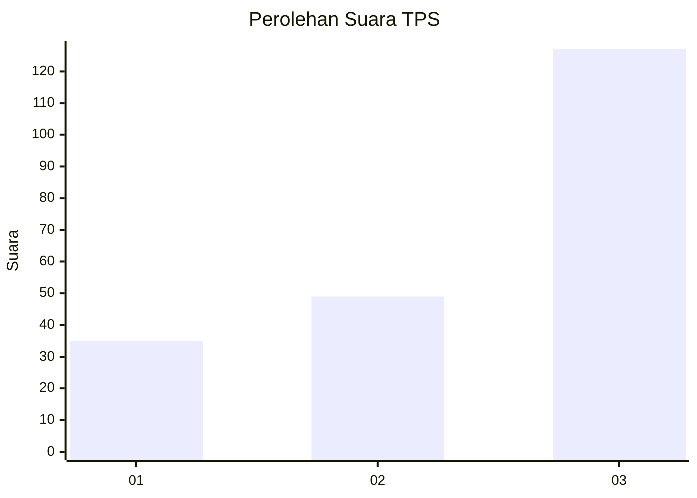
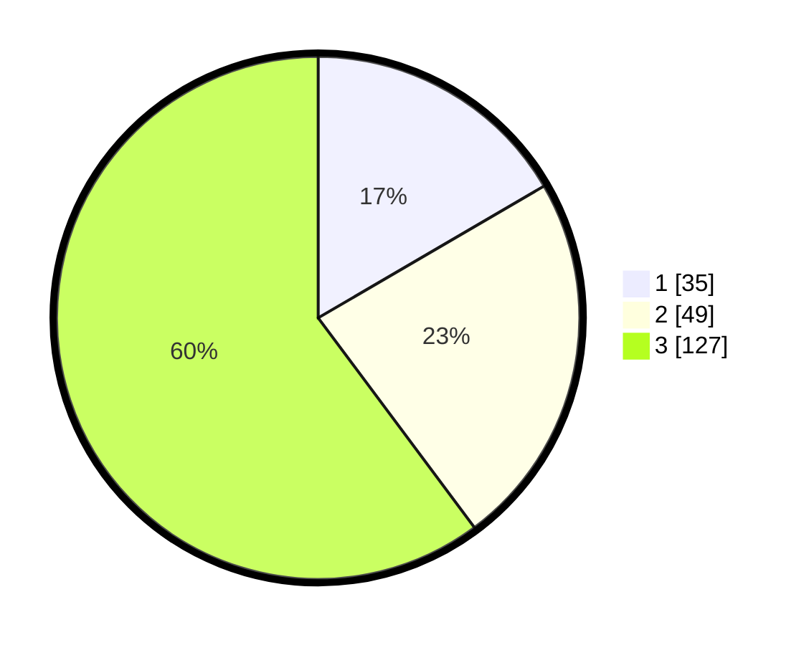

# Hasil

## Grafik

## Tabel

| No. | Nama Paslon    | Suara | Suara (raw) | Persentase |
|:--- |:-------------- | -----:| -----------:| ----------:|
| 1   | ANIES MUHAIMIN | 35    | [35][p-1]   | 16,59      |
| 2   | PRABOWO GIBRAN | 49    | [49][p-2]   | 23,22      |
| 3   | GANJAR MAHFUD  | 127   | [127][p-3]  | 60,19      |

[p-1]: https://github.com/gigit-pemilu/pemilu-2024-35-jawa-timur/blob/main/pilpres/hitung-suara/sub/35-jawa-timur/sub/29-sumenep/sub/11-pragaan/sub/2005-larangan-perreng/sub/006-tps/sub/paslon-1.txt
[p-2]: https://github.com/gigit-pemilu/pemilu-2024-35-jawa-timur/blob/main/pilpres/hitung-suara/sub/35-jawa-timur/sub/29-sumenep/sub/11-pragaan/sub/2005-larangan-perreng/sub/006-tps/sub/paslon-2.txt
[p-3]: https://github.com/gigit-pemilu/pemilu-2024-35-jawa-timur/blob/main/pilpres/hitung-suara/sub/35-jawa-timur/sub/29-sumenep/sub/11-pragaan/sub/2005-larangan-perreng/sub/006-tps/sub/paslon-3.txt

## Foto C Plano

https://sirekap-obj-formc.kpu.go.id/3af3/pemilu/ppwp/35/29/11/20/05/3529112005006-20240214-222621--44a67a85-ddbb-4f2e-a5bf-5aeddee87cc0.jpg

https://sirekap-obj-formc.kpu.go.id/3af3/pemilu/ppwp/35/29/11/20/05/3529112005006-20240214-222829--ccf484b3-59c5-423c-88d5-d9a752de06ec.jpg

https://sirekap-obj-formc.kpu.go.id/3af3/pemilu/ppwp/35/29/11/20/05/3529112005006-20240214-222955--6b0a7250-869b-4d08-91ae-acc75b9b2b3e.jpg

## Metadata

| Key        | Value               |
| ---------- | ------------------- |
| Time Stamp | 2024-02-16 14:30:33 |

