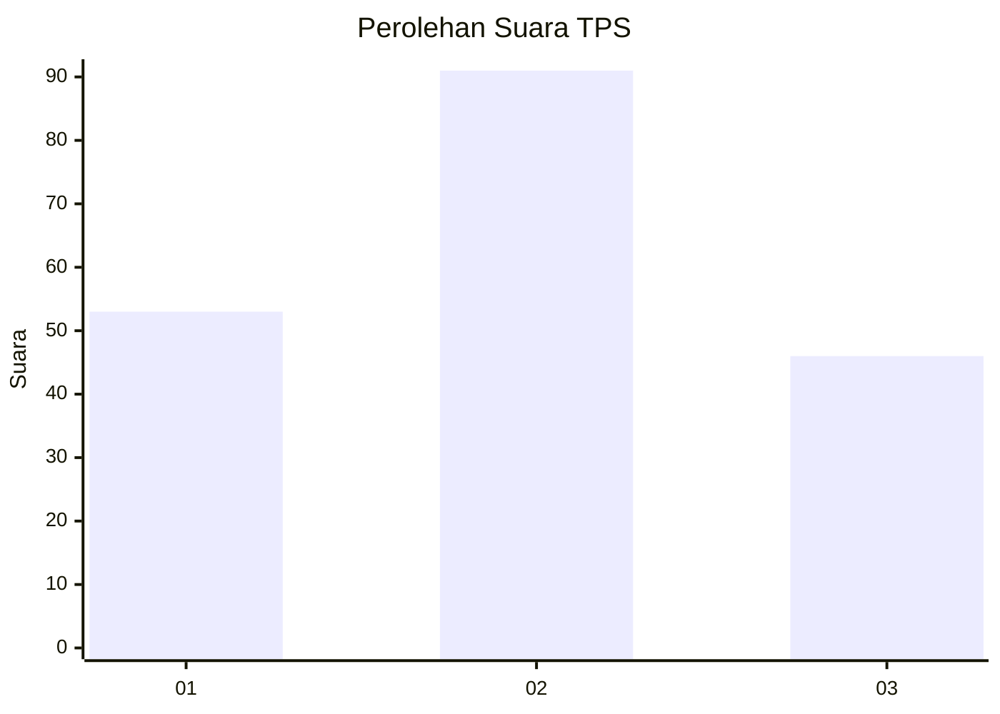
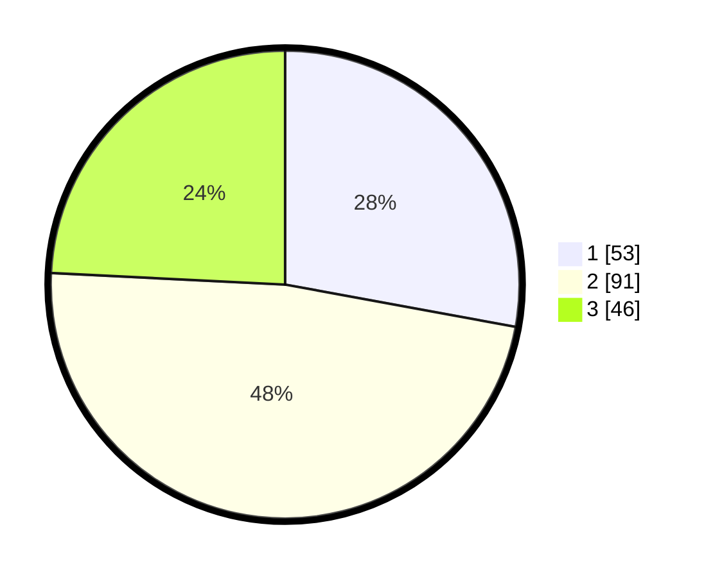

# Hasil

## Grafik

## Tabel

| No. | Nama Paslon    | Suara | Suara (raw) | Persentase |
|:--- |:-------------- | -----:| -----------:| ----------:|
| 1   | ANIES MUHAIMIN | 53    | [53][p-1]   | 27,89      |
| 2   | PRABOWO GIBRAN | 91    | [91][p-2]   | 47,89      |
| 3   | GANJAR MAHFUD  | 46    | [46][p-3]   | 24,21      |

[p-1]: https://github.com/gigit-pemilu/pemilu-2024-35-jawa-timur/blob/main/pilpres/hitung-suara/sub/35-jawa-timur/sub/29-sumenep/sub/11-pragaan/sub/2006-sentol-daya/sub/002-tps/sub/paslon-1.txt
[p-2]: https://github.com/gigit-pemilu/pemilu-2024-35-jawa-timur/blob/main/pilpres/hitung-suara/sub/35-jawa-timur/sub/29-sumenep/sub/11-pragaan/sub/2006-sentol-daya/sub/002-tps/sub/paslon-2.txt
[p-3]: https://github.com/gigit-pemilu/pemilu-2024-35-jawa-timur/blob/main/pilpres/hitung-suara/sub/35-jawa-timur/sub/29-sumenep/sub/11-pragaan/sub/2006-sentol-daya/sub/002-tps/sub/paslon-3.txt

## Foto C Plano

https://sirekap-obj-formc.kpu.go.id/66ca/pemilu/ppwp/35/29/11/20/06/3529112006002-20240215-051035--e9204584-23e7-44aa-ae3f-c4781e34737c.jpg

https://sirekap-obj-formc.kpu.go.id/66ca/pemilu/ppwp/35/29/11/20/06/3529112006002-20240215-051047--555ed71e-80b7-411a-a35d-53f781567b4a.jpg

https://sirekap-obj-formc.kpu.go.id/66ca/pemilu/ppwp/35/29/11/20/06/3529112006002-20240214-214948--c31944f8-d27a-4312-8636-fa3966d25669.jpg

## Metadata

| Key        | Value               |
| ---------- | ------------------- |
| Time Stamp | 2024-02-25 12:00:00 |

