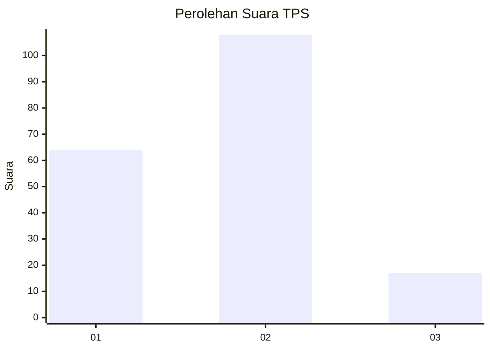
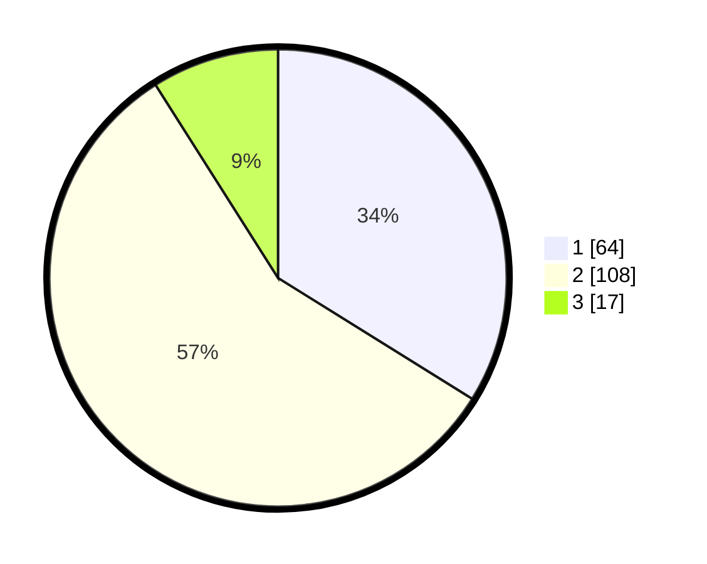

# Hasil

## Grafik

## Tabel

| No. | Nama Paslon    | Suara | Suara (raw) | Persentase |
|:--- |:-------------- | -----:| -----------:| ----------:|
| 1   | ANIES MUHAIMIN | 64    | [64][p-1]   | 33,86      |
| 2   | PRABOWO GIBRAN | 108   | [108][p-2]  | 57,14      |
| 3   | GANJAR MAHFUD  | 17    | [17][p-3]   | 8,99       |

[p-1]: https://github.com/gigit-pemilu/pemilu-2024-35-jawa-timur/blob/main/pilpres/hitung-suara/sub/35-jawa-timur/sub/29-sumenep/sub/11-pragaan/sub/2013-aeng-panas/sub/003-tps/sub/paslon-1.txt
[p-2]: https://github.com/gigit-pemilu/pemilu-2024-35-jawa-timur/blob/main/pilpres/hitung-suara/sub/35-jawa-timur/sub/29-sumenep/sub/11-pragaan/sub/2013-aeng-panas/sub/003-tps/sub/paslon-2.txt
[p-3]: https://github.com/gigit-pemilu/pemilu-2024-35-jawa-timur/blob/main/pilpres/hitung-suara/sub/35-jawa-timur/sub/29-sumenep/sub/11-pragaan/sub/2013-aeng-panas/sub/003-tps/sub/paslon-3.txt

## Foto C Plano

https://sirekap-obj-formc.kpu.go.id/d333/pemilu/ppwp/35/29/11/20/13/3529112013003-20240215-083110--97f003d9-2703-44a4-9901-7340e533a426.jpg

https://sirekap-obj-formc.kpu.go.id/d333/pemilu/ppwp/35/29/11/20/13/3529112013003-20240215-083445--21cabd4b-90f1-45f9-bb1c-182d5f19ae6d.jpg

https://sirekap-obj-formc.kpu.go.id/d333/pemilu/ppwp/35/29/11/20/13/3529112013003-20240215-083558--5f4d3b5c-0562-4d38-aa85-15050b679152.jpg

## Metadata

| Key        | Value               |
| ---------- | ------------------- |
| Time Stamp | 2024-02-16 21:01:00 |

