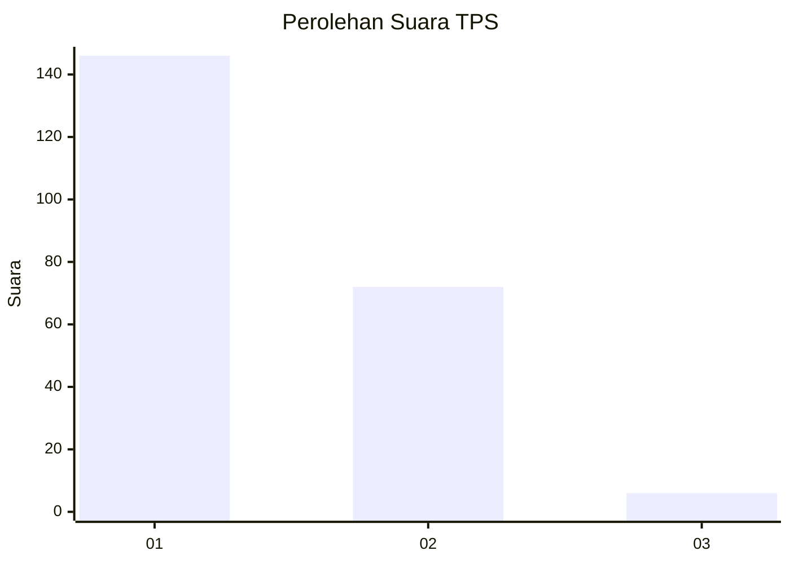
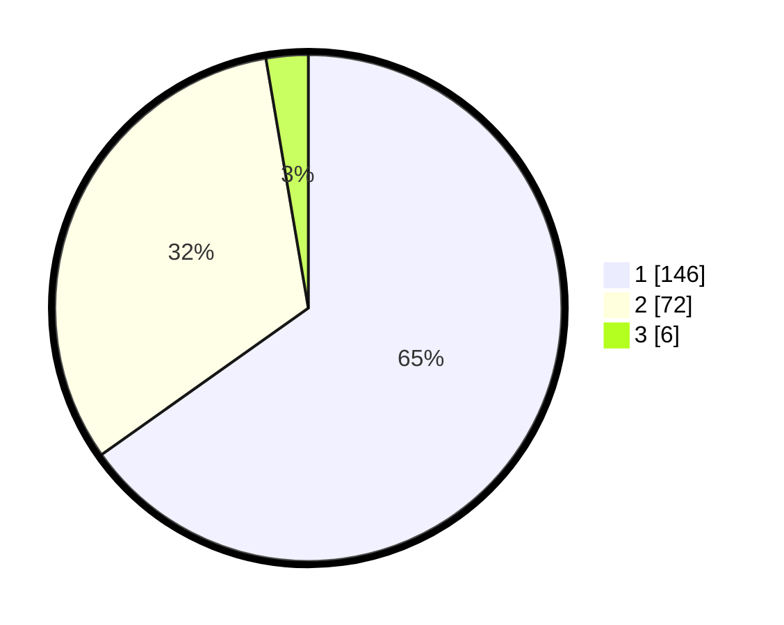

# Hasil

## Grafik

## Tabel

| No. | Nama Paslon    | Suara | Suara (raw) | Persentase |
|:--- |:-------------- | -----:| -----------:| ----------:|
| 1   | ANIES MUHAIMIN | 146   | [146][p-1]  | 65,18      |
| 2   | PRABOWO GIBRAN | 72    | [72][p-2]   | 32,14      |
| 3   | GANJAR MAHFUD  | 6     | [6][p-3]    | 2,68       |

[p-1]: https://github.com/gigit-pemilu/pemilu-2024-35-jawa-timur/blob/main/pilpres/hitung-suara/sub/35-jawa-timur/sub/29-sumenep/sub/11-pragaan/sub/2013-aeng-panas/sub/010-tps/sub/paslon-1.txt
[p-2]: https://github.com/gigit-pemilu/pemilu-2024-35-jawa-timur/blob/main/pilpres/hitung-suara/sub/35-jawa-timur/sub/29-sumenep/sub/11-pragaan/sub/2013-aeng-panas/sub/010-tps/sub/paslon-2.txt
[p-3]: https://github.com/gigit-pemilu/pemilu-2024-35-jawa-timur/blob/main/pilpres/hitung-suara/sub/35-jawa-timur/sub/29-sumenep/sub/11-pragaan/sub/2013-aeng-panas/sub/010-tps/sub/paslon-3.txt

## Foto C Plano

https://sirekap-obj-formc.kpu.go.id/fe63/pemilu/ppwp/35/29/11/20/13/3529112013010-20240214-224147--d7eaeba0-fe2b-40c7-8a02-8495be8fa24b.jpg

https://sirekap-obj-formc.kpu.go.id/fe63/pemilu/ppwp/35/29/11/20/13/3529112013010-20240214-224513--1e023550-53c5-4bac-b98c-49d2c455a261.jpg

https://sirekap-obj-formc.kpu.go.id/fe63/pemilu/ppwp/35/29/11/20/13/3529112013010-20240214-224600--d072a3b6-148e-4b0a-8b01-3c34319aaebf.jpg

## Metadata

| Key        | Value               |
| ---------- | ------------------- |
| Time Stamp | 2024-02-24 22:31:28 |

