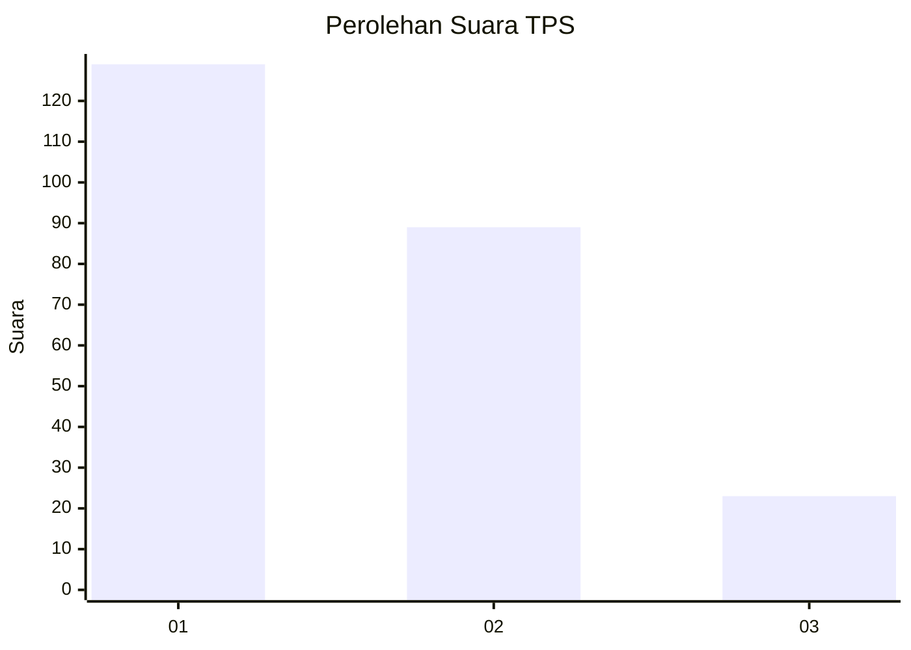
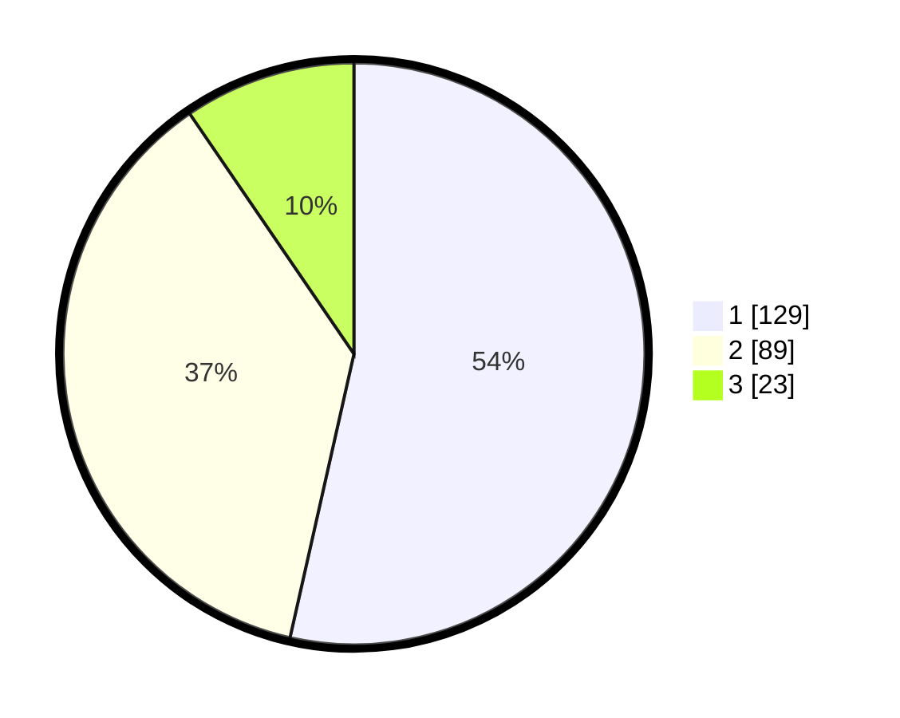

# Hasil

## Grafik

## Tabel

| No. | Nama Paslon    | Suara | Suara (raw) | Persentase |
|:--- |:-------------- | -----:| -----------:| ----------:|
| 1   | ANIES MUHAIMIN | 129   | [129][p-1]  | 53,53      |
| 2   | PRABOWO GIBRAN | 89    | [89][p-2]   | 36,93      |
| 3   | GANJAR MAHFUD  | 23    | [23][p-3]   | 9,54       |

[p-1]: https://github.com/gigit-pemilu/pemilu-2024/blob/main/pilpres/hitung-suara/sub/35-jawa-timur/sub/29-sumenep/sub/11-pragaan/sub/2014-karduluk/sub/003-tps/sub/paslon-1.txt
[p-2]: https://github.com/gigit-pemilu/pemilu-2024/blob/main/pilpres/hitung-suara/sub/35-jawa-timur/sub/29-sumenep/sub/11-pragaan/sub/2014-karduluk/sub/003-tps/sub/paslon-2.txt
[p-3]: https://github.com/gigit-pemilu/pemilu-2024/blob/main/pilpres/hitung-suara/sub/35-jawa-timur/sub/29-sumenep/sub/11-pragaan/sub/2014-karduluk/sub/003-tps/sub/paslon-3.txt

## Foto C Plano

https://sirekap-obj-formc.kpu.go.id/ac39/pemilu/ppwp/35/29/11/20/14/3529112014003-20240214-214258--ca221263-d99e-47e5-81ca-e0033593d040.jpg

https://sirekap-obj-formc.kpu.go.id/ac39/pemilu/ppwp/35/29/11/20/14/3529112014003-20240214-214430--46e57739-0c32-4099-b794-70f08dc2c3ce.jpg

https://sirekap-obj-formc.kpu.go.id/ac39/pemilu/ppwp/35/29/11/20/14/3529112014003-20240214-214534--9551cbe9-ce87-4ee3-aa21-258f5095be57.jpg

## Metadata

| Key        | Value               |
| ---------- | ------------------- |
| Time Stamp | 2024-02-25 12:00:00 |

