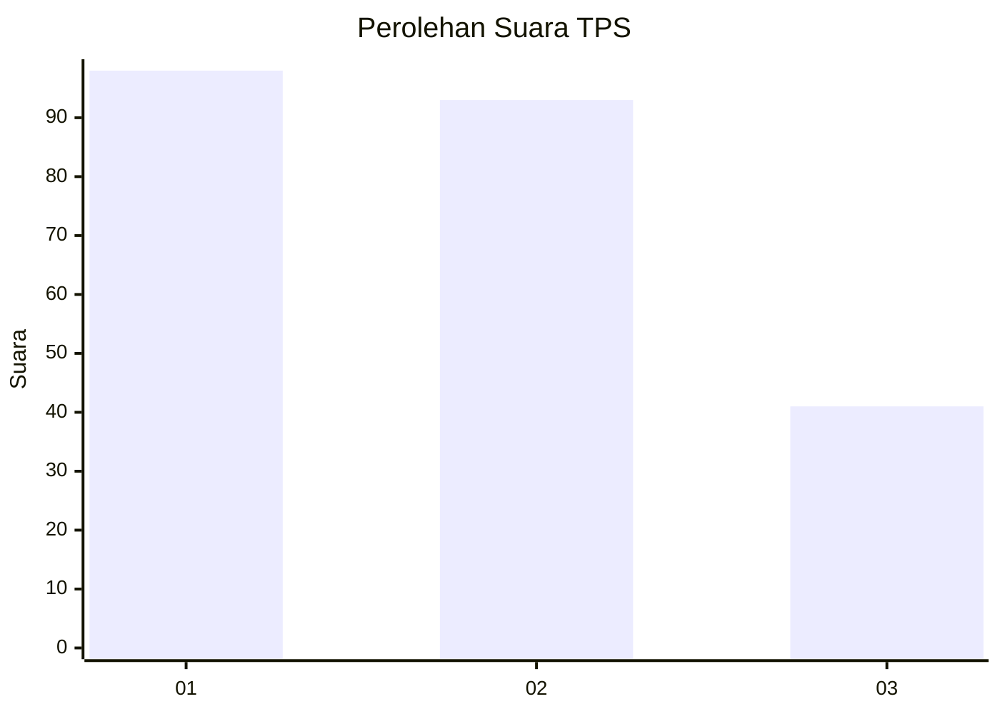
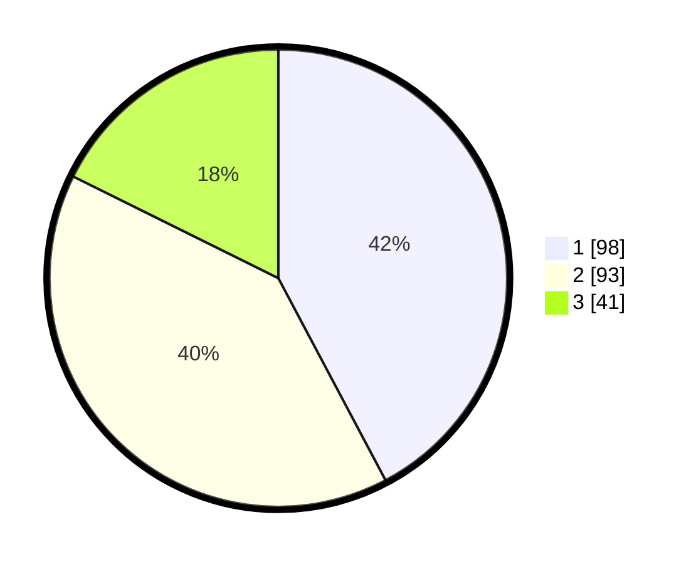

# Hasil

## Grafik

## Tabel

| No. | Nama Paslon    | Suara | Suara (raw) | Persentase |
|:--- |:-------------- | -----:| -----------:| ----------:|
| 1   | ANIES MUHAIMIN | 98    | [98][p-1]   | 42,24      |
| 2   | PRABOWO GIBRAN | 93    | [93][p-2]   | 40,09      |
| 3   | GANJAR MAHFUD  | 41    | [41][p-3]   | 17,67      |

[p-1]: https://github.com/gigit-pemilu/pemilu-2024-35-jawa-timur/blob/main/pilpres/hitung-suara/sub/35-jawa-timur/sub/29-sumenep/sub/11-pragaan/sub/2014-karduluk/sub/004-tps/sub/paslon-1.txt
[p-2]: https://github.com/gigit-pemilu/pemilu-2024-35-jawa-timur/blob/main/pilpres/hitung-suara/sub/35-jawa-timur/sub/29-sumenep/sub/11-pragaan/sub/2014-karduluk/sub/004-tps/sub/paslon-2.txt
[p-3]: https://github.com/gigit-pemilu/pemilu-2024-35-jawa-timur/blob/main/pilpres/hitung-suara/sub/35-jawa-timur/sub/29-sumenep/sub/11-pragaan/sub/2014-karduluk/sub/004-tps/sub/paslon-3.txt

## Foto C Plano

https://sirekap-obj-formc.kpu.go.id/06a7/pemilu/ppwp/35/29/11/20/14/3529112014004-20240214-194110--22b6575c-1237-40b9-9d45-d033007d3dc3.jpg

https://sirekap-obj-formc.kpu.go.id/06a7/pemilu/ppwp/35/29/11/20/14/3529112014004-20240214-194242--8785cba8-8a54-47a2-9a9a-f7e63fe53fee.jpg

https://sirekap-obj-formc.kpu.go.id/06a7/pemilu/ppwp/35/29/11/20/14/3529112014004-20240214-194349--02daad18-b7a3-4436-9c95-a69cf346275b.jpg

## Metadata

| Key        | Value               |
| ---------- | ------------------- |
| Time Stamp | 2024-02-25 17:00:00 |

