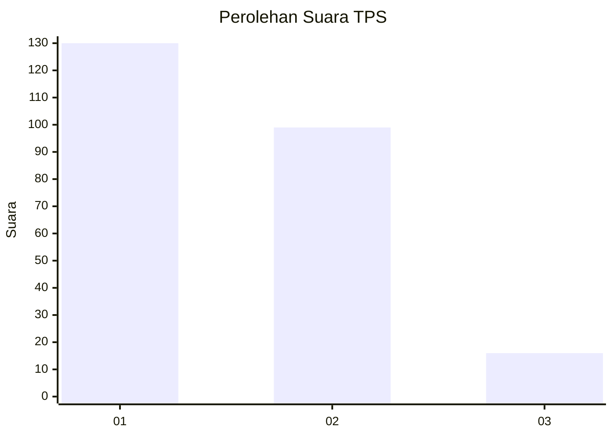
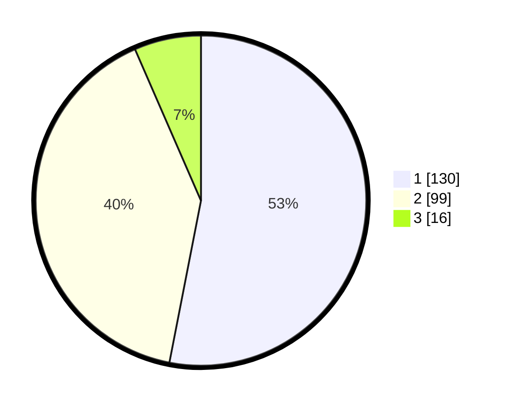

# Hasil

## Grafik

## Tabel

| No. | Nama Paslon    | Suara | Suara (raw) | Persentase |
|:--- |:-------------- | -----:| -----------:| ----------:|
| 1   | ANIES MUHAIMIN | 130   | [130][p-1]  | 53,06      |
| 2   | PRABOWO GIBRAN | 99    | [99][p-2]   | 40,41      |
| 3   | GANJAR MAHFUD  | 16    | [16][p-3]   | 6,53       |

[p-1]: https://github.com/gigit-pemilu/pemilu-2024/blob/main/pilpres/hitung-suara/sub/35-jawa-timur/sub/29-sumenep/sub/11-pragaan/sub/2014-karduluk/sub/012-tps/sub/paslon-1.txt
[p-2]: https://github.com/gigit-pemilu/pemilu-2024/blob/main/pilpres/hitung-suara/sub/35-jawa-timur/sub/29-sumenep/sub/11-pragaan/sub/2014-karduluk/sub/012-tps/sub/paslon-2.txt
[p-3]: https://github.com/gigit-pemilu/pemilu-2024/blob/main/pilpres/hitung-suara/sub/35-jawa-timur/sub/29-sumenep/sub/11-pragaan/sub/2014-karduluk/sub/012-tps/sub/paslon-3.txt

## Foto C Plano

https://sirekap-obj-formc.kpu.go.id/8a87/pemilu/ppwp/35/29/11/20/14/3529112014012-20240214-222537--39288ff8-6278-4e60-b983-ee9705297932.jpg

https://sirekap-obj-formc.kpu.go.id/8a87/pemilu/ppwp/35/29/11/20/14/3529112014012-20240214-222627--9ed6fa77-2b09-4276-9f87-1e93981b0be1.jpg

https://sirekap-obj-formc.kpu.go.id/8a87/pemilu/ppwp/35/29/11/20/14/3529112014012-20240214-222820--f20cb402-e628-452e-886c-a85b04bdb138.jpg

## Metadata

| Key        | Value               |
| ---------- | ------------------- |
| Time Stamp | 2024-02-16 21:01:00 |

