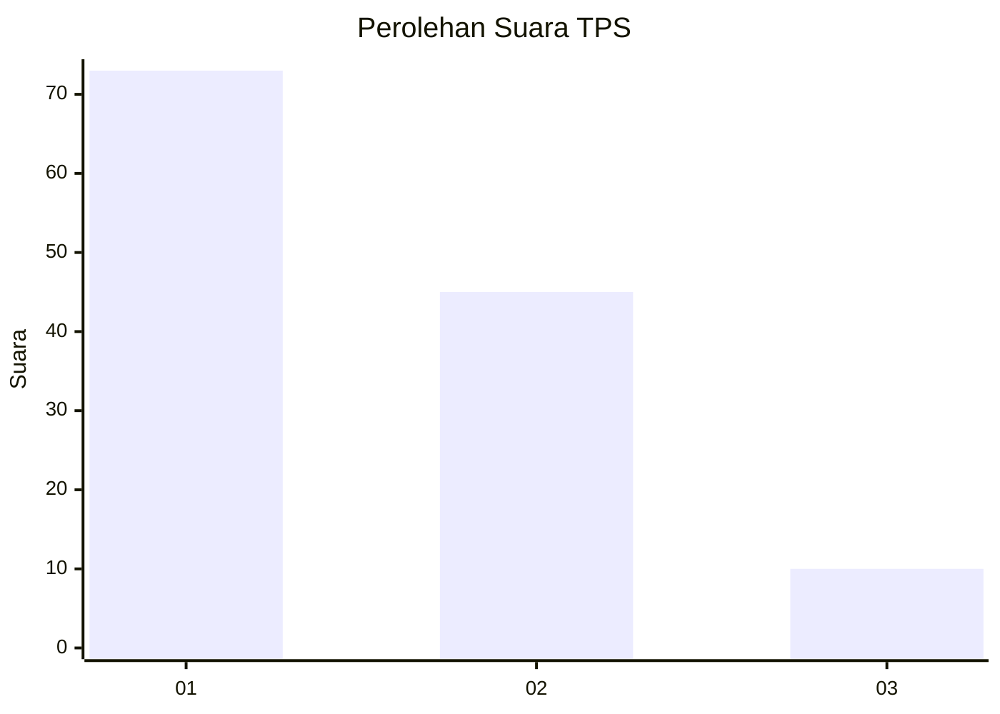
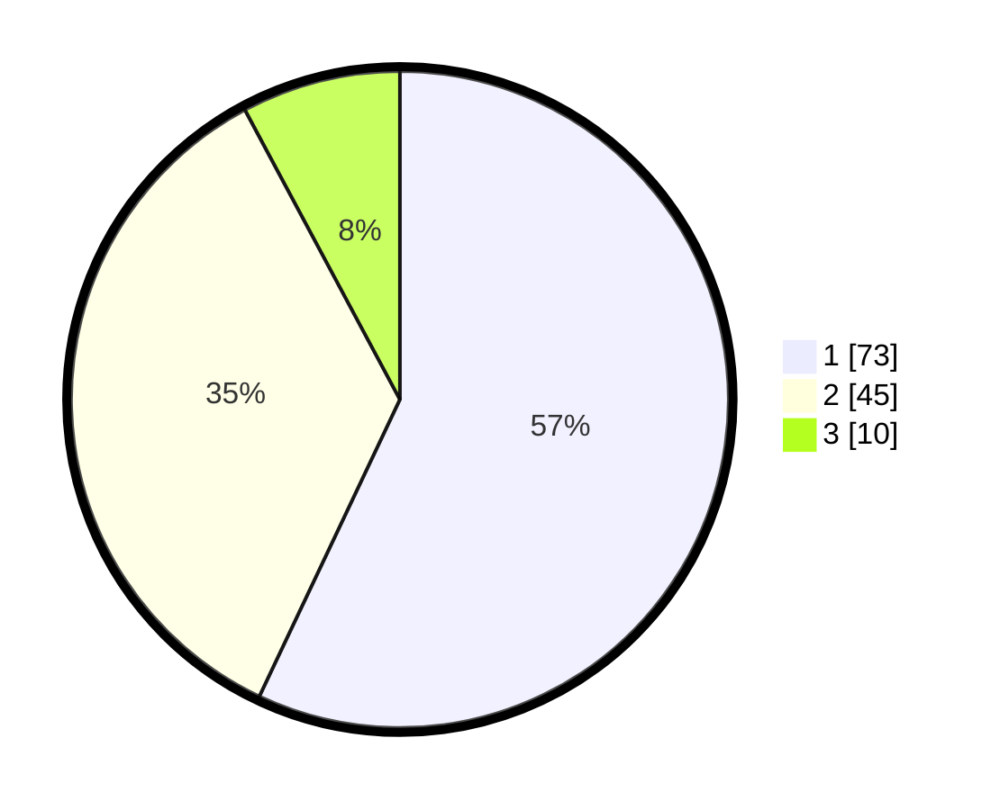

# Hasil

## Grafik

## Tabel

| No. | Nama Paslon    | Suara | Suara (raw) | Persentase |
|:--- |:-------------- | -----:| -----------:| ----------:|
| 1   | ANIES MUHAIMIN | 73    | [73][p-1]   | 57,03      |
| 2   | PRABOWO GIBRAN | 45    | [45][p-2]   | 35,16      |
| 3   | GANJAR MAHFUD  | 10    | [10][p-3]   | 7,81       |

[p-1]: https://github.com/gigit-pemilu/pemilu-2024/blob/main/pilpres/hitung-suara/sub/35-jawa-timur/sub/29-sumenep/sub/11-pragaan/sub/2014-karduluk/sub/026-tps/sub/paslon-1.txt
[p-2]: https://github.com/gigit-pemilu/pemilu-2024/blob/main/pilpres/hitung-suara/sub/35-jawa-timur/sub/29-sumenep/sub/11-pragaan/sub/2014-karduluk/sub/026-tps/sub/paslon-2.txt
[p-3]: https://github.com/gigit-pemilu/pemilu-2024/blob/main/pilpres/hitung-suara/sub/35-jawa-timur/sub/29-sumenep/sub/11-pragaan/sub/2014-karduluk/sub/026-tps/sub/paslon-3.txt

## Foto C Plano

https://sirekap-obj-formc.kpu.go.id/9b99/pemilu/ppwp/35/29/11/20/14/3529112014026-20240214-214717--b2bfee48-f8f4-471d-a4d7-b35b5a0dfab7.jpg

https://sirekap-obj-formc.kpu.go.id/9b99/pemilu/ppwp/35/29/11/20/14/3529112014026-20240214-214835--3d5d7482-4bb4-4946-9b1c-74ee55a1752b.jpg

https://sirekap-obj-formc.kpu.go.id/9b99/pemilu/ppwp/35/29/11/20/14/3529112014026-20240214-214942--7e194010-570d-45ca-9e7f-73597f68c286.jpg

## Metadata

| Key        | Value               |
| ---------- | ------------------- |
| Time Stamp | 2024-02-25 23:00:00 |

