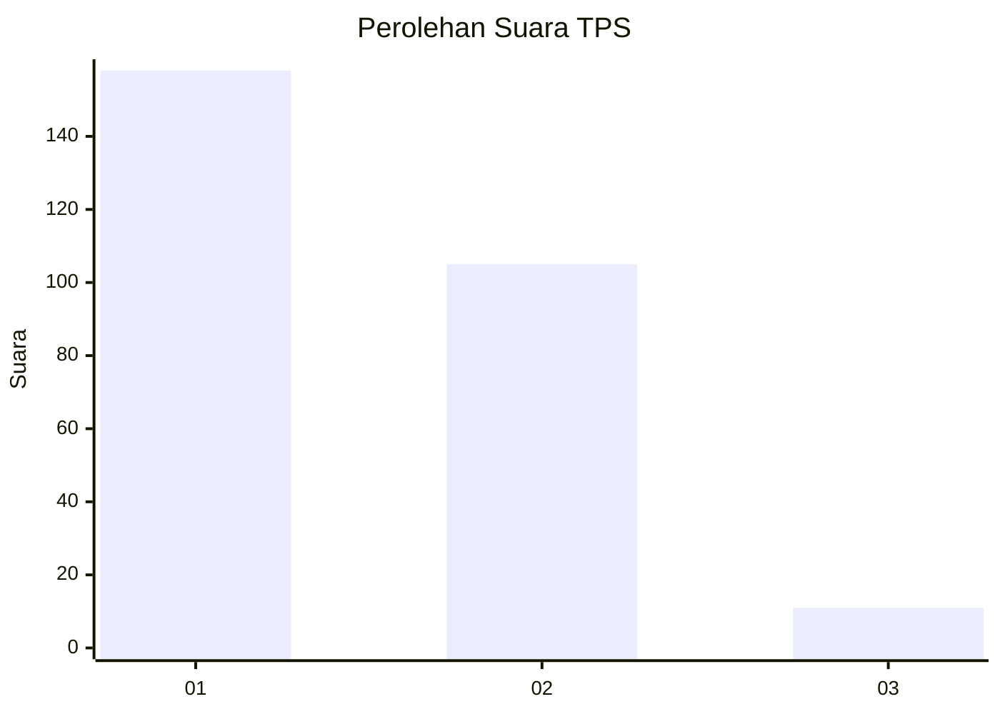
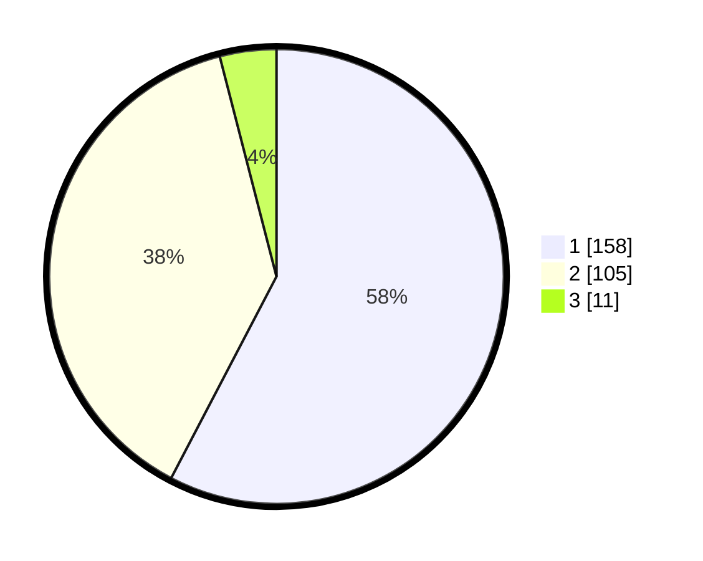

# Hasil

## Grafik

## Tabel

| No. | Nama Paslon    | Suara | Suara (raw) | Persentase |
|:--- |:-------------- | -----:| -----------:| ----------:|
| 1   | ANIES MUHAIMIN | 158   | [158][p-1]  | 57,66      |
| 2   | PRABOWO GIBRAN | 105   | [105][p-2]  | 38,32      |
| 3   | GANJAR MAHFUD  | 11    | [11][p-3]   | 4,01       |

[p-1]: https://github.com/gigit-pemilu/pemilu-2024/blob/main/pilpres/hitung-suara/sub/35-jawa-timur/sub/29-sumenep/sub/11-pragaan/sub/2014-karduluk/sub/030-tps/sub/paslon-1.txt
[p-2]: https://github.com/gigit-pemilu/pemilu-2024/blob/main/pilpres/hitung-suara/sub/35-jawa-timur/sub/29-sumenep/sub/11-pragaan/sub/2014-karduluk/sub/030-tps/sub/paslon-2.txt
[p-3]: https://github.com/gigit-pemilu/pemilu-2024/blob/main/pilpres/hitung-suara/sub/35-jawa-timur/sub/29-sumenep/sub/11-pragaan/sub/2014-karduluk/sub/030-tps/sub/paslon-3.txt

## Foto C Plano

https://sirekap-obj-formc.kpu.go.id/a67c/pemilu/ppwp/35/29/11/20/14/3529112014030-20240215-000236--9f74f778-4c7d-4dbc-9ce7-fbecb8f32ae8.jpg

https://sirekap-obj-formc.kpu.go.id/a67c/pemilu/ppwp/35/29/11/20/14/3529112014030-20240215-000401--9946c1c8-6379-4cf6-bf8f-3cdede2f38f1.jpg

https://sirekap-obj-formc.kpu.go.id/a67c/pemilu/ppwp/35/29/11/20/14/3529112014030-20240215-000516--9a95dca7-d75c-49bd-aea3-8d17b8c58d1a.jpg

## Metadata

| Key        | Value               |
| ---------- | ------------------- |
| Time Stamp | 2024-02-16 21:01:00 |

