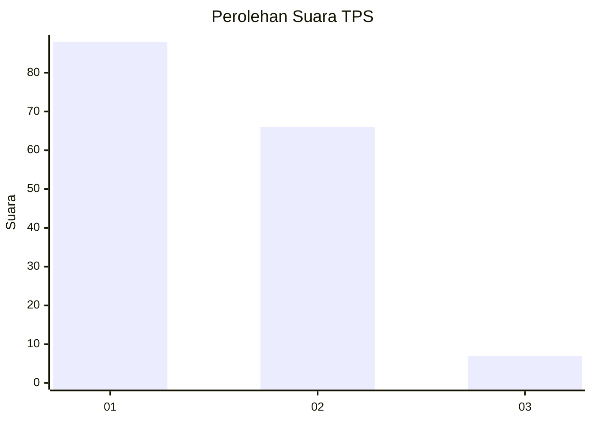
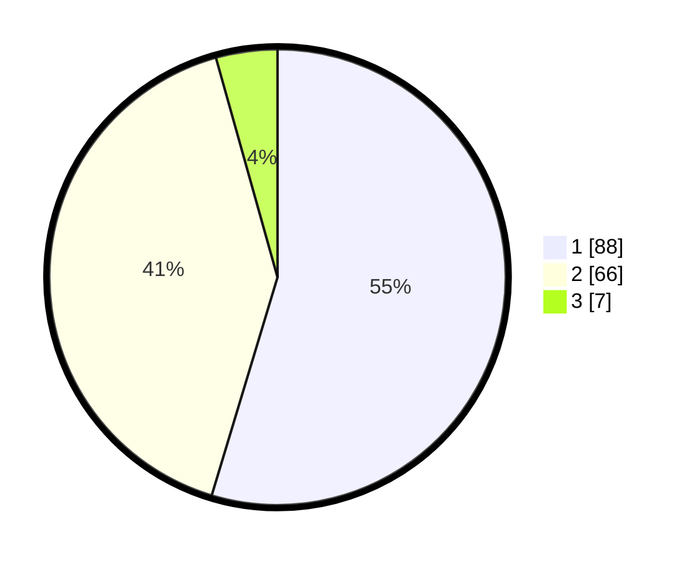

# Hasil

## Grafik

## Tabel

| No. | Nama Paslon    | Suara | Suara (raw) | Persentase |
|:--- |:-------------- | -----:| -----------:| ----------:|
| 1   | ANIES MUHAIMIN | 88    | [88][p-1]   | 54,66      |
| 2   | PRABOWO GIBRAN | 66    | [66][p-2]   | 40,99      |
| 3   | GANJAR MAHFUD  | 7     | [7][p-3]    | 4,35       |

[p-1]: https://github.com/gigit-pemilu/pemilu-2024-35-jawa-timur/blob/main/pilpres/hitung-suara/sub/35-jawa-timur/sub/29-sumenep/sub/11-pragaan/sub/2014-karduluk/sub/031-tps/sub/paslon-1.txt
[p-2]: https://github.com/gigit-pemilu/pemilu-2024-35-jawa-timur/blob/main/pilpres/hitung-suara/sub/35-jawa-timur/sub/29-sumenep/sub/11-pragaan/sub/2014-karduluk/sub/031-tps/sub/paslon-2.txt
[p-3]: https://github.com/gigit-pemilu/pemilu-2024-35-jawa-timur/blob/main/pilpres/hitung-suara/sub/35-jawa-timur/sub/29-sumenep/sub/11-pragaan/sub/2014-karduluk/sub/031-tps/sub/paslon-3.txt

## Foto C Plano

https://sirekap-obj-formc.kpu.go.id/1291/pemilu/ppwp/35/29/11/20/14/3529112014031-20240214-234729--539060cd-4ac2-453e-8fa5-91119938dcd5.jpg

https://sirekap-obj-formc.kpu.go.id/1291/pemilu/ppwp/35/29/11/20/14/3529112014031-20240214-234844--7504d245-02b2-4783-8e61-26109e75de8e.jpg

https://sirekap-obj-formc.kpu.go.id/1291/pemilu/ppwp/35/29/11/20/14/3529112014031-20240214-234924--f574bffe-046a-44d1-b075-ca77549dd245.jpg

## Metadata

| Key        | Value               |
| ---------- | ------------------- |
| Time Stamp | 2024-02-24 22:31:28 |

