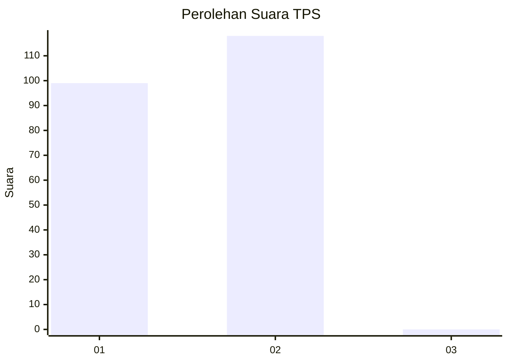
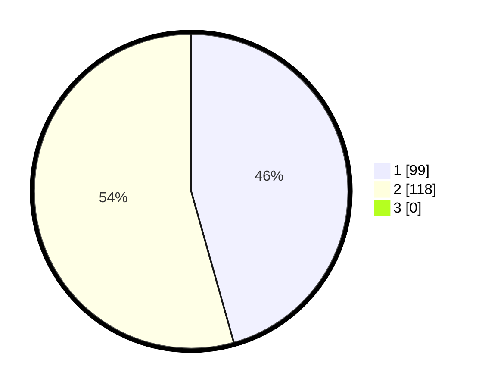

# Hasil

## Grafik

## Tabel

| No. | Nama Paslon    | Suara | Suara (raw) | Persentase |
|:--- |:-------------- | -----:| -----------:| ----------:|
| 1   | ANIES MUHAIMIN | 99    | [99][p-1]   | 45,62      |
| 2   | PRABOWO GIBRAN | 118   | [118][p-2]  | 54,38      |
| 3   | GANJAR MAHFUD  | 0     | [0][p-3]    | 0,00       |

[p-1]: https://github.com/gigit-pemilu/pemilu-2024-35-jawa-timur/blob/main/pilpres/hitung-suara/sub/35-jawa-timur/sub/29-sumenep/sub/12-ambunten/sub/2002-ambunten-tengah/sub/013-tps/sub/paslon-1.txt
[p-2]: https://github.com/gigit-pemilu/pemilu-2024-35-jawa-timur/blob/main/pilpres/hitung-suara/sub/35-jawa-timur/sub/29-sumenep/sub/12-ambunten/sub/2002-ambunten-tengah/sub/013-tps/sub/paslon-2.txt
[p-3]: https://github.com/gigit-pemilu/pemilu-2024-35-jawa-timur/blob/main/pilpres/hitung-suara/sub/35-jawa-timur/sub/29-sumenep/sub/12-ambunten/sub/2002-ambunten-tengah/sub/013-tps/sub/paslon-3.txt

## Foto C Plano

https://sirekap-obj-formc.kpu.go.id/f351/pemilu/ppwp/35/29/12/20/02/3529122002013-20240214-220054--1a92e7be-36be-451d-99a2-399c8b48775c.jpg

https://sirekap-obj-formc.kpu.go.id/f351/pemilu/ppwp/35/29/12/20/02/3529122002013-20240214-220721--031ae33f-3b47-408b-858c-643435cf1fce.jpg

https://sirekap-obj-formc.kpu.go.id/f351/pemilu/ppwp/35/29/12/20/02/3529122002013-20240214-220816--77d2a807-af8b-4110-812e-d662487d52a1.jpg

## Metadata

| Key        | Value               |
| ---------- | ------------------- |
| Time Stamp | 2024-02-25 17:00:00 |

