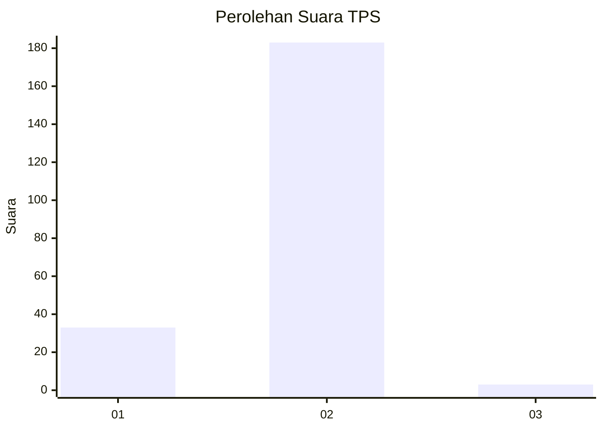
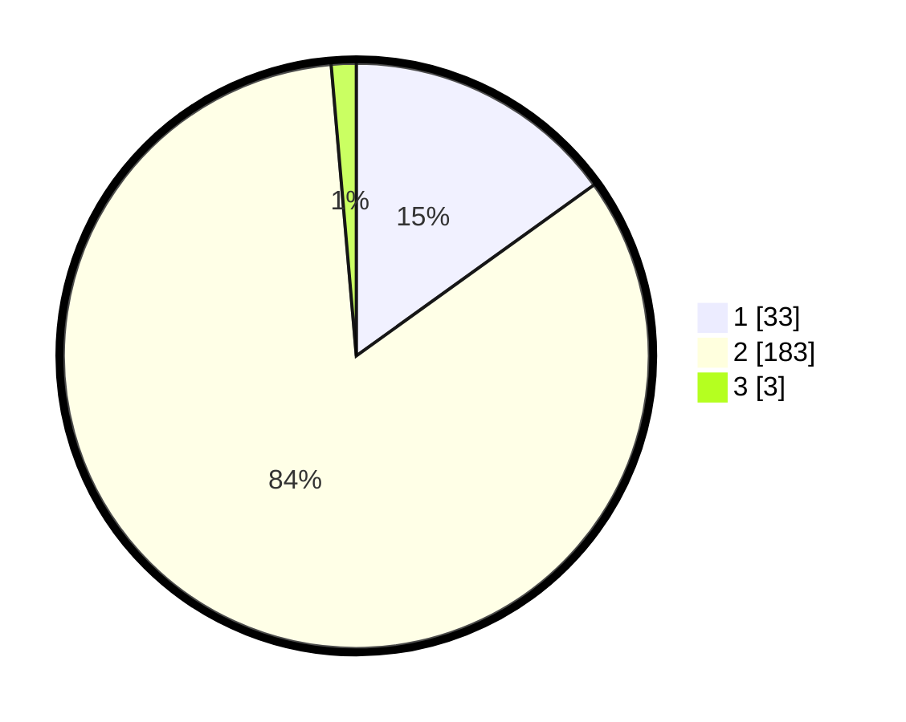

# Hasil

## Grafik

## Tabel

| No. | Nama Paslon    | Suara | Suara (raw) | Persentase |
|:--- |:-------------- | -----:| -----------:| ----------:|
| 1   | ANIES MUHAIMIN | 33    | [33][p-1]   | 15,07      |
| 2   | PRABOWO GIBRAN | 183   | [183][p-2]  | 83,56      |
| 3   | GANJAR MAHFUD  | 3     | [3][p-3]    | 1,37       |

[p-1]: https://github.com/gigit-pemilu/pemilu-2024/blob/main/pilpres/hitung-suara/sub/35-jawa-timur/sub/29-sumenep/sub/12-ambunten/sub/2002-ambunten-tengah/sub/019-tps/sub/paslon-1.txt
[p-2]: https://github.com/gigit-pemilu/pemilu-2024/blob/main/pilpres/hitung-suara/sub/35-jawa-timur/sub/29-sumenep/sub/12-ambunten/sub/2002-ambunten-tengah/sub/019-tps/sub/paslon-2.txt
[p-3]: https://github.com/gigit-pemilu/pemilu-2024/blob/main/pilpres/hitung-suara/sub/35-jawa-timur/sub/29-sumenep/sub/12-ambunten/sub/2002-ambunten-tengah/sub/019-tps/sub/paslon-3.txt

## Foto C Plano

https://sirekap-obj-formc.kpu.go.id/032c/pemilu/ppwp/35/29/12/20/02/3529122002019-20240214-224413--db063db2-2857-4afb-9acc-4db46204d38d.jpg

https://sirekap-obj-formc.kpu.go.id/032c/pemilu/ppwp/35/29/12/20/02/3529122002019-20240214-224850--0d000f24-9ec3-4b8d-83e9-a8c3a290b09e.jpg

https://sirekap-obj-formc.kpu.go.id/032c/pemilu/ppwp/35/29/12/20/02/3529122002019-20240214-225031--f2080c02-11c7-428e-bb65-ffc6c1bd9334.jpg

## Metadata

| Key        | Value               |
| ---------- | ------------------- |
| Time Stamp | 2024-02-24 22:31:28 |

