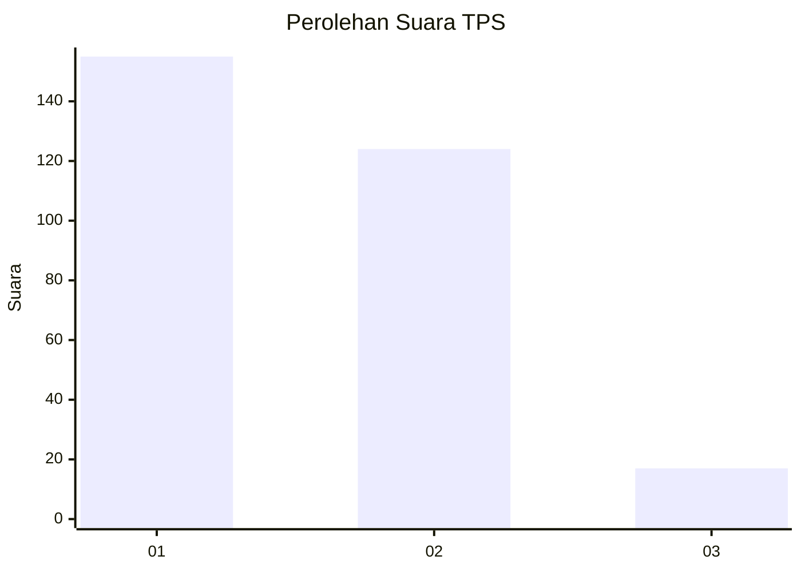
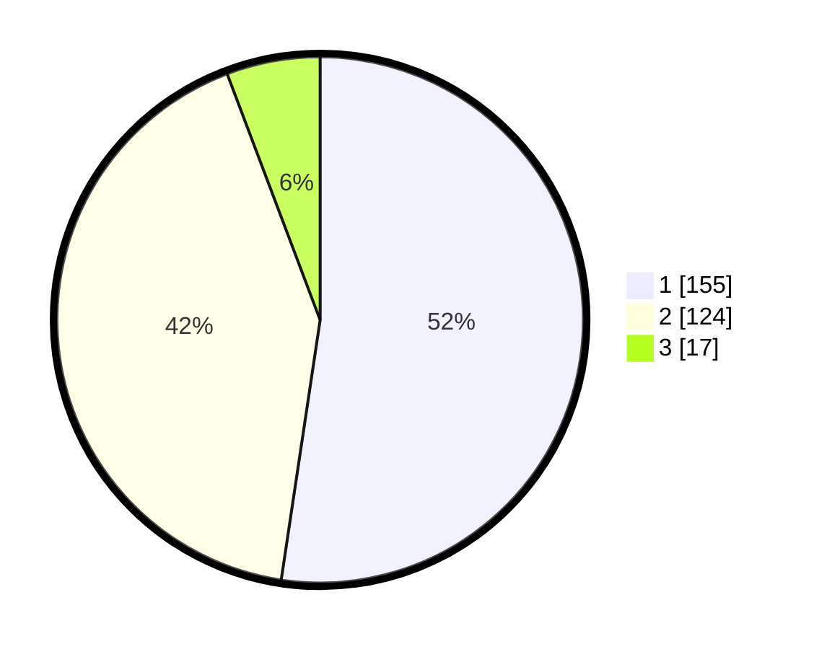

# Hasil

## Grafik

## Tabel

| No. | Nama Paslon    | Suara | Suara (raw) | Persentase |
|:--- |:-------------- | -----:| -----------:| ----------:|
| 1   | ANIES MUHAIMIN | 155   | [155][p-1]  | 52,36      |
| 2   | PRABOWO GIBRAN | 124   | [124][p-2]  | 41,89      |
| 3   | GANJAR MAHFUD  | 17    | [17][p-3]   | 5,74       |

[p-1]: https://github.com/gigit-pemilu/pemilu-2024-35-jawa-timur/blob/main/pilpres/hitung-suara/sub/35-jawa-timur/sub/29-sumenep/sub/12-ambunten/sub/2003-ambunten-timur/sub/014-tps/sub/paslon-1.txt
[p-2]: https://github.com/gigit-pemilu/pemilu-2024-35-jawa-timur/blob/main/pilpres/hitung-suara/sub/35-jawa-timur/sub/29-sumenep/sub/12-ambunten/sub/2003-ambunten-timur/sub/014-tps/sub/paslon-2.txt
[p-3]: https://github.com/gigit-pemilu/pemilu-2024-35-jawa-timur/blob/main/pilpres/hitung-suara/sub/35-jawa-timur/sub/29-sumenep/sub/12-ambunten/sub/2003-ambunten-timur/sub/014-tps/sub/paslon-3.txt

## Foto C Plano

https://sirekap-obj-formc.kpu.go.id/e318/pemilu/ppwp/35/29/12/20/03/3529122003014-20240214-235842--d1cae6c6-848b-4c99-be67-7b56555f6d60.jpg

https://sirekap-obj-formc.kpu.go.id/e318/pemilu/ppwp/35/29/12/20/03/3529122003014-20240214-214808--37c5949c-28d4-47a1-947f-0e59e209064a.jpg

https://sirekap-obj-formc.kpu.go.id/e318/pemilu/ppwp/35/29/12/20/03/3529122003014-20240214-215030--ece477be-14f2-4b99-938a-c7c6f79705d4.jpg

## Metadata

| Key        | Value               |
| ---------- | ------------------- |
| Time Stamp | 2024-02-15 22:00:27 |

