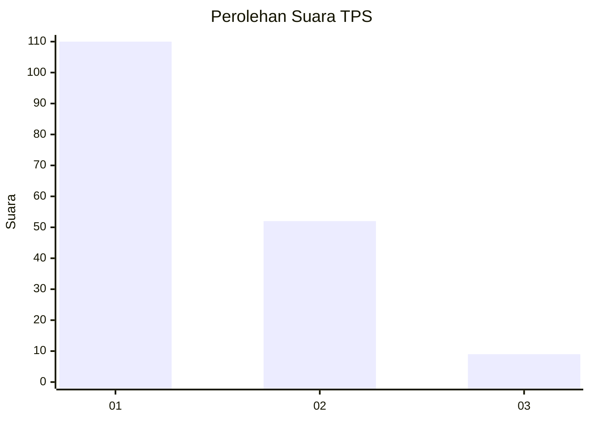
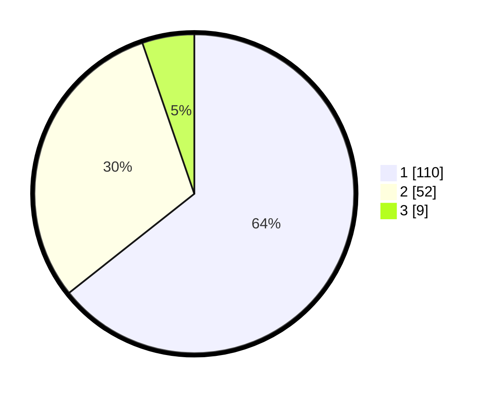

# Hasil

## Grafik

## Tabel

| No. | Nama Paslon    | Suara | Suara (raw) | Persentase |
|:--- |:-------------- | -----:| -----------:| ----------:|
| 1   | ANIES MUHAIMIN | 110   | [110][p-1]  | 64,33      |
| 2   | PRABOWO GIBRAN | 52    | [52][p-2]   | 30,41      |
| 3   | GANJAR MAHFUD  | 9     | [9][p-3]    | 5,26       |

[p-1]: https://github.com/gigit-pemilu/pemilu-2024-35-jawa-timur/blob/main/pilpres/hitung-suara/sub/35-jawa-timur/sub/29-sumenep/sub/12-ambunten/sub/2006-tambaagung-ares/sub/001-tps/sub/paslon-1.txt
[p-2]: https://github.com/gigit-pemilu/pemilu-2024-35-jawa-timur/blob/main/pilpres/hitung-suara/sub/35-jawa-timur/sub/29-sumenep/sub/12-ambunten/sub/2006-tambaagung-ares/sub/001-tps/sub/paslon-2.txt
[p-3]: https://github.com/gigit-pemilu/pemilu-2024-35-jawa-timur/blob/main/pilpres/hitung-suara/sub/35-jawa-timur/sub/29-sumenep/sub/12-ambunten/sub/2006-tambaagung-ares/sub/001-tps/sub/paslon-3.txt

## Foto C Plano

https://sirekap-obj-formc.kpu.go.id/f150/pemilu/ppwp/35/29/12/20/06/3529122006001-20240214-230140--a3a87691-1203-40d3-b550-63a5778140fe.jpg

https://sirekap-obj-formc.kpu.go.id/f150/pemilu/ppwp/35/29/12/20/06/3529122006001-20240214-230459--3055ef32-7242-4875-a85f-368fc1d32184.jpg

https://sirekap-obj-formc.kpu.go.id/f150/pemilu/ppwp/35/29/12/20/06/3529122006001-20240214-231045--a3f0d3f1-01e1-4729-905e-bba11af84528.jpg

## Metadata

| Key        | Value               |
| ---------- | ------------------- |
| Time Stamp | 2024-02-25 16:00:00 |

