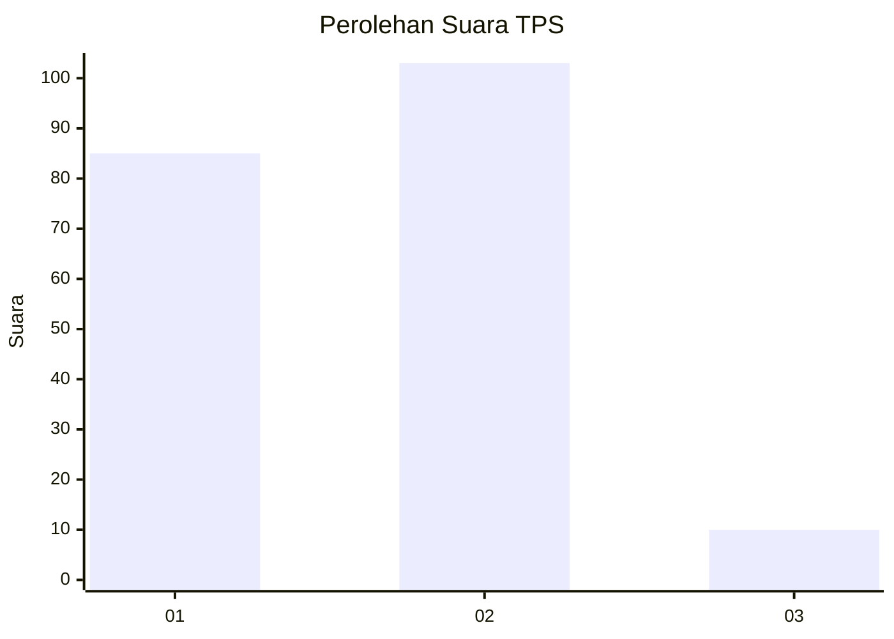
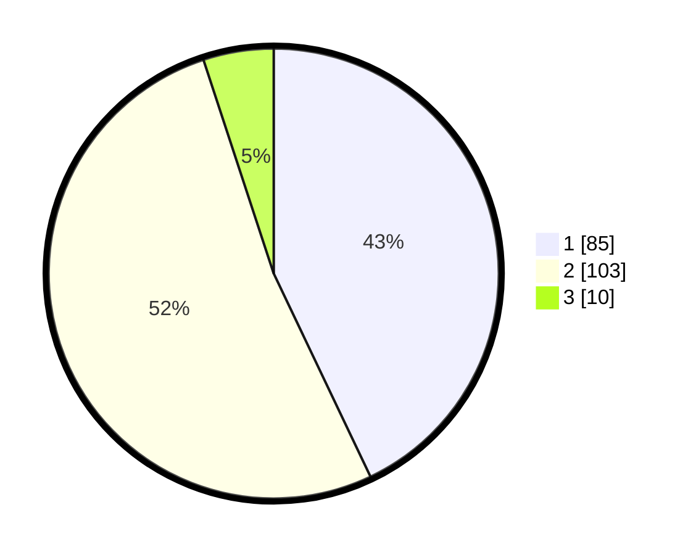

# Hasil

## Grafik

## Tabel

| No. | Nama Paslon    | Suara | Suara (raw) | Persentase |
|:--- |:-------------- | -----:| -----------:| ----------:|
| 1   | ANIES MUHAIMIN | 85    | [85][p-1]   | 42,93      |
| 2   | PRABOWO GIBRAN | 103   | [103][p-2]  | 52,02      |
| 3   | GANJAR MAHFUD  | 10    | [10][p-3]   | 5,05       |

[p-1]: https://github.com/gigit-pemilu/pemilu-2024/blob/main/pilpres/hitung-suara/sub/35-jawa-timur/sub/29-sumenep/sub/12-ambunten/sub/2006-tambaagung-ares/sub/006-tps/sub/paslon-1.txt
[p-2]: https://github.com/gigit-pemilu/pemilu-2024/blob/main/pilpres/hitung-suara/sub/35-jawa-timur/sub/29-sumenep/sub/12-ambunten/sub/2006-tambaagung-ares/sub/006-tps/sub/paslon-2.txt
[p-3]: https://github.com/gigit-pemilu/pemilu-2024/blob/main/pilpres/hitung-suara/sub/35-jawa-timur/sub/29-sumenep/sub/12-ambunten/sub/2006-tambaagung-ares/sub/006-tps/sub/paslon-3.txt

## Foto C Plano

https://sirekap-obj-formc.kpu.go.id/9909/pemilu/ppwp/35/29/12/20/06/3529122006006-20240214-213107--692c0852-e1be-4b9e-ae73-72f38bd0f4a9.jpg

https://sirekap-obj-formc.kpu.go.id/9909/pemilu/ppwp/35/29/12/20/06/3529122006006-20240214-213315--94168bf9-2e3c-4fad-b9ef-d9a1b4000d21.jpg

https://sirekap-obj-formc.kpu.go.id/9909/pemilu/ppwp/35/29/12/20/06/3529122006006-20240214-213501--7e8ea97f-ec74-492c-881d-75ca800d3c6b.jpg

## Metadata

| Key        | Value               |
| ---------- | ------------------- |
| Time Stamp | 2024-02-17 01:00:00 |

