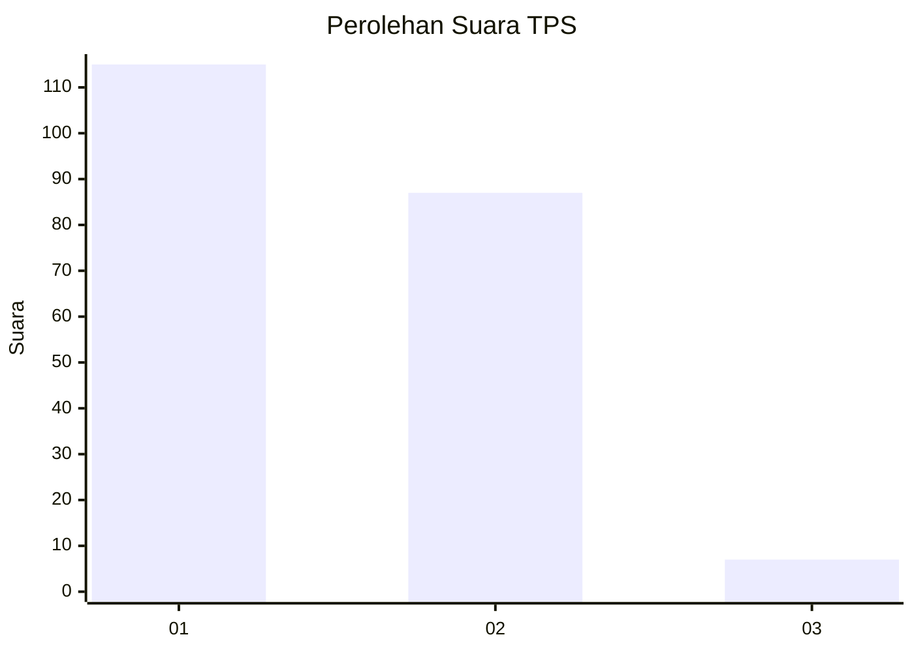
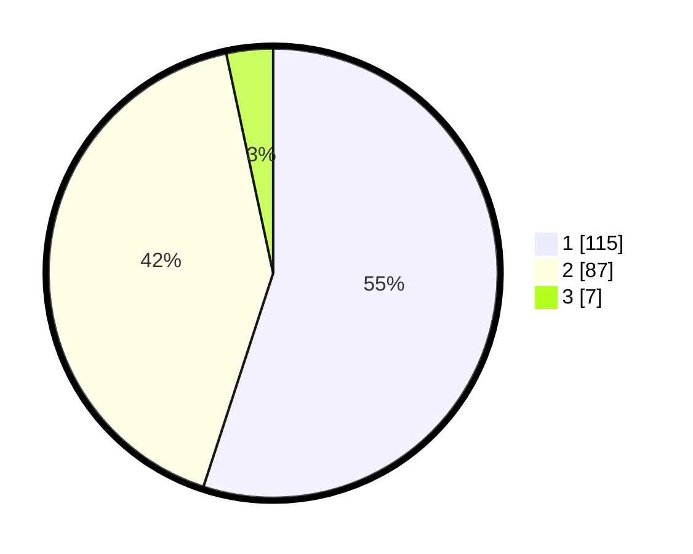

# Hasil

## Grafik

## Tabel

| No. | Nama Paslon    | Suara | Suara (raw) | Persentase |
|:--- |:-------------- | -----:| -----------:| ----------:|
| 1   | ANIES MUHAIMIN | 115   | [115][p-1]  | 55,02      |
| 2   | PRABOWO GIBRAN | 87    | [87][p-2]   | 41,63      |
| 3   | GANJAR MAHFUD  | 7     | [7][p-3]    | 3,35       |

[p-1]: https://github.com/gigit-pemilu/pemilu-2024/blob/main/pilpres/hitung-suara/sub/35-jawa-timur/sub/29-sumenep/sub/12-ambunten/sub/2006-tambaagung-ares/sub/007-tps/sub/paslon-1.txt
[p-2]: https://github.com/gigit-pemilu/pemilu-2024/blob/main/pilpres/hitung-suara/sub/35-jawa-timur/sub/29-sumenep/sub/12-ambunten/sub/2006-tambaagung-ares/sub/007-tps/sub/paslon-2.txt
[p-3]: https://github.com/gigit-pemilu/pemilu-2024/blob/main/pilpres/hitung-suara/sub/35-jawa-timur/sub/29-sumenep/sub/12-ambunten/sub/2006-tambaagung-ares/sub/007-tps/sub/paslon-3.txt

## Foto C Plano

https://sirekap-obj-formc.kpu.go.id/52a1/pemilu/ppwp/35/29/12/20/06/3529122006007-20240215-115339--3b8249ab-6152-420a-9860-5a8a6189784e.jpg

https://sirekap-obj-formc.kpu.go.id/52a1/pemilu/ppwp/35/29/12/20/06/3529122006007-20240214-211605--cc70e981-9e2e-43f0-b818-80218c4a08d2.jpg

https://sirekap-obj-formc.kpu.go.id/52a1/pemilu/ppwp/35/29/12/20/06/3529122006007-20240214-222942--8d0bca70-490d-4574-98b6-3c409c0db4a2.jpg

## Metadata

| Key        | Value               |
| ---------- | ------------------- |
| Time Stamp | 2024-02-15 12:00:28 |

