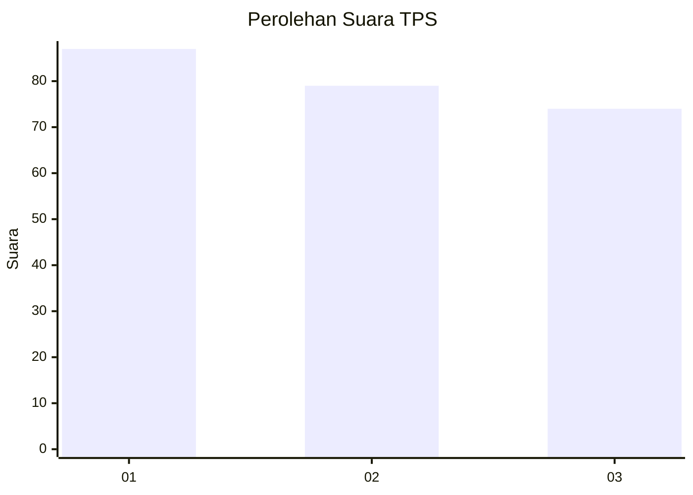
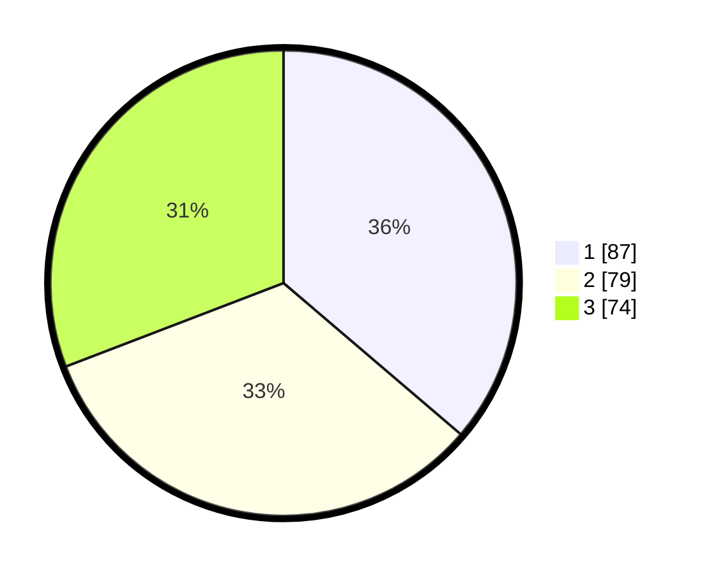

# Hasil

## Grafik

## Tabel

| No. | Nama Paslon    | Suara | Suara (raw) | Persentase |
|:--- |:-------------- | -----:| -----------:| ----------:|
| 1   | ANIES MUHAIMIN | 87    | [87][p-1]   | 36,25      |
| 2   | PRABOWO GIBRAN | 79    | [79][p-2]   | 32,92      |
| 3   | GANJAR MAHFUD  | 74    | [74][p-3]   | 30,83      |

[p-1]: https://github.com/gigit-pemilu/pemilu-2024/blob/main/pilpres/hitung-suara/sub/35-jawa-timur/sub/29-sumenep/sub/12-ambunten/sub/2009-bukabu/sub/005-tps/sub/paslon-1.txt
[p-2]: https://github.com/gigit-pemilu/pemilu-2024/blob/main/pilpres/hitung-suara/sub/35-jawa-timur/sub/29-sumenep/sub/12-ambunten/sub/2009-bukabu/sub/005-tps/sub/paslon-2.txt
[p-3]: https://github.com/gigit-pemilu/pemilu-2024/blob/main/pilpres/hitung-suara/sub/35-jawa-timur/sub/29-sumenep/sub/12-ambunten/sub/2009-bukabu/sub/005-tps/sub/paslon-3.txt

## Foto C Plano

https://sirekap-obj-formc.kpu.go.id/faf2/pemilu/ppwp/35/29/12/20/09/3529122009005-20240215-054347--48fdaa7f-5a1e-4c43-895a-5f7298b3ef17.jpg

https://sirekap-obj-formc.kpu.go.id/faf2/pemilu/ppwp/35/29/12/20/09/3529122009005-20240215-054501--75711a9a-b285-48bb-bc5a-fdd3d6e139b4.jpg

https://sirekap-obj-formc.kpu.go.id/faf2/pemilu/ppwp/35/29/12/20/09/3529122009005-20240214-232930--5406b6ed-b6a8-4fe4-b425-ada1538bd5dc.jpg

## Metadata

| Key        | Value               |
| ---------- | ------------------- |
| Time Stamp | 2024-02-25 15:00:00 |

